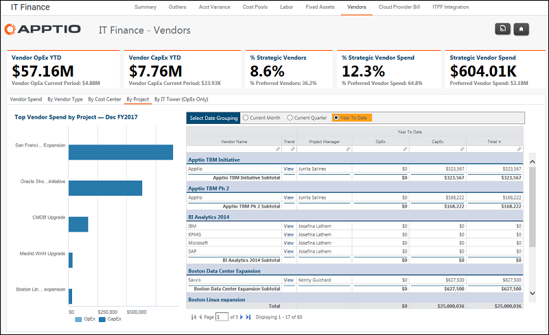

# IT Finance - Vendors - By Project (v103)

Applies to: Costing Standard 11.8.x running on either [TBM Studio v12](https://community.apptio.com/community/apptio/product-central/tbm-studio/studio-v12 "(Opens in a new tab or window)") or [TBM Studio v11](https://community.apptio.com/community/apptio/product-central/tbm-studio/studio-v11 "(Opens in a new tab or window)").

## Introduction

Use this report to identify projects driving the greatest vendor spend.

## Navigation

IT Finance > Vendors > By Project

## Roles

This report is designed for:

- IT Finance
- Vendor Manager
- IT Management

## Objectives

Use this report to:

- Identify the projects that are driving the most vendor spend using the chart.
- Identify the vendors that are supporting specific projects using the table.

## Questions answered

The information presented on this report can be used to answer the following questions:

- What project is driving the greatest vendor spend?
- Who is the project manager that is overseeing the project's vendor spend?
- How much of the vendor spend is capitalized?
- Does it make sense for the vendor to be involved with the project?

## Next actions

- View the 13-month trend by vendor by clicking View in the Trend column.
- Analyze vendors by project or IT Tower by selecting the By IT Tower (OpEx Only) tab.
