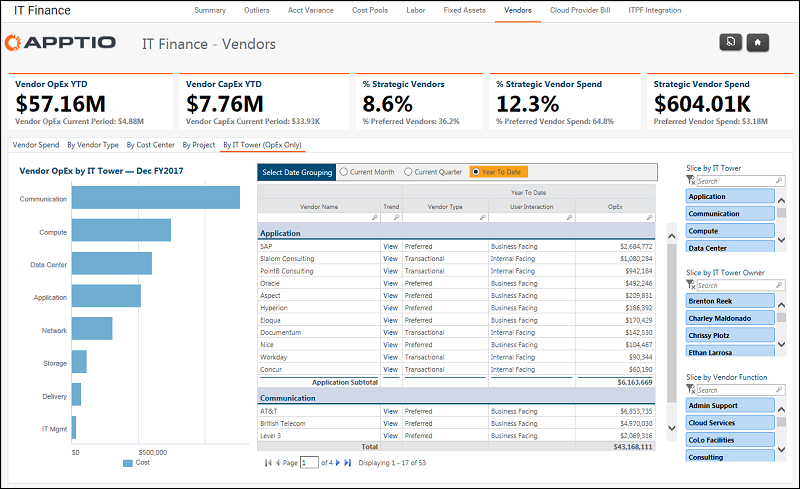

# IT Finance - Vendors - By IT Tower report (OpEx Only) (v103)

Applies to: Costing Standard 11.8.x running on either [TBM Studio v12](https://community.apptio.com/community/apptio/product-central/tbm-studio/studio-v12 "(Opens in a new tab or window)") or [TBM Studio v11](https://community.apptio.com/community/apptio/product-central/tbm-studio/studio-v11 "(Opens in a new tab or window)").

## Introduction

Identify which IT Tower has the largest vendor spend.

## Navigation

IT Finance > Vendors > By IT Tower (OpEx Only)

## Roles

This report is designed for:

- IT Finance
- Vendor Manager
- IT Management

## Objectives

Use this report to:

- Identify which IT Tower has the greatest vendor spend using the chart.
- Identify the vendors associated with each IT Tower using the table.

## Questions answered

The information presented on this report can be used to answer the following questions:

- How much vendor spend is driven by each IT Tower?
- What vendors roll up into which IT Tower?
- Are there multiple vendors providing similar products and services?
- Does it make sense for this vendor spend to be in this IT Tower?

## Next actions

- View the 13-month trend by vendor by clicking View in the Trend column.
- Filter for a specific IT Tower, IT Tower Owner, or Function using the slicers.
