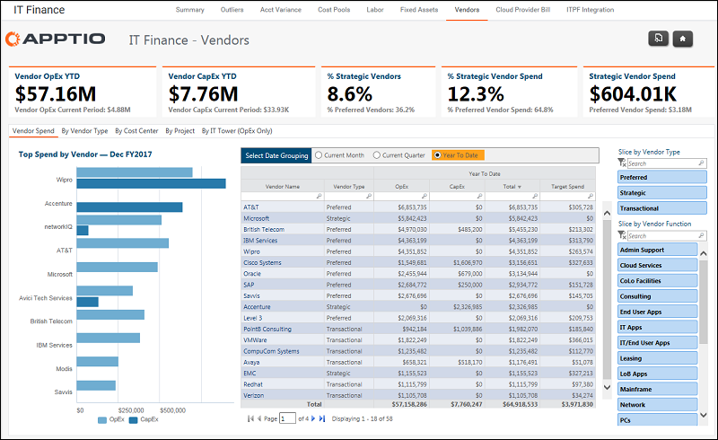

# IT Finance - Vendors - Spend report (v103)

Applies to: Costing Standard 11.8.x running on either [TBM Studio v12](https://community.apptio.com/community/apptio/product-central/tbm-studio/studio-v12 "(Opens in a new tab or window)") or [TBM Studio v11](https://community.apptio.com/community/apptio/product-central/tbm-studio/studio-v11 "(Opens in a new tab or window)").

## Introduction

Use this report to analyze vendor spend by vendor type, cost center, project and IT tower.

## Navigation

IT Finance > Vendors > Vendor Spend

## Roles

This report is designed for:

- IT Finance
- Vendor Manager
- IT Management

## Objectives

Use this report to:

- See the total vendor spend by OpEx and CapEx.
- Understand the mix of vendors by type (e.g. preferred, strategic, and transactional).
- Identify the top spend by vendor.

## Questions answered

The information presented on this report can be used to answer the following questions:

- Who are my top vendors by spend?
- Is spending in line with my expectations? Did I spend more or less than I expected?
- How much am I spending in a particular function or category, such as SaaS?
- Who are my strategic vendors?

## Next actions

- Filter the list of vendors by type or function using the slicers.
- Analyze the vendors by vendor type, cost center, project, or IT Tower using the tabs.
