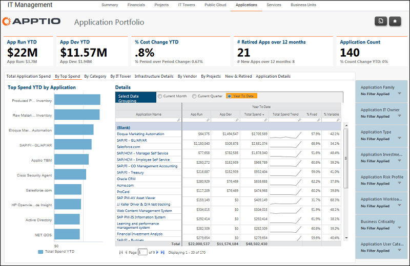

# IT Management - Applications - By Top Spend report (v103)

Use this report to see the top spend YTD by application.

Applies to: Costing Standard 11.8.x running on either TBM Studio v12
or TBM Studio v11.

## Navigation

IT Management > Applications > By Top Spend

## Roles

This report is designed for:

- Application Owners
- Application Portfolio Owners / VP of Application Dev & Support
- Enterprise Architects

## Objectives

Use this report to:

- Quickly see the top spend YTD by application in the Top Spend YTD by Application chart.
- Review the operational and development spending by application.
- Review the fixed and variable spending percentages by application.

## Questions answered

The information presented on this report can be used to answer the following questions:

- How much have we spent by application?
- Do we have a sensible balance of spending to maintain current operations and develop applications for the future?
- Is action required to mitigate risk?

## Next actions

Click an application name to obtain an Application Portfolio - Detail report.

Use the detail reports to review:

- A summary of the application.
- A breakdown of the application's operational spending by IT Tower.
- The spending for an IT Sub-Tower over time.
- The spending with vendors for the application.
