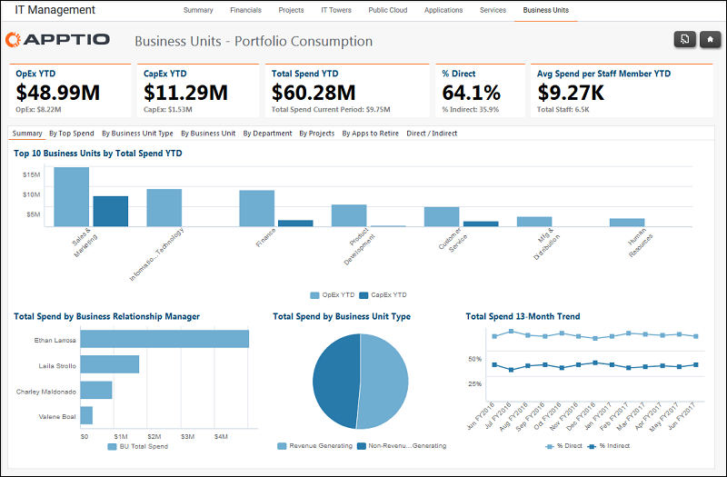

# IT Management Business Units reports (v103)

The IT Management Business Units reports show spend by business unit, business unit type,
department, and direct/indirect costs.

Applies to: Costing Standard 11.8.x running on either TBM Studio v12
or TBM Studio v11.

## Navigation

IT Management > Business Units > Summary

## Roles

This report is designed for:

- Business unit owners
- CIOs
- CFOs

## Objectives

Use this report to:

- See the top 10 Business Units by total spend YTD.
- See the top 5 spend amounts by Business Relationship Manager.
- See total spending by Business Unit Type.
- See the 13-month trend of total spending.

## Questions answered

The information presented on this report can be used to answer the following questions:

- How much have we spent for services so far this year?
- Where is our biggest spend by service, service name, or service category?
- Is action required to mitigate risk?

## Next actions

Click the other tabs to view the data by top spend, business unit type, business unit,
department, and direct/indirect costs.
