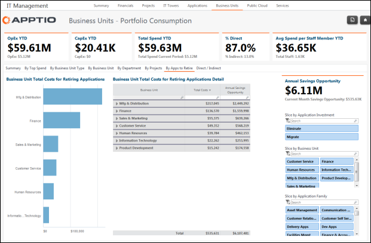

# IT Management - Business Units - By Apps to Retire report (v103)

Use this report to cost savings that could be realized if an application was
retired.

Applies to: Costing Standard 11.8.x running on either TBM Studio v12
or TBM Studio v11.

## Navigation

IT Management > Business Units > By Apps to Retire

## Roles

This report is designed for:

- Business unit owners
- CIOs
- CFOs

## Objectives

Use this report to:

- Review the monthly and annual costs of applications.
- Compare costs by application investment, business unit, and application family.

## Questions answered

The information presented on this report can be used to answer the following questions:

- Are there applications whose cost does not justify their continued support?
- Which applications are the most costly? Is that cost justified?

## Next actions

Follow-up with application users to see if they still have a valid reason for continuing to use
the application.
