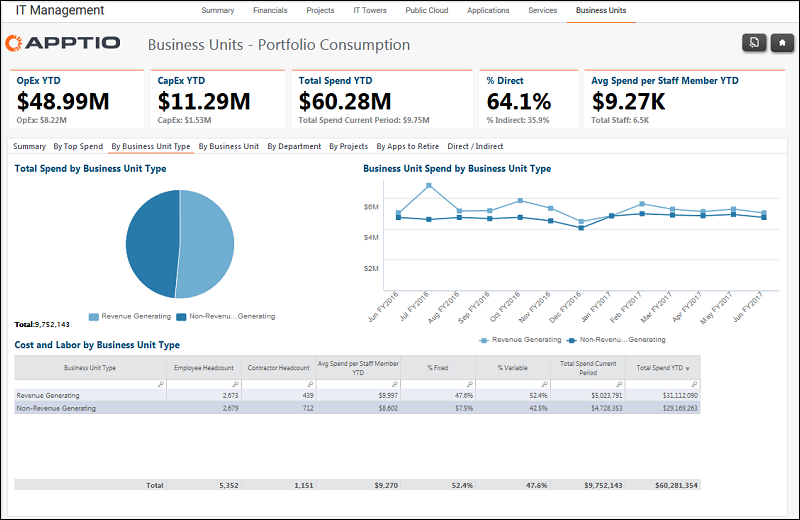

# IT Management - Business Units - By Business Unit Type Report (v103)

Use this report to review spending by business unit type.

Applies to: Costing Standard 11.8.x running on either TBM Studio v12
or TBM Studio v11.

## Navigation

IT Management > Business Units > By Business Unit Type

## Roles

This report is designed for:

- Business unit owners
- CIOs
- CFOs

## Objectives

Use this report to review spending by business unit type.

## Questions answered

The information presented on this report can be used to answer the following questions:

- Do we have the right mix of spending in support of revenue generating and non-revenue generating business units?
- Is action required to mitigate risk?

## Next actions

Use the tabs in the report to learn more about spending for business units.
