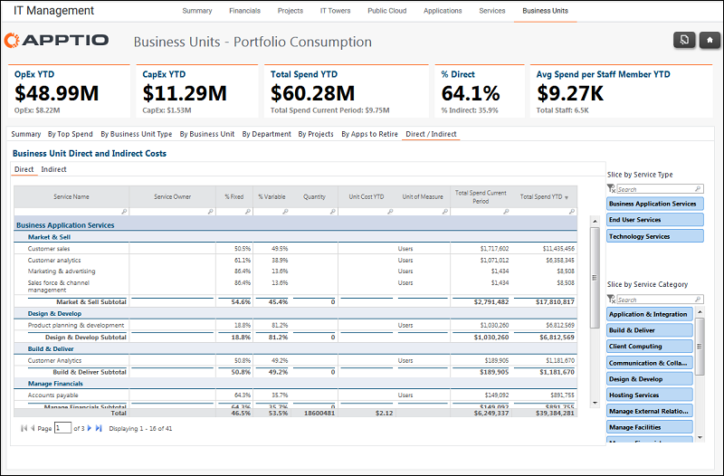

# IT Management - Business Units - Direct/Indirect Report (v103)

Use this report to review the direct and indirect costs by business unit.

Applies to: Costing Standard 11.8.x running on either TBM Studio v12
or TBM Studio v11.

## Navigation

IT Management > Business Units > Direct/Indirect

## Roles

This report is designed for:

- Business unit owners
- CIOs
- CFOs

## Objectives

Use this report to review the direct and indirect costs by business unit.

## Questions answered

The information presented on this report can be used to answer the following questions:

Is action required to mitigate risk?

## Next actions

Use the slicers to filter the report by Service Type or Service Category.
