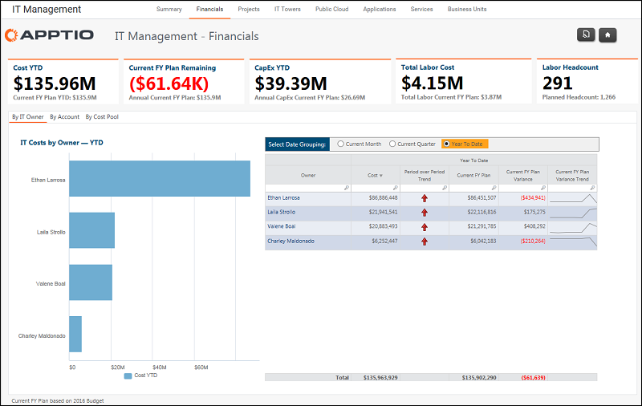

# IT Management - Financials report (v103)

The IT Management - Financials report shows monthly spend and budget variance by IT
Owner, account, and cost pool.

Applies to: Costing Standard 11.8.x running on either TBM Studio v12
or TBM Studio v11.

## Navigation

IT Management > Financials

## Roles

This report is designed for:

- CIO
- IT Management

## Objectives

Use this report to:

- See monthly spend and budget variance at the CIO-1 level.
- Review for current period, quarter or year to date.

## Questions answered

The information presented on this report can be used to answer the following questions:

- Is the overall budget at the CIO-1 level (e.g. Owner) on track to hit budget?
- Is the budget variance trending up, down, or remaining constant?
- Is the variance significant enough to warrant further investigation and explanation?

## Next actions

- Drill into a specific Owner for further analysis by underlying cost centers.
- Click the "By Account" tab to see the cost and budget in the company's accounting structure
  at the sub-group level.
- Click the "By Cost Pool" tab to see the cost & budget in the standard Cost Pool taxonomy.
