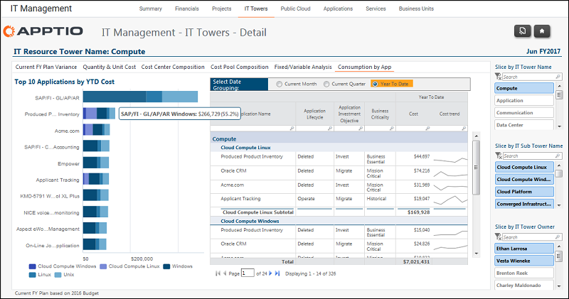

# IT Management - IT Tower Details - Consumption by Application report (v103)

◆ Applies to: Costing Standard 11.8.x running on either TBM Studio v12 or TBM Studio
v11.

## Introduction

Use this report to see the spend by application.

## Navigation

IT Management > IT Towers > IT Tower Name > Consumption by Application

## Roles

This report is designed for:

- IT Management
- IT Tower Owner

## Objectives

Use this report to:

- See the top 10 reports by cost.
- Review application costs by IT tower, sub-tower, and tower owner.

## Questions answered

The information presented on this report can be used to answer the following questions:

- Is my spend going to support the most critical applications in the organization?
- What applications are slated to by retired?
- What is the cost trend for an application.

## Next actions

- Review the plans to eliminate the retired applications.
- Adjust spend to support the most critical applications.
