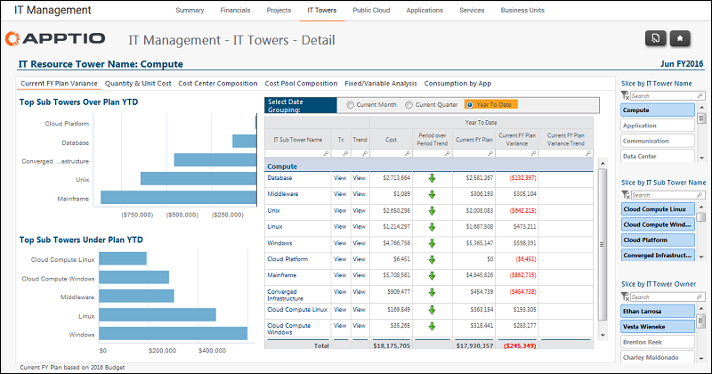

# IT Management - IT Tower Details - Current FY Plan Variance report (v103)

◆ Applies to: Costing Standard 11.8.x running on either TBM Studio v12 or TBM Studio
v11.

## Introduction

Use to see the top over/under budget variance YTD by IT sub-tower and identify spend and budget
variance by IT sub-tower for the current month, quarter, and YTD.

## Navigation

IT Management > IT Towers > IT Tower Name

## Roles

This report is designed for:

- IT Management
- IT Tower Owner

## Objectives

Use this report to:

- Quickly see the top over/under budget variance YTD by IT sub-tower using the Top 5 YTD Over
  Budget Variance by Sub Tower chart.
- Identify the spend and budget variance by IT sub-tower for the current month, quarter and YTD
  using the Select Date Grouping option.

## Questions answered

The information presented on this report can be used to answer the following questions:

- How much have I spent by IT sub-tower?
- Where is my biggest spend?
- Where is my biggest variance?
- What amount is material compared to my overall IT spend?
- Is action required to mitigate the budget risk?

## Next actions

- View the account transactions by clicking View in the TX column.
- View 13-month spend and budget trends to identify abnormalities by clicking View in the Trend
  column.
- Investigate volume and unit costs by clicking the Quantity & Unit Cost tab.
