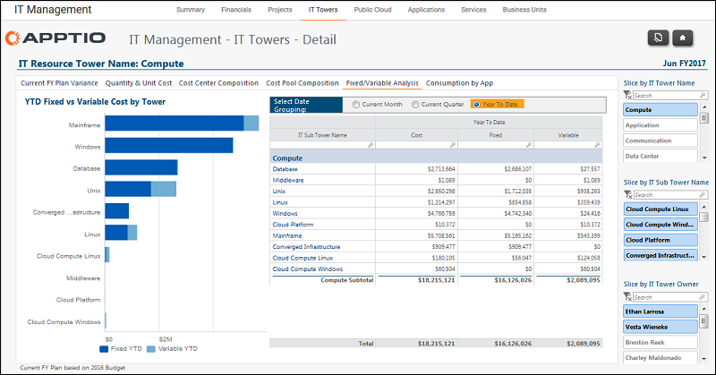

# IT Management - IT Towers Details - Fixed/Variable Analysis report (v103)

◆ Applies to: Costing Standard 11.8.x running on either TBM Studio v12 or TBM Studio
v11.

## Introduction

Use this report to identify the relative fixed/variable spend for each IT subtower.

## Navigation

IT Management > IT Towers > IT Tower Name > Fixed/Variable Analysis

## Roles

This report is designed for:

- IT Management
- IT Tower Owner

## Objectives

Use this report to:

Identify the relative fixed/variable spend for each IT sub-tower.

## Questions answered

The information presented on this report can be used to answer the following questions:

- If demand or consumption drops, will my costs drop as well or are they primarily fixed and
  remain in tact?
- If I need to reduce costs, which IT sub-towers could have an impact in the near-term?
- What is driving my fixed costs?
- Are their architectural, structural or sourcing changes that I could make to create a more
  variable cost structure?
- What is an appropriate Fixed spend ratio for our company and this service?

## Next actions

- View the 13-month fixed/variable spend to identify trends over time by clicking View in the
  Trend column.
- Look at the IT Finance Fixed/Variable reports to see which accounts are fixed or variable.
