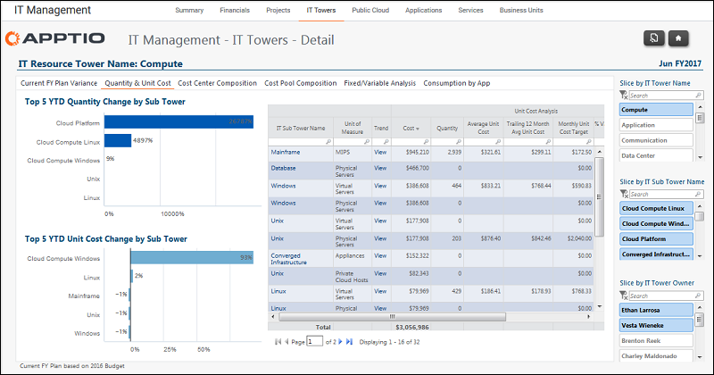

# IT Management - IT Towers Details - Quantity &amp; Unit Cost report (v103)

◆ Applies to: Costing Standard 11.8.x running on either TBM Studio v12 or TBM Studio
v11.

## Introduction

Use this report to identify changes in volume and unit cost since the beginning of the year for
each IT subtower, and see the volumes, spend and unit costs for the current period.

## Navigation

IT Management > IT Towers > IT Tower Name > Quantity & Unit Cost

## Roles

This report is designed for:

- IT Management
- IT Tower Owner

## Objectives

Use this report to:

- Identify changes in the volume and unit cost since the beginning of the year for each IT
  sub-tower using the Top 5 TYD charts.
- See the volumes, spend, and unit costs for the current period using the table.

## Questions answered

The information presented on this report can be used to answer the following questions:

- What are the volumes and unit cost by sub-tower?
- How are unit costs trending over the past few months?
- How do my unit costs compare to peer benchmarks (available with Infrastructure Benchmarks).

## Next actions

- View the 13-month volume and unit costs to identify trends by clicking View in the Trend
  column.
- Investigate cost pool composition to understand what is driving the supply side of the costs by
  clicking the Cost Pool Composition tab.
