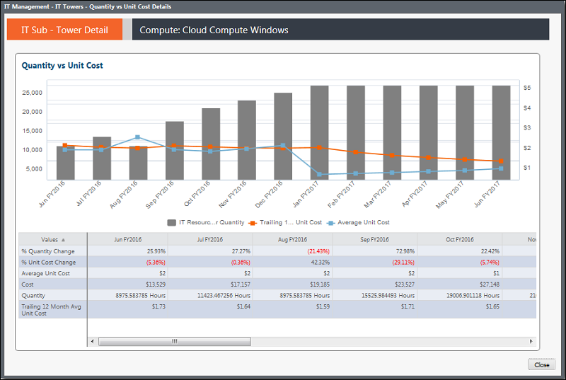

# IT Management - IT Towers Details - Quantity &amp; Unit Cost - Trend report (v103)

◆ Applies to: Costing Standard 11.8.x running on either TBM Studio v12 or TBM Studio
v11.

## Introduction

Use this report to see the volumes and unit costs by month for the past 13 months, and to review
volume, total costs, unit costs, and percent change by month.

## Navigation

IT Management > IT Towers > IT Tower Name > Quantity & Unit Cost > Trend View

## Roles

This report is designed for:

- IT Management
- IT Tower Owner

## Objectives

Use this report to:

- See the volumes, spend, and unit costs by month for the past 13 months using the Quantity Unit
  Cost chart.
- Review volume, total costs, unit costs, and percent change by month using the table.

## Questions answered

The information presented on this report can be used to answer the following questions:

- How are the volumes fluctuating over time?
- Are the volumes increasing due to business demand? If yes, do I need to work with my business
  partners to manage the demand and the resulting increase in TCO?
- Are my unit costs flat or decreasing over time? If not, where are my supply-side costs
  increasing?

## Next actions

Investigate the cost pool composition to understand what is driving the supply side of the costs
by viewing the Quantity & Unit Cost report.
