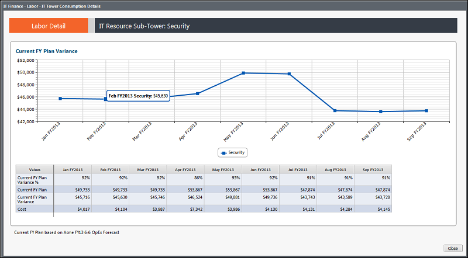

# IT Management - Labor Details - Consumption - Trend report (v103)

◆ Applies to: Costing Standard 11.8.x running on either TBM Studio v12 or TBM Studio
v11.

## Introduction

Use this report to see the labor costs allocated to a specific IT subtower by month for the past
13 months.

## Navigation

IT Management > Labor > Cost Center > Consumption > Trend View

## Roles

This report is designed for:

- IT Finance personnel
- Cost Center Owner

## Objectives

Use this report to:

- See the labor costs allocated to a specific IT sub-tower by month for the past 13 months.
- Review the supporting data to see the budget variance and percent variance by month.

## Questions answered

You can use the information presented on this report to answer the following questions:

- How has the resource cost allocation fluctuated over time?
- If labor is allocated by time reporting, am I seeing increasing or decreasing demands in one
  area over another?
- If there is a dramatic deviation followed by a leveling off, ist it a result of a change in the
  allocation approach? Who is making those allocation changes if not me?

## Next actions

Investigate the allocation rules used to map labor spend to IT towers. The options could be:
percent allocation by cost center, by role, or time reporting.
