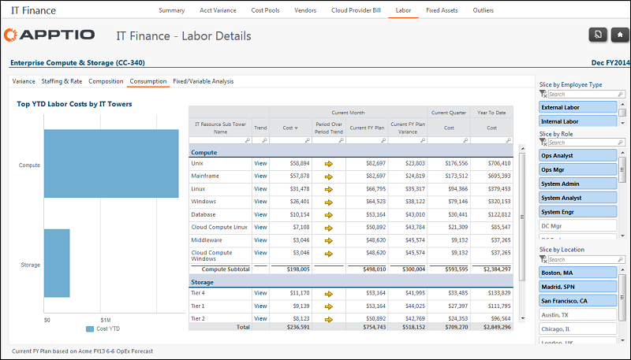

# IT Management - Labor Details - Consumption report (v103)

◆ Applies to: Costing Standard 11.8.x running on either TBM Studio v12 or TBM Studio
v11.

## Introduction

Use this report to understand which accounts make up the labor spend.

## Navigation

IT Management > Labor > Cost Center > Consumption

## Roles

This report is designed for:

- IT Finance personnel
- Cost Center Owner

## Objectives

Use this report to:

- View how labor costs are allocated to IT towers using the chart.
- See which roles are supporting the IT towers using the table.
- Filter by role and location.

## Questions answered

You can use the information presented on this report to answer the following questions:

- To which IT towers are my cost center labor costs being allocated?
- Do I have resources allocated to unexpected or incorrect IT towers?
- Is action required to correct or more accurately allocate my labor costs?

## Next actions

- View 13-month IT tower consumption to identify trends by clicking View in the Trend column.
- Investigate the allocation rules for mapping labor spend to IT towers. The rules could be:
  - Percent allocation by cost center
  - By role
  - By time reporting
