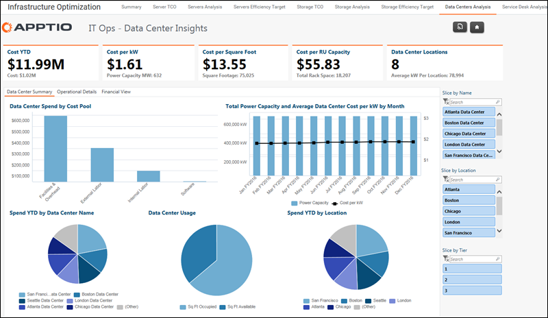

# IT Operations - Data Centers Analysis report

◆ Applies to: Costing Standard 11.8.x running on either TBM Studio v12 or TBM Studio
v11.

## Introduction

Use this report to analyze the costs and efficiency of the data centers.

## Navigation

IT Infra & Operations > Data Centers Analysis

## Roles

This report is designed for:

- Data Center leaders/managers

## Objectives

Use this report to:

- Review the monthly and YTD costs for the data centers.
- Analyze costs by RU (rack unit), square foot, and power unit rate across the data centers.
- Analyze the budget variance for each data center.
- Analyze costs by region, location, purpose, certification level, and tier.

## Questions answered

The information presented on this report can be used to answer the following questions:

- Which data centers are most cost effective based on RU, square footage, and power unit
  rate?
- How do cost vary over the calendar year?
- Are there data centers that are underperforming?

## Next actions

- Click the tabs to see operational details and financial information.
