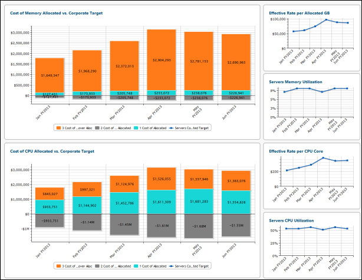

# IT Operations - Servers Efficiency Target report

◆ Applies to: Costing Standard 11.8.x running on either TBM Studio v12 or TBM Studio
v11.

## Introduction

Use this report to compare the cost of memory and CPU allocations to corporate targets.

## Navigation

IT Infra & Operations > Servers Efficiency Target report

## Roles

This report is designed for:

- Server leaders/managers

## Objectives

Use this report to:

- Compare allocated memory to corporate targets.
- Compare allocated CPU to corporate target.

## Questions answered

The information presented on this report can be used to answer the following questions:

- Does the cost of allocated memory align with the corporate targets?
- What is the effective rate per allocated GB of memory?
- Does the cost per CPU allocated align with the corporate targets?
- What is the effective rate per CPU core?

## Next actions

Research other operations metrics by selecting one of the other IT Operations tabs.
