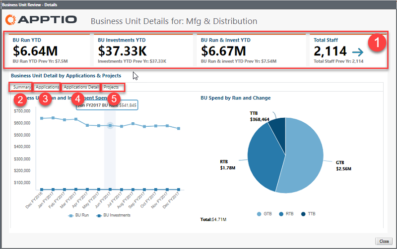
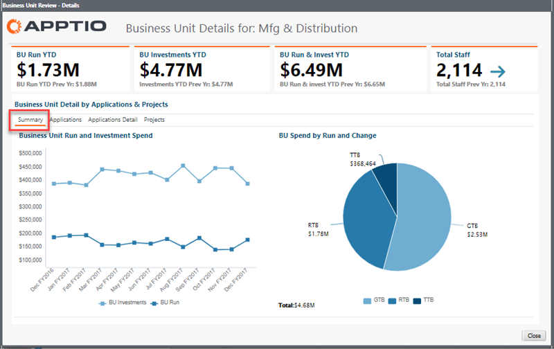
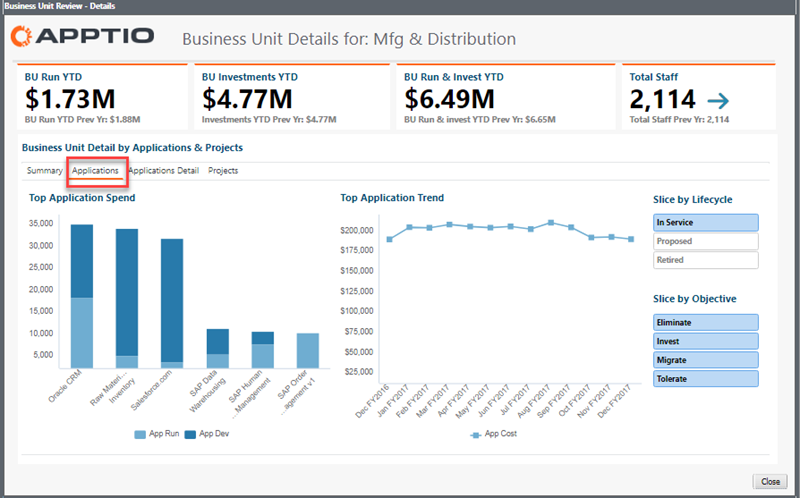
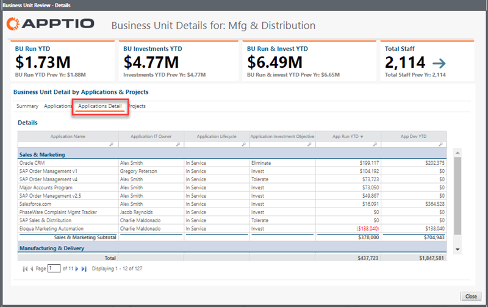
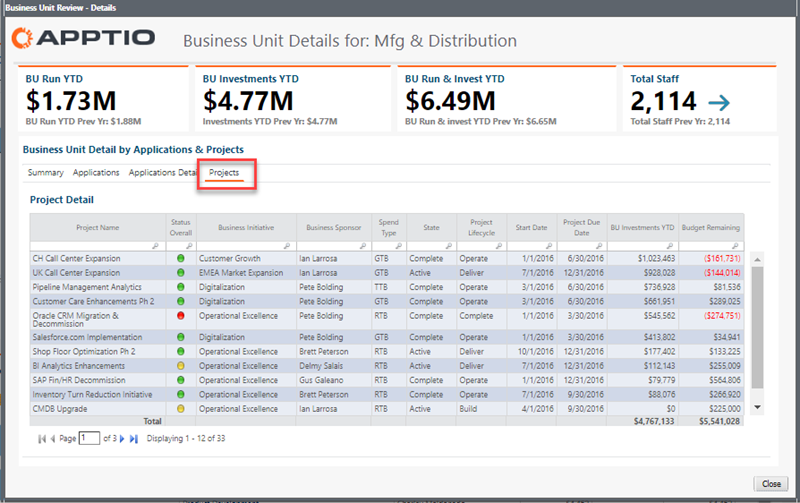

# Business Unit Details report

- Applies to: Costing Standard on TBM Studio 12.3 and later, with Template v104 and later ([Learn more](comparev103v104reports.html))

The **Business Unit Details** dialog provides insight into the impact of applications and
projects on your business units (BUs).

## Display the report

1. Log in to Apptio.
2. In the navigation bar, click **Cost Transparency**.

   Note: If you are already logged in, select **Applications** from the Report
   collection menu. ([How?](https://community.apptio.com/docs/DOC-6720.html "(Opens in a new tab or window)"))
3. In the **Home** page, click **Applications**.
4. In the report collection, click **Application Portfolio**.
5. In the **Application Consumption by Business Unit** panel, click in the bar
   chart or any item in the **Business Unit** column of the **Application
   Spend by Business Unit** table.

   The **Business Unit Details** dialog opens.

## Key elements

The **Business Unit Details** dialog contains the following elements:

(1) KPIs
:   KPIs provide a high-level view of your BU spend compared to budget:

    - **BU Run YTD** - This KPI shows the BU-related OpEx, or the day-to-day activity that is
      included in the amortization of BU-related applications and projects YTD for the current and
      previous year.
    - **BU Investments YTD** - This KPI shows the BU-related activity around changing the portfolio
      and developing the business YTD for the current and previous year.
    - **BU Run & Invest YTD** - This KPI shows the total BU run and investment YTD for the
      current and previous year.
    - **Total Staff** - This KPI shows the total BU headcount for the current and previous
      year.

(2) Summary
:   Click this tab to see the trending spend of your BU run and investments, and a chart that
    reflects the current spend in terms of the Transform the Business (TTB), Grow the Business (GTB),
    and Run the Business (RTB) categories of your business investments.

    

(3) Applications
:   Click this tab to see the application related to BU with the highest spend, and the trending
    spend of that application over time. Select a lifestyle or objective slicer to filter the data as needed.

    

(4) Application Detail
:   Click this tab to see a YTD summary of all the application detail for that business unit.

    

(5) Projects
:   Click this tab to see details for the projects that contribute to application cost for the
    selected business unit.

    
