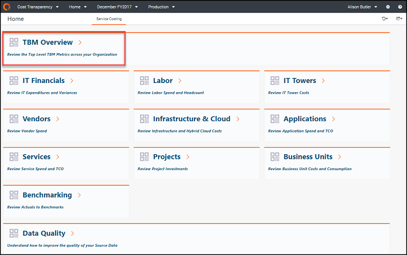
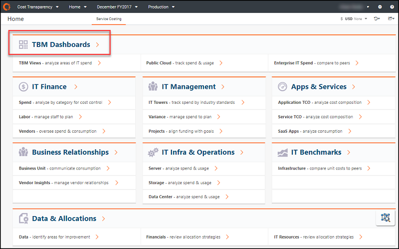
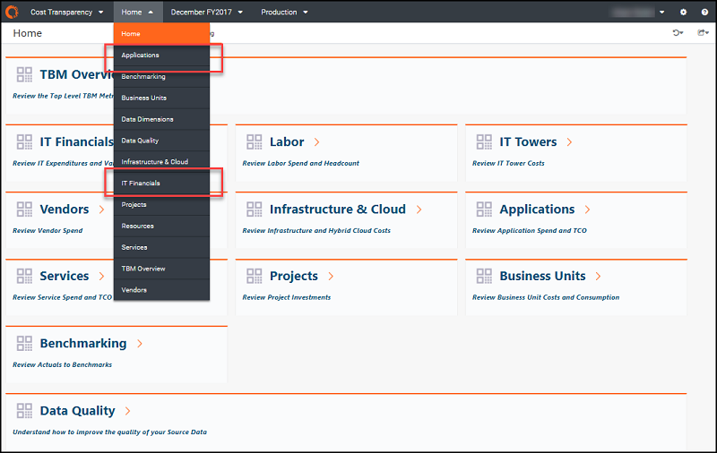
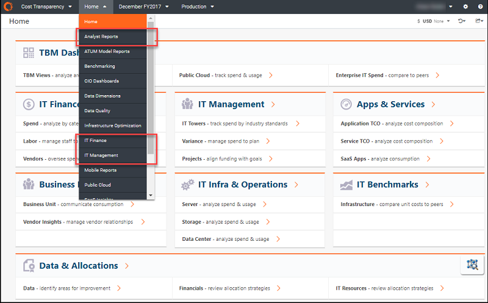

# Compare v.104 and v.103 Costing Standard reports

The reports you see in Costing Standard are based on your version of TBM Studio and the report
template you are using.

**Template v.104**

**Available in TBM Studio 12.3+**

If you use TBM Studio 12.3+ with Template v.104, the reports are organized into the following
report collections. Notice that the report collection displayed at the top of the **Home** page
is **TBM Overview**.

**Template v.103**

**Available in TBM Studio 12.0+**

Reports beginning with TBM Studio 12.0 use Template v.103. If you use Template v.103, the
**Home** page is organized according to roles. Notice that the report collection at the top of
this **Home**page is **TBM Dashboards**.

If your **Home** page has been customized, the above images might not apply to your situation.
Instead, you can determine your template based on the contents of the **Home** menu.

**Template v.104**

The drop-down menus tarts with **Applications** and contains **IT Financials.**

**Template v.103**

The drop-down menu starts with **Analyst Reports** and contains **IT Finance** and  **IT
Management**.

For more information:

- [Costing Standard report collections
  (v104+)](ctreportcollections104-plus.html)
- [Costing Standard report collections
  (v103)](../reports-v103/ctreportcollections103.html)
- [Specify component version in TBM
  Studio](https://community.ibm.com/community/user/viewdocument/upgrade-cost-transparency-from-temp-1?CommunityKey=4100dfb8-fc23-4203-83c7-019253cf7c0b&tab=librarydocuments "(Opens in a new tab or window)")
- [Upgrade Costing Standard to Template
  v104](../user-guide/upgradectto104-8841.html "This document describes the reasons behind the Costing Standard user interface (UI) upgrade and the recommended steps for upgrading Apptio application content from Template v103 to the latest version of the application template.")
