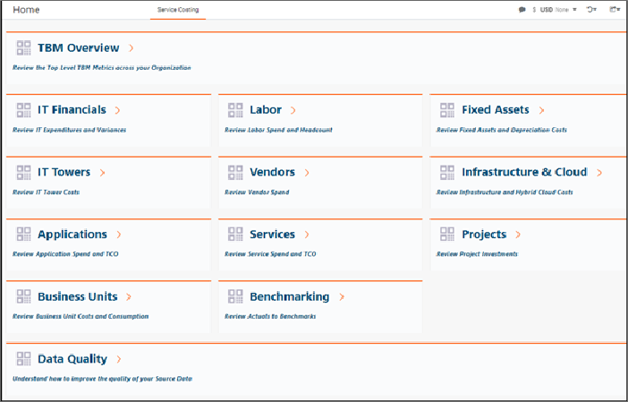

# Costing Standard home page

- Applies to: Costing Standard on TBM Studio 12.3.3 and later, with Template v104 and later

Use the Costing Standard home page to access the report collections in the Costing Standard
application. The reports are organized by areas of interest. Click a heading to open the high-level
summary report for a report collection.

## Home page icon

Click the Home icon  in the upper right corner to return to the
Home page from anywhere in the application.

## Access

Access to the Costing Standard is controlled by roles. You can access the application if you have
been assigned to any of the following default roles, except Project Manager and Business Unit Owner.
If you cannot access the application, check with your Apptio administrator.

- Admin
- Analyst
- Adaption Admin
- Budgeting Process Owner
- Business Owner
- Business User
- Datalink (Classic) Admin
- Executive User
- Finance
- Power User
- Service Manager
- View Only

The following roles cannot access Costing Standard:

- Business Unit Owner
- Project Manager

**See Also**

- [Navigate in Costing Standard](navigatect_v12.html)

[Overview of Costing Standard
Reports](reportoverviewmonthlytcoreports12_3_3.html)
