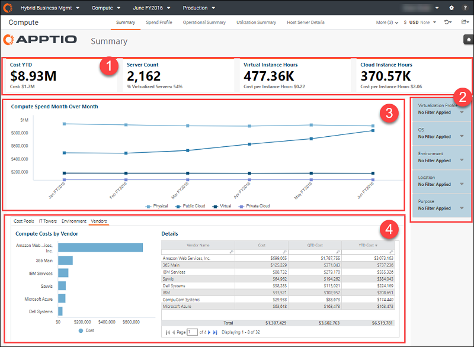
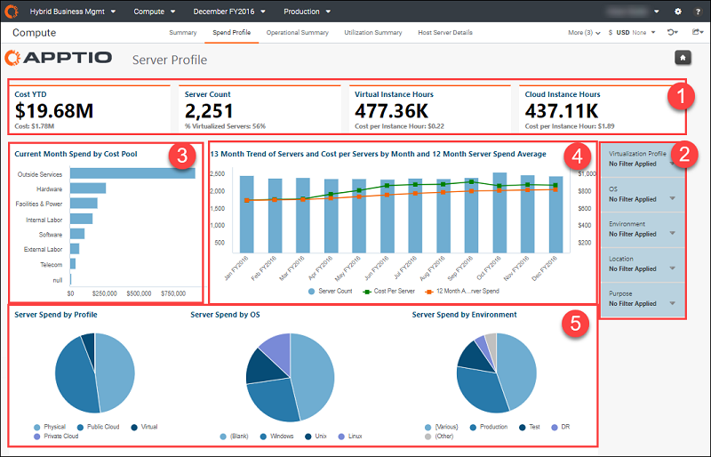
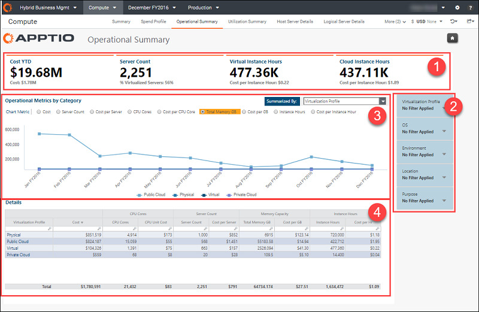
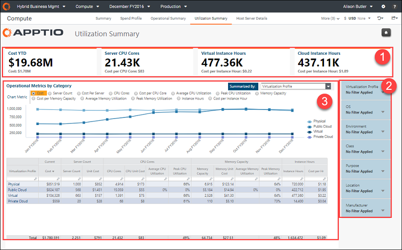
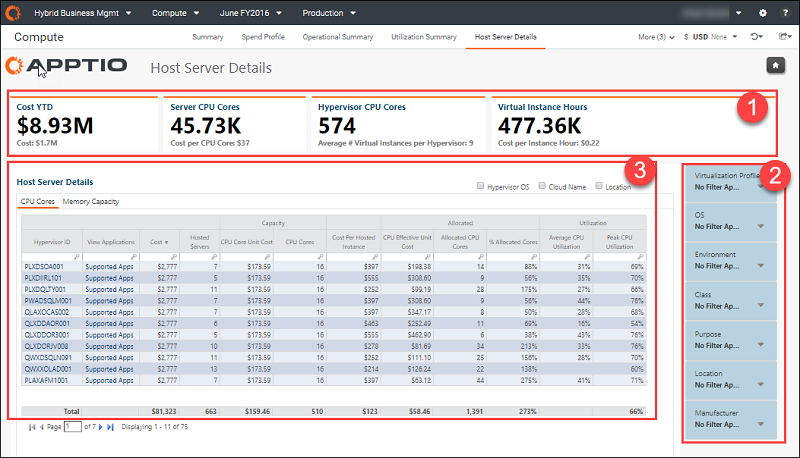
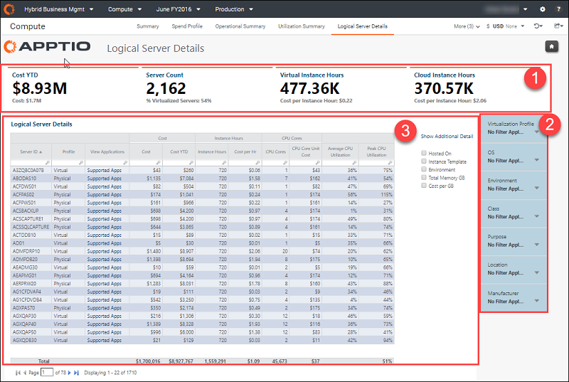
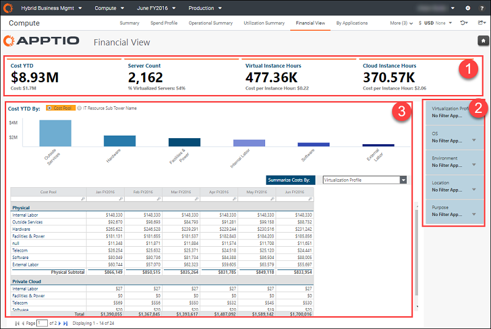
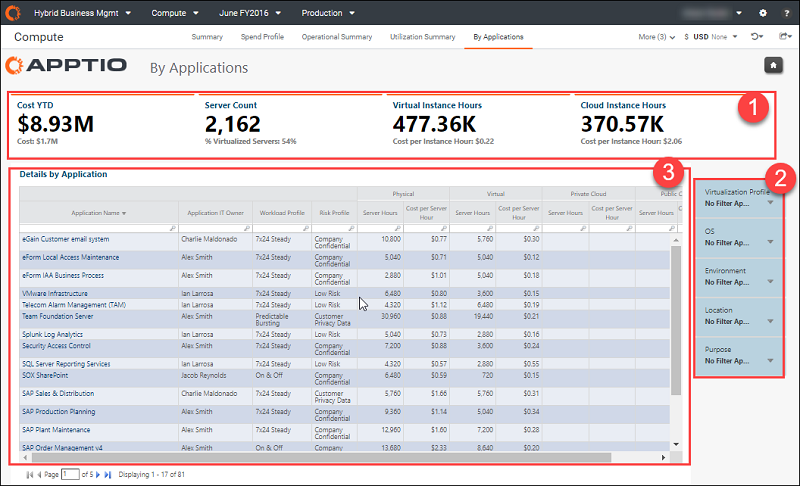

# Compute Optimization & Insights Collection

- Applies to: Hybrid Business Management on TBM Studio TBM Studio and later

Use the Compute reports to understand the cost, capacity, and utilization of your Compute
resources. The reports allow you to analyze your spend profile, understand Compute metrics,
understand operational metrics, analyze server utilization, and understand an Applications view of
server details (host and logical). Use this report collection to understand the overall health of
your Compute infrastructure against plan, with actionable, insightful KPIs and high-level analytics.
This information is especially helpful in understanding where you are incurring Compute costs and
determine where spending anomalies are happening. It provides granular reporting so that you can
optimize server cost and utilization.

This report collection is designed for the following roles:

- Director of IT
- Compute team within IT
- Head of Operations
- IT Service Owners

This report collection aligns to the following business goals:

- View Compute costs across the enterprise
- Understand cost per virtualization hour and instance hour
- Track Compute infrastructure strategy and use of Compute resources
- Track the balance between server count, cost per server, CPU cores, total memory, cost per GB,
  instance hours, and cost of instance hours to determine whether Compute spending is trending as
  expected

These reports enable you to determine the following:

- Which server platforms require additional unit purchases?
- What's the cost per server hour for each application?
- Which server platforms and units should be retired?
- Where opportunities are to migrate from on-premise infrastructure to public cloud?

## Display the report collection

1. Log in to Apptio.
2. On the **Home** page, click **Hybrid Business Management**.
3. In the Report collection menu, select **Compute**. The **Compute Summary** report opens by
   default.

## Compute Summary report

Compute Summary report provides an overview of total Compute spend in the enterprise, across
on-premises and cloud, as well as helps to visualize the spend across dimensions such as - Cost
pools, Environments, Vendors and IT Towers.

This report has the following elements:

**(1) KPIs** - KPIs provide a high-level view of your infrastructure spend:

- **Cost YTD** - This KPI shows the overall spend on Compute YTD. Spending for the current
  period is shown as **Cost**.
- **Server Count** - This KPI shows the current number of on-premises servers. The secondary
  KPI shows the percentage of virtual servers as **% Virtualized Servers**.
- **Virtual Instance Hours** - This KPI shows the current usage (in instance hours) of your
  virtual servers. The secondary KPI shows **Cost per Instance Hour**.
- **Cloud Instance Hours** - This KPI shows the current usage (in instance hours) of your
  public and cloud servers. The secondary KPI shows **Cost per Instance Hour**.

**(2) Filters** - The following filters are available in this report. These filters are
cumulative, and affect all data on the page, including the KPIs:

- **Virtualization Profile** - Select a specific type of on-premises or cloud server to see the
  impact of Compute spending on that server type.
- **OS** - Select a specific operating system (OS) to see the impact of Compute spending on
  that OS.
- **Environment** - Select a specific environment (such as Dev, Prod, or Test) to limit data in
  the report to servers in that environment.
- **Location** - Select a specific location to see the impact of Compute spending for that
  location.
- **Purpose** - Select a specific server purpose to see the impact of Compute spending on
  servers with the same purpose.

**(3) Compute Spend Month Over Month** - Use this chart to view the 1-year trending spend for
Compute resources across your on-premises and public cloud servers.

**(4) Compute Costs by** - Click the **Cost Pools**, **IT Towers**, **Environment**,
or **Vendors** tabs to view charts of the current Storage spending for the month. The
**Details** table lists the spending of the current month, QTD, and YTD.

Questions answered:

- Are there anomalies in our spending?
- Is the spending in line with our Compute strategy?
- How is the infrastructure strategy evolving?
- Where are we incurring Compute costs?

## Spend Profile report

Click **Spend Profile** in the Report collection tab to open the report. This report showcases
a cost profile of compute costs.

This report has the following elements:

**(1) KPIs** - The KPIs in this report are the same as in the Compute - Summary. See element 1
in the [Compute Summary report](hbmcomputecollection.html).

**(2) Filters** - The filters in this report are the same as in the Compute - Summary. See
element 2 in the [Compute Summary
report](hbmcomputecollection.html).

**(3) Current Month Spend by Cost Pool** - Use this chart to view the current server spend per
cost pool (Outside Services, Hardware, etc.).

**(4) 13 Month Trend of Servers** - Use this chart to view your monthly server count, cost per
server, and average annual spend on servers so you can watch for anomalies and trends that don't
align with your business strategy.

**(5) Server spend by** - Use the **by Profile**, **by OS**, and **by Environment**
pie charts to understand the balance of your server costs across various metrics.

Questions answered:

- How is the server strategy evolving?
- Where are we incurring Server costs?
- Are there anomalies in our server spending?

## Operational Summary report

Click **Operational Summary** in the Report collection tab to open the report. Use this report
to understand operational metrics of your compute resources (such as server costs, CPU cores, cost
per instance hour, etc. by virtualization profile) running on-premises.

This report has the following elements:

**(1) KPIs** - The KPIs in this report are the same as in the Compute - Summary. See element 1
in the [Compute Summary report](hbmcomputecollection.html).

**(2) Filters** - The filters in this report are the same as in the Compute - Summary. See
element 2 in the [Compute Summary report](hbmcomputecollection.html).

**(3) Operational Metrics by Category** - Use the options at the top of this chart to
selectively display various metrics. Additional metrics are available in the **Summarized By**
list. Use the chart to view the current operational spending based on the options you select.

**(4) Details** - The **Details** table provides the current monthly cost for the metric
you select from the **Summarized By** list, and the counts and unit costs of all related CPUs,
servers, memory, and instance hours.

Questions answered:

- How is our operational strategy evolving?
- Where are we incurring operational costs?
- Are there anomalies in our operational spending?

## Utilization Summary report

Click **Utilization Summary** in the Report collection tab to open the report. Use this report
to get a perspective of how utilization of on-premises compute resources is impacting the cost. You
could view utilization metrics related to your on-premises Compute resources (such as server costs,
CPU cores, memory capacity, average or peak utilization, etc.) broken out per virtualization
profile.

This report has the following elements:

**(1) KPIs** - The KPIs in this report are the same as in the Compute - Summary. See element 1
in the [Compute Summary report](hbmcomputecollection.html).

**(2) Filters** - The following filters are available in this report. These filters are
cumulative, and affect all data on the page, including the KPIs:

- **Virtualization Profile** - Select a specific type of on-premises or cloud server to see the
  impact of Compute spending on that server type.
- **OS** - Select a specific operating system (OS) to see the impact of Compute spending on
  that OS.
- **Environment** - Select a specific environment (such as Dev, Prod, or Test) to limit data in
  the report to servers in that environment.
- **Class** - Select a class (the size of reserved instances) to limit the data in the report
  to a specific class.
- **Location** - Select a specific location to see the impact of Compute spending for that
  location.
- **Purpose** - Select a specific server purpose to see the impact of Compute spending on
  servers with the same purpose.
- **Manufacturer** - Select a specific cloud service provider to limit the data in the report
  to the services from that provider.

**(3) Operational Metrics by Category**

- This report is similar to the Operational Summary report, but with metrics about average and
  peak CPU usage, and average and peak memory usage.
- Use the options at the top of this chart to selectively display various metrics. Additional
  metrics are available in the **Summarized By** list.
- The table provides the current monthly cost for the metric you select from the **Summarized
  By** list, and the counts, unit costs, average use, and peak of use related CPUs, servers, memory,
  and instance hours.

Questions answered:

- How is our Compute utilization strategy evolving?
- Where are we incurring utilization costs?
- Are there anomalies in our Compute utilization?

## Host Server Details report

Click **Host Server Details** in the Report collection tab to open the report. Use this report
to view your Compute spend specific to on-premises physical host machines. The report provides the
cost for the current period, the number of physical servers, and unit cost, along with average and
peak utilization.

**NOTE**: A *hypervisor*, also called a virtual machine monitor (VMM), is a software
program that runs on an actual host hardware platform and supervises the execution of the guest
operating systems on the virtual machines.

This report has the following elements:

**(1) KPIs** - KPIs provide a high-level view of your host server spending:

- **Cost YTD** - This KPI shows the overall spend on host servers YTD. Spending for the current
  period is shown as **Cost**.
- **Server CPU Cores** - This KPI shows the current number of physical server cores. The
  secondary KPI shows the cost per core as **Cost per CPU Core**.
- **Hypervisor CPU Core** - This KPI shows the current number of hypervisor processors. The
  secondary KPI shows the average instance per hypervisor as **Average # Virtual Instances per
  Hypervisor**.
- **Virtual Instance Hours** - This KPI shows the current capacity (as instance hours) of your
  virtual servers. The secondary KPI shows **Cost per Instance Hour**.

**(2) Filters** - The filters in this report are the same as in the Utilization Summary. See
element 2 in the [Utilization Summary report](hbmcomputecollection.html).

**(3) Host Server Details**

- Use the options at the top of this chart to add columns with **Hypervisor OS**, **Cloud
  Name**, and **Location** to the chart.
- Use the **CPU Cores** and **Memory Capacity** tabs to view the current capacity, cost per
  unit, allocation, and average/peak utilization of your CPU cores and memory.

Questions answered:

- How is our host server strategy evolving?
- Where are we incurring utilization costs?

## Logical Server Details report

Click **Logical Server Details** in the Report collection tab to open the report. Use this
report to view your Compute spend specific to logical machines or virtual machines. The report
provides the cost for the current period, the number of servers, and unit costs, along with average
and peak utilization.

This report has the following elements:

**(1) KPIs** - The KPIs in this report are the same as in the Compute - Summary. See element 1
in the [Compute Summary report](hbmcomputecollection.html).

**(2) Filters** - The filters in this report are the same as in the Compute - Summary. See
element 2 in the [Compute Summary report](hbmcomputecollection.html).

**(3) Logical Server Details**

- Use the options at the right of this chart to add columns that list the host name, instance
  template, environment name, total memory, and cost per GB to the chart.
- Use the table to view the current capacity, instance hours, core count, unit cost, allocation,
  and average/peak utilization of your logical servers.

Questions answered:

- How is our logical server strategy evolving?
- Where are we incurring costs?

## Financial View report

Click **Financial View** in the Report collection tab to open the report. Use this report to
get a financial view of your Compute spend per class, environment, location, OS, or virtualization
profile.

This report has the following elements:

**(1) KPIs** - The KPIs in this report are the same as in the Compute - Summary. See element 1
in the [Compute Summary report](hbmcomputecollection.html).

**(2) Filters** - The filters in this report are the same as in the Compute - Summary. See
element 2 in the [Compute Summary report](hbmcomputecollection.html).

**(3) Cost YTD By**

- Use the options at the top of this chart to view the spending YTD for Compute resources per cost
  pool (Outside Services, Hardware, etc.) versus IT Sub-tower (Servers, Transport, Voice, etc.). This
  information provides an overview of your overall Compute spending per ATUM Tower and Sub-tower.
- The table shows the same data month-by-month, based on your selection in the **Summarize Costs
  By** list.

Questions answered:

- How is our Compute strategy evolving?
- Where are we incurring Compute costs?
- Are there anomalies in our Compute spending?

## By Applications report

Click **By Applications** in the Report collection tab to open the report. Use this report to
view your Compute spend by application across your entire deployment profile.

This report has the following elements:

**(1) KPIs** - The KPIs in this report are the same as in the Compute - Summary. See element 1
in the [Compute Summary report](hbmcomputecollection.html).

**(2) Filters** - The filters in this report are the same as in the Compute - Summary. See
element 2 in the [Compute Summary report](hbmcomputecollection.html).

**(3) Cost YTD By** - Use this table to view the spending YTD for Compute resources per
application (for example, Active Directory, SAP Data Warehouse, and Office 365). The table shows the
application owner, workload profile, and risk profile of each application. Also, the server hours
and cost per server hour are broken out for each application.

Questions answered:

- How is our Compute strategy evolving?
- Where are we incurring Compute costs?
- Are there anomalies in our Compute spending?
- What's the distribution of Compute spend for a hybrid application?
