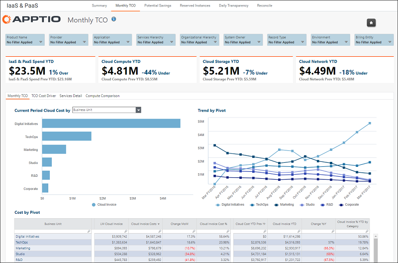
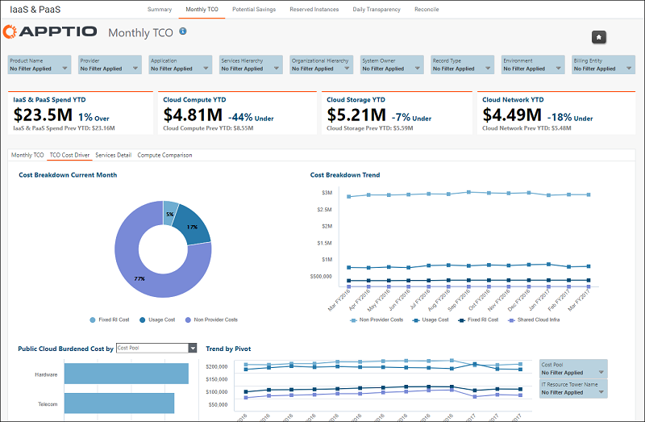
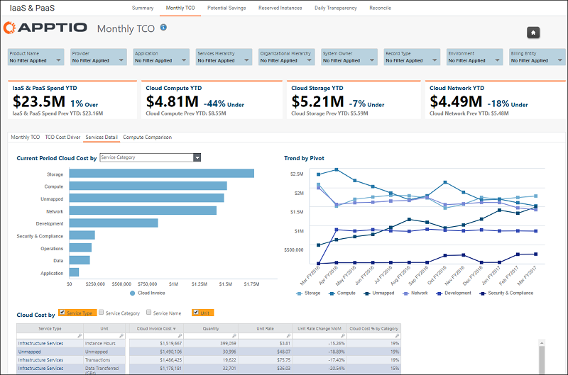
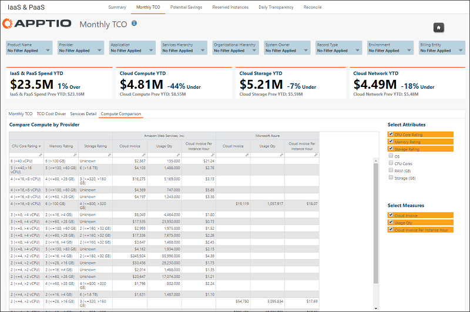

# Report overview - Monthly TCO

Note: Applies to: [Apptio Costing Standard](https://community.apptio.com/docs/DOC-8364.html "(Opens in a new tab or window)") or [Apptio Cloud
Cost Management](https://community.apptio.com/docs/DOC-8365.html "(Opens in a new tab or window)") on TBM Studio v12.4.1 and later, with Template v104 and later

## Overview

The Monthly TCO reports provide an understanding your organization's total monthly spending on
public cloud services. You can gain a much deeper understanding of which organizations and
applications are driving the most public cloud spend, which types of cloud services are being
consumed, and what other, non-provider costs (for example, Labor, Software, and others) are
associated with consuming those services. The reporting includes organizational, application, and
service type slicers to enable filtering for specific areas in order to drill down deeper into
public cloud costs.

**KPIs**

- **IaaS & PaaS Spend YTD** — The fully burdened costs of public cloud IaaS & PaaS
  services year-to-date, including not just public cloud provider costs, but also those non-provider
  costs incurred as a direct result of adopting public cloud services.
- **IaaS & PaaS Spend Prev YTD** — The fully-burdened costs of public cloud IaaS & PaaS
  services year-to-date for the prior year.
- **Cloud Compute YTD** — The fully burdened costs of public cloud computer services
  year-to-date.
- **Cloud Compute Prev YTD** — The fully burdened costs of public cloud computer services
  year-to-date for the prior year.
- **Cloud Storage YTD** — The fully burdened costs of public cloud storage services
  year-to-date.
- **Cloud Storage Prev YTD** — The fully burdened costs of public cloud storage services
  year-to-date for the prior year.
- **Cloud Network YTD** — The fully burdened costs of public cloud network services
  year-to-date.
- **Cloud Network Prev YTD** — The fully burdened costs of public cloud network services
  year-to-date for the prior year.

## Reports

- **Monthly TCO** — Explore how cloud spend breaks down by organization, application, IT
  resource towers, provider, product, environment, and ATUM-normalized classification of service.
  
  - **Metrics**
    - LM Cloud Invoice — last month's modeled cloud invoice costs.
    - Cloud Invoice Costs — the modeled cloud invoice costs for the currently selected month.
    - Change MoM — the month over month change in modeled cloud invoice costs. Calculated by
      subtracting LM Cloud Invoice from Cloud Invoice Costs.
    - Cloud Invoice Cost % — the line item % of the total modeled cloud invoice costs for the
      currently selected month.
    - Cloud Cost YTD Prev Yr — the year-to-date modeled cloud invoice costs up to the currently
      selected month last year. For example, if you were currently in March of 2019, this value would
      include year-to-date costs for 2018 up to March of 2018.
    - Cloud Invoice YTD — the year-to-date modeled cloud invoice costs up to the currently selected
      month.
    - Cloud Invoice % YTD by Category — the line item % of the total year-to-date modeled cloud
      invoice costs up to the selected month.
- **TCO Cost Driver** — Understand the makeup of the total cost of ownership for cloud spend.
  Learn about the other, non-provider costs that are associated with consuming public cloud services.
  
- **Services Details** — Understand how public cloud spend is trending by specific service
  categories, such as Compute, Storage, Networking, and Database. Gain an understanding of service
  consumption and effective unit rate trends for each of these service categories. 
- **Compute Comparison**(v12.5+) — Compare cloud compute spend between multiple service
  providers by comparing costs of instances with similar CPU cores, memory, and storage. 
