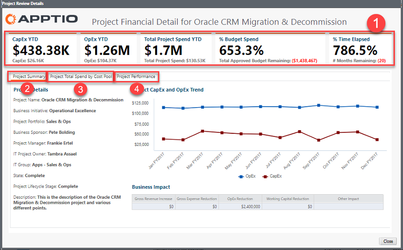
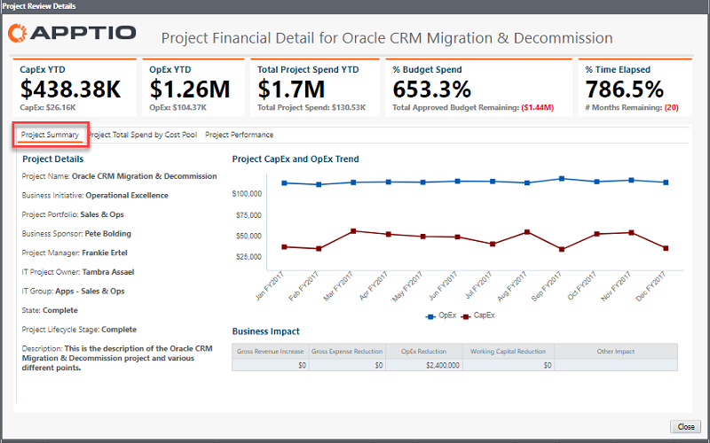
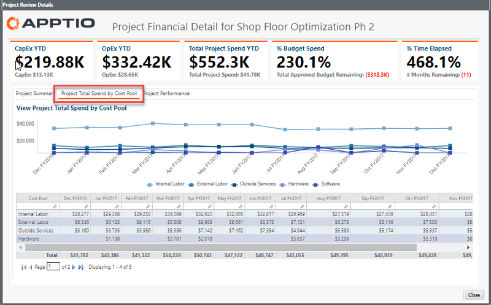
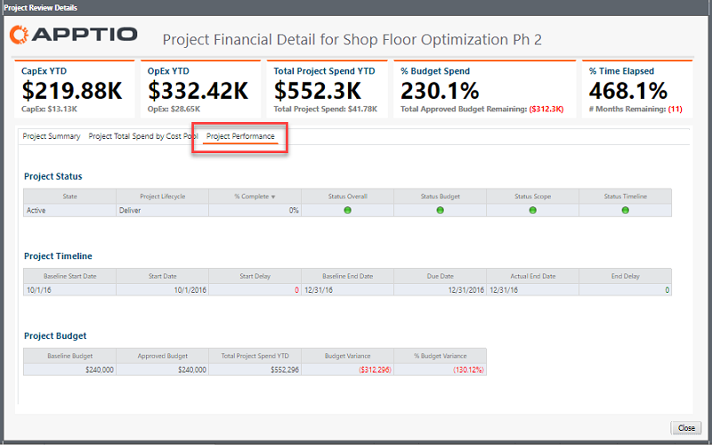

# Project Financial Details dialog

Note: Applies to: Costing Standard on TBM Studio 12.3 and later, with Template v104 and later ([Learn more](ctreportcollections104-plus.html))

This article explains the **Project Financial Details** dialog, which is
available from the [Application Portfolio
report](applicationportfolio.html). Use this report to see the financial details (OpEx and CapEx spend, spend by cost
pool, and overall performance) of your application-related projects.

**Display the dialog:**

1. Log in to Apptio.
2. In the navigation bar, click **Cost Transparency**.

   Note: If you are already logged in, select **Applications** from the
   **Report collection** menu. ([How?](https://community.apptio.com/docs/DOC-6720.html "(Opens in a new tab or window)")
   )
3. In the **Home** page, click **Applications**.
4. In the report collection, click **Application Portfolio**.

   The **Application Portfolio** report opens.
5. In the **Applications Impacted by Projects** panel, click in the bar chart or
   any item in the **Project Name** column of the table.

   The **Project Financial Details** dialog opens with information specific to
   the project you clicked.

## Key elements

The **Project Financial Details** dialog contains the following elements:

**(1) KPIs**

**KPIs** show application-related run costs and usage data YTD:

- **CapExYTD**. This is the current YTD and current month spending for CapEx.
- **OpEx YTD**. This is the current YTD and current month spending for OpEx.
- **Total Project Spend YTD**. This is the YTD and current month spending for the project.
- **% Budget Spend**.This is the percentage of the total approved budget used by the project
  and the project's remaining budget.
- **% Time Elapsed**. This is the percentage of the total estimated length of time for the
  project and the number of months remaining in that estimated timeline.

**(2) Project Summary**

This tab shows project details, the OpEx/CapEx trend, and the business impact for the project in
terms of gross revenue increase, gross expense reduction, OpEx reduction, and working capital
reduction.

**(3) Project Total Spend by Cost Pool**

This tab provides month-by-month trending by cost pool.

**(4) Project Performance**

This tab provides a high-level overview of project status, timeline, and budget.

