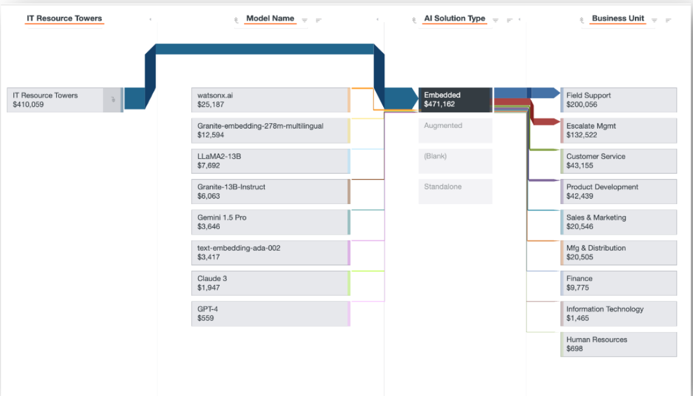

# AI TCO - Model Views

| Key Benefits | Details |
| --- | --- |
| - Visualize cost and usage flow from beginning to end in the cost model​ - Trace the underlying cost drivers feeding into AI TCO including direct costs from the General   Ledger as well as labor and vendor costs​ - Visualize how usage data drives the allocation of AI TCO to the AI solutions​ | **For** : IT Finance, Solution Leaders (App & Service Owners)  **Use Case** : AI Cost Transparency & Allocation |
