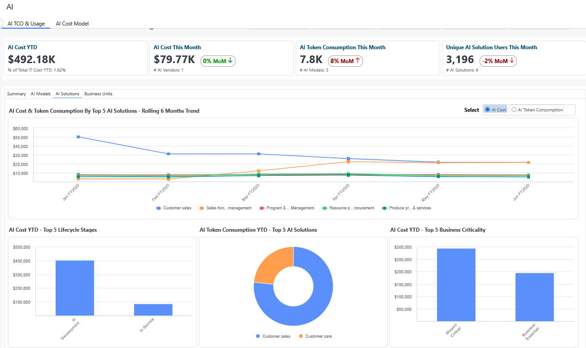
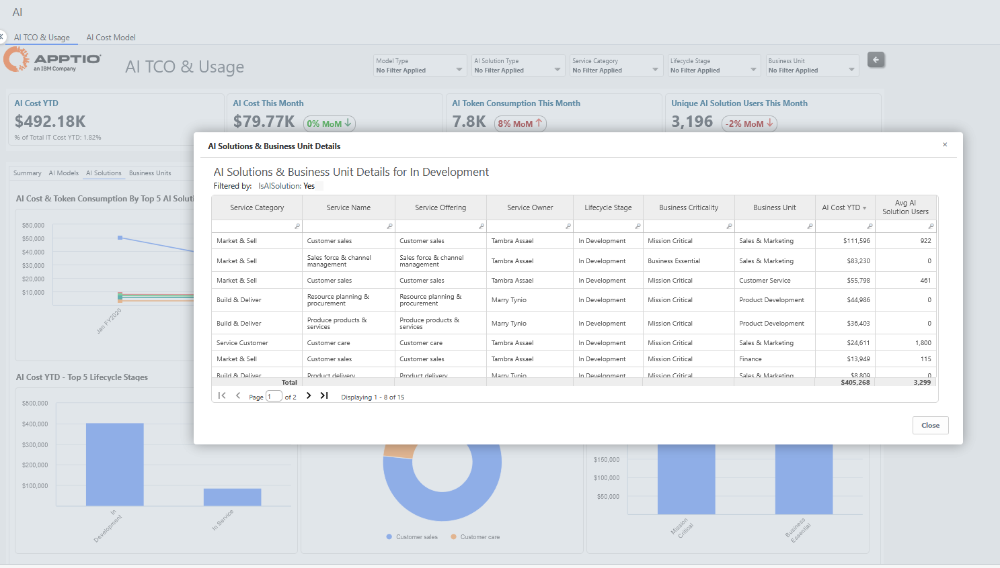
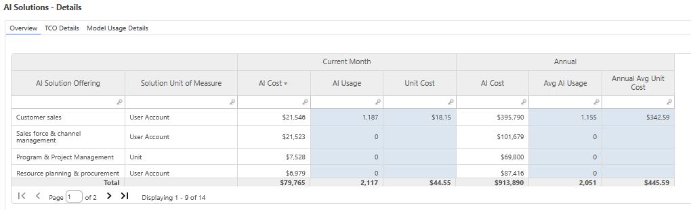

# AI TCO - AI Solutions

| Key Benefits | Details |
| --- | --- |
| - Get AI TCO and cost driver visibility, across cloud, labor, vendor and other AI expenses​ - See the breakdown of AI cost and consumption YTD by:​   - AI lifecycle stage​   - Top AI solutions​   - Business criticality ​ - Understand the AI model consumption by each AI solution​ | **For** : Solution Leaders (App & Service Owners)  **Use Case** : Insights to Optimize AI Spend & Usage |
