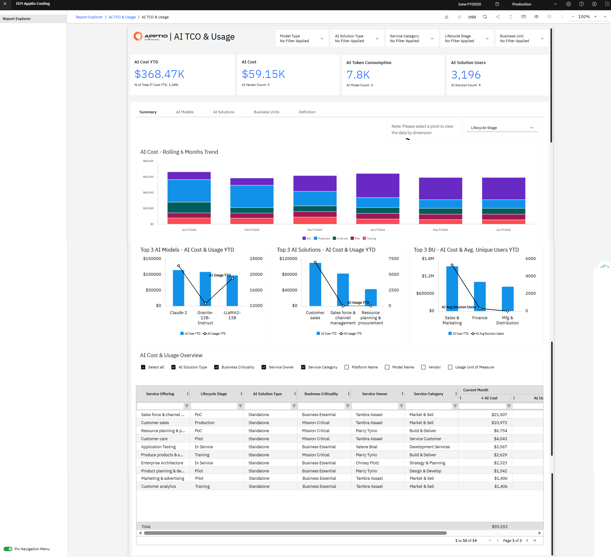
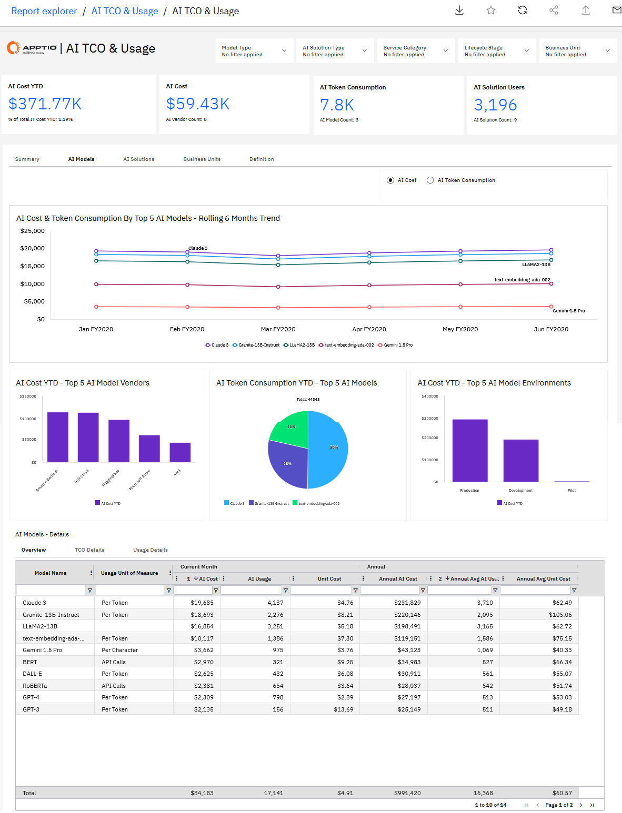
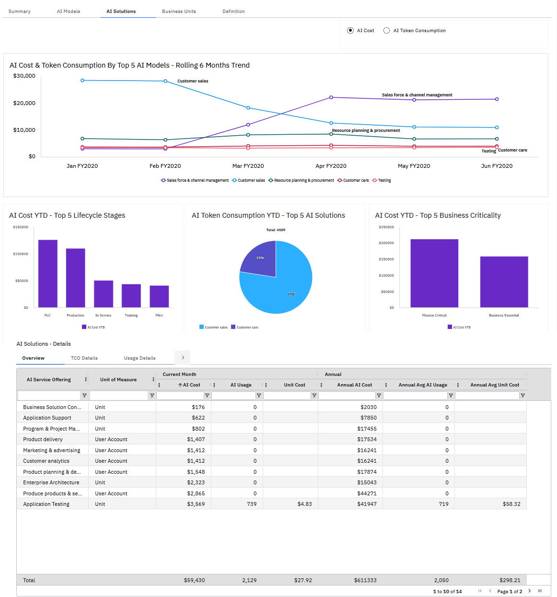
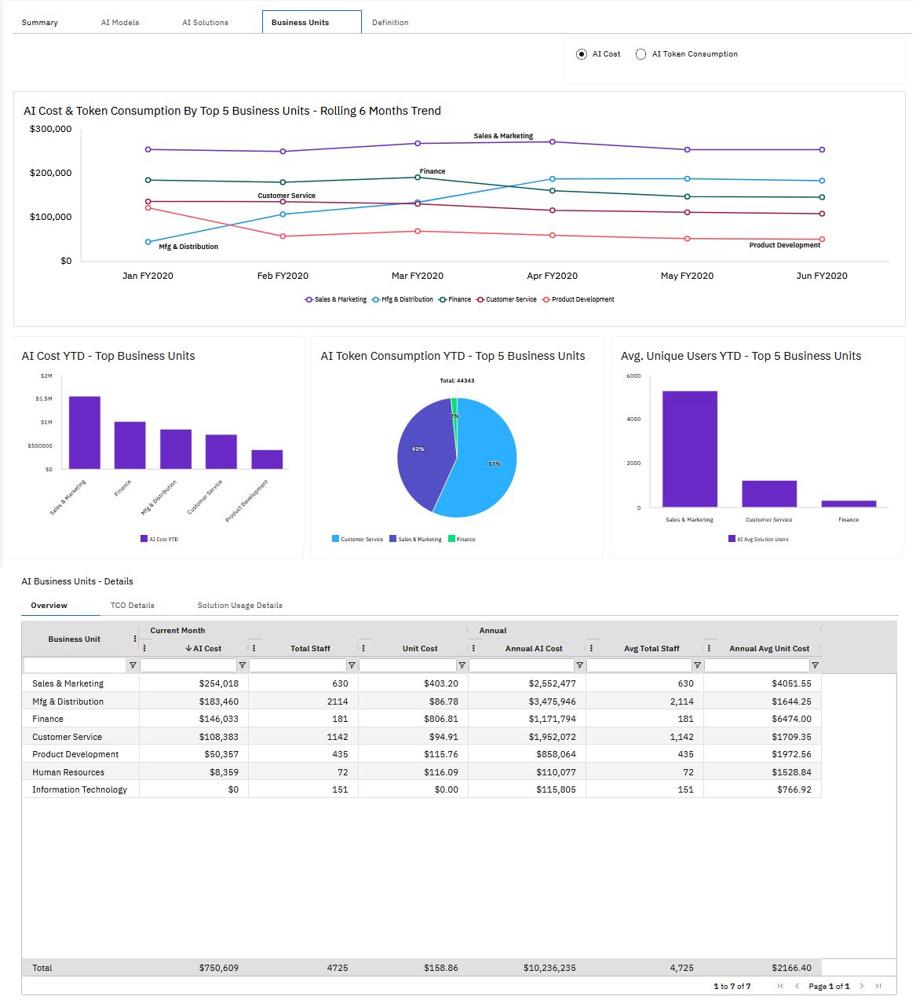
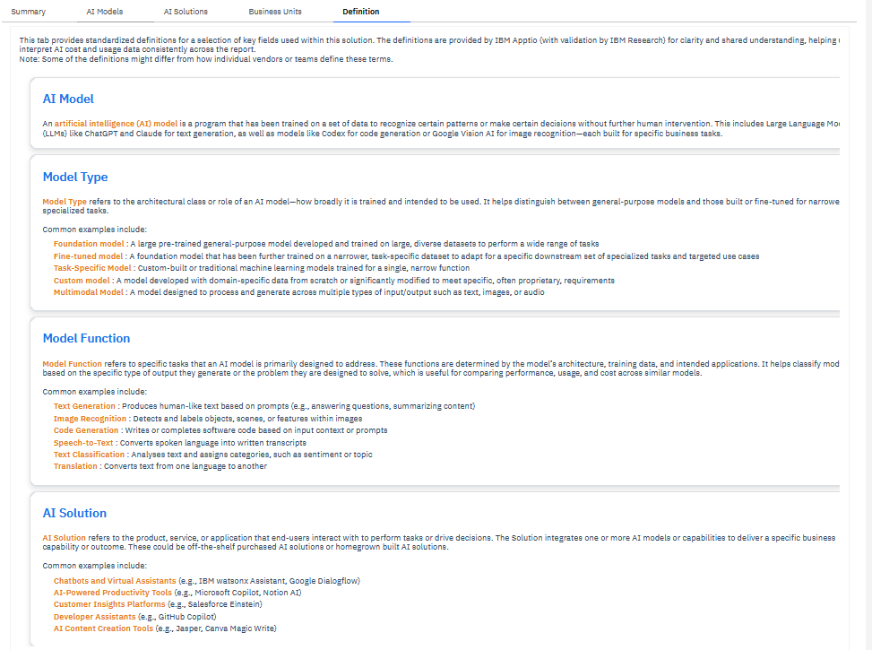

# AI TCO NX Reports

## AI TCO and Usage

The **AI TCO & Usage** report provides a centralized and defensible view of AI costs
and consumption across the organization. By consolidating financial and usage data for AI
models and AI solutions, this report enables organizations to understand total cost of
ownership, monitor adoption patterns, and support responsible scaling of AI investments.

**This report is designed for use by the following roles:**

• C-Suite Executives

• IT and AI Leaders

• Solution Owners (Application and Service Owners)

• Business Unit Leaders

## AI TCO – Summary

• Understand and track total AI cost of ownership (TCO), AI model usage, and AI solution
adoption across the enterprise.

• Compare AI spend as a percentage of total IT spend to assess scale and impact.

• Identify cost versus usage anomalies across top AI models, AI solutions, and business
units to surface early inefficiencies.

For more details on how to use the AI TCO & Usage report, go [AI TCO Summary.](https://www.ibm.com/docs/en/apptio-commercial/costing-standard/saas?topic=reports-ai-tco-summary "(Opens in a new tab or window)")

## AI TCO – AI Models

• Gain visibility into AI model TCO and unit costs across platforms such as Granite,
Llama, and Claude.

• Analyze AI cost and token consumption year-to-date by model vendor, token type, and
model environment.

• Identify opportunities to consolidate or retire AI models with low usage or unfavorable
cost-to-value ratios.

For more details on how to use the AI TCO & Usage report, go [AI TCO & Usage.](https://www.ibm.com/docs/en/apptio-commercial/costing-standard/saas?topic=reports-ai-tco-ai-models "(Opens in a new tab or window)")

## AI TCO – AI Solutions

• Understand AI solution-level TCO and key cost drivers across cloud, labor, vendor, and
other AI expenses.

• Review AI cost and consumption year-to-date by lifecycle stage, business criticality,
and top AI solutions.

• Analyze how AI models are consumed by each AI solution to optimize design, scaling, and
investment decisions.

For more details on how to use the AI TCO & Usage report, go [AI TCO & Usage.](https://www.ibm.com/docs/en/apptio-commercial/costing-standard/saas?topic=reports-ai-tco-ai-solutions "(Opens in a new tab or window)")

## AI TCO – Business Units

• Track AI solution adoption and consumption patterns across business units.

• Identify opportunities to reduce unit costs by consolidating or retiring AI models or AI
solutions.

• Increase transparency of AI costs and usage at the business unit level to encourage
responsible AI consumption.

For more details on how to use the AI TCO & Usage report, go [AI TCO & Usage.](https://www.ibm.com/docs/en/apptio-commercial/costing-standard/saas?topic=reports-ai-tco-business-units "(Opens in a new tab or window)")

