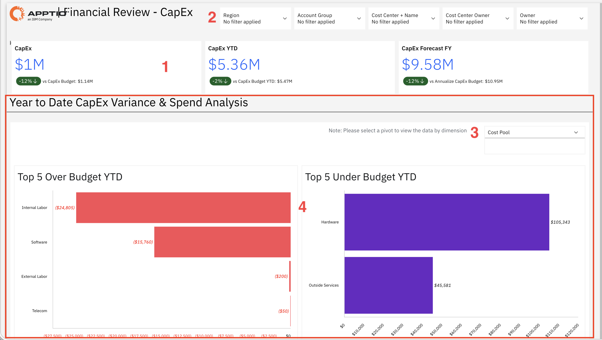
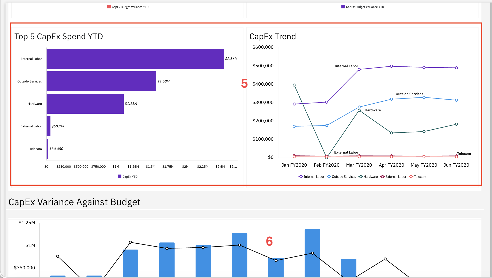
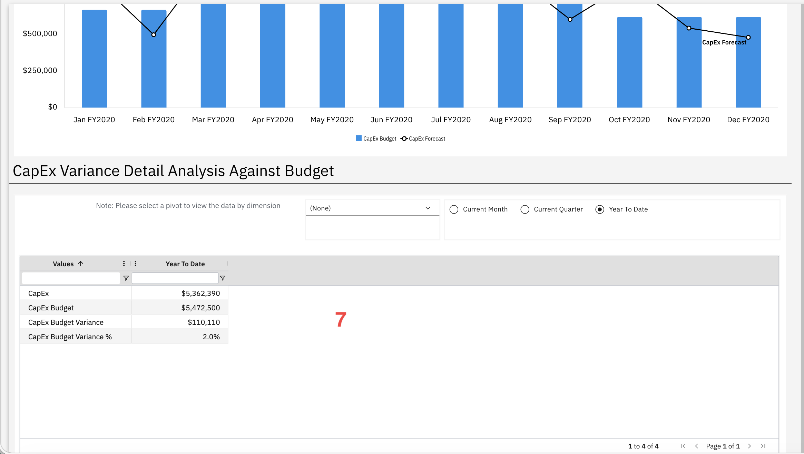

# Financial Review - CapEx

Use this report to analyze year-to-date capital expenses against budget allocations and
identify areas of overspending or cost savings across categories.

This report is designed for use by the following personas:

- CFO
- CIO
- Executive Leadership
- PMO Leaders
- Capital Planning Teams

## Key Elements

| Element | Description |
| --- | --- |
| Key Performance Indicator Cards (1) | Three KPI cards show capital expense, capital expense year to date, and capital expense forecast for the fiscal year. |
| Filter Controls (2) | Five filters let you narrow the report by region, account group, cost center and name, cost center owner, and owner. |
| Dimension Selector (3) | Use this selector to view variance and spending analysis by different dimensions. |
| Top 5 Over Budget YTD Chart (4) | A horizontal bar chart shows the top five categories that are over budget year to date. |
| Top 5 Under Budget YTD Chart (4) | A horizontal bar chart shows the top five categories that are under budget year to date. |
| Top 5 CapEx Spend YTD Chart (5) | A vertical bar chart shows the top five capital expense categories by spend year to date. |
| CapEx Trend Chart (5) | A line chart shows the capital expense trend over time by category. |
| CapEx Variance Against Budget Chart (6) | A combined bar and line chart compares monthly capital expense budget with the capital expense forecast trend. |
| CapEx Variance Detail Analysis Table (7) | This table shows capital expense, capital expense budget, capital expense budget variance, and capital expense budget variance percentage for the selected time period. |

## Questions Answered

- Are we spending as planned on capital projects?
- Which areas are over or under budget?
- Will we fully use our capital budget by year end?
- Are projects progressing as expected based on spending?
- Do under-budget areas indicate delays or risks?
- Are there unexpected costs causing overspending?
- Is our spending aligned with business priorities?
- What is our expected year-end capital position based on current trends?

## Recommended Actions

- Review under-budget categories and check if they indicate project delays or execution
  issues
- Investigate over-budget areas to understand the reasons behind extra spending and take
  corrective action
- Compare spending trends with project timelines to assess project progress and identify gaps
- Evaluate overall capital budget usage and decide if funds need to be reallocated or better
  utilized
- Analyze how capital is distributed across categories to ensure alignment with strategic
  priorities
- Work with project teams to understand variances and plan next steps based on project status
- Update forecasts based on current spending and adjust plans if needed
