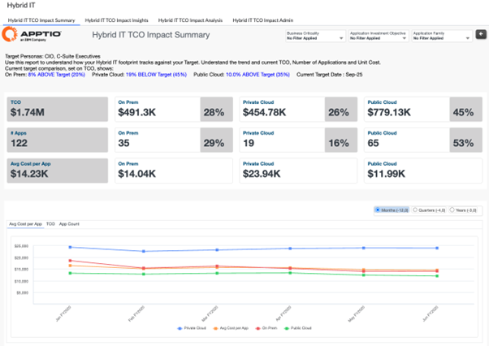
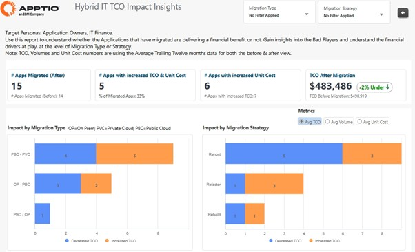
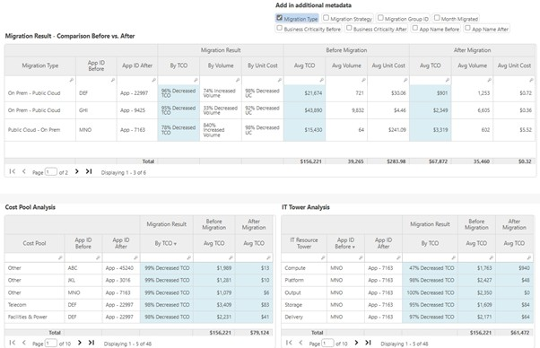

# Hybrid IT TCO Impact Reports

## Hybrid IT Collection Summary

The Hybrid IT collection provides visibility into the cost, scale, and financial impact of
operating applications across on-premises, private cloud, and public cloud environments. It
enables organizations to assess how their current hybrid footprint compares to target
states, evaluate whether application migrations are delivering expected financial outcomes,
and understand the underlying cost drivers influencing migration success or risk. This
collection supports executive decision-making, migration validation, and optimization of
hybrid IT strategies by combining TCO, unit cost, volume, and application-level
insights.

**Reports included in this collection:**

Hybrid IT TCO Impact – Summary

Hybrid IT TCO Impact – Insights

Hybrid IT TCO Impact – Analysis

## **Hybrid IT TCO Impact – Summary**

This report provides a high-level snapshot of your hybrid IT environment, enabling you to
compare the current and historical state of on-premises, private cloud, and public cloud
deployments. It focuses on application-driven metrics to help leaders understand how cost,
scale, and mix of the hybrid environment align with defined target states and migration
strategies.

**This report is designed for use by the following roles:**

• CIOs and C-Suite Executives

• Application Owners

• IT Finance and IT Leadership

**Insights Provided:**

• View total cost of ownership, application count, and average cost per application across
on-premises, private cloud, and public cloud environments

• Track hybrid IT metrics over time and compare current versus target hybrid footprint

• Understand the percentage distribution of applications across hybrid environments

• Analyze hybrid mix by application attributes such as business criticality, investment
objective, and application family

• Identify misalignment between actual deployment state and intended hybrid strategy

• Support executive-level discussions on migration progress and hybrid IT optimization

For more details on how to use the Hybrid IT TCO Impact – Summary report, go [here.](https://www.ibm.com/docs/en/apptio-commercial/costing-standard/saas?topic=reports-hybrid-it-tco-impact-summary "(Opens in a new tab or window)")

## **Hybrid IT TCO Impact – Insights**

This report enables detailed analysis of the financial impact of application migrations
across your hybrid IT environment. It helps stakeholders understand whether migrations are
delivering the expected cost benefits by comparing pre- and post-migration total cost of
ownership (TCO), unit costs, and volumes across different migration paths and
strategies.

**This report is designed for use by the following roles:**

• C-Suite Executives

• Application Owners

• IT Finance Teams

**Insights Provided:**

• Identify applications where total cost of ownership or unit cost increased after
migration

• Understand migration distribution by migration type (for example, On-Prem to Public
Cloud, Public Cloud to Private Cloud, Private Cloud to On-Prem)

• Analyze migration patterns by migration strategy such as Rehost, Refactor, Rebuild, or
Replatform

• Track how many applications are delivering financial benefits versus drawbacks over
time

• Analyze trends in average TCO, volumes, and unit costs by migration type, migration
strategy, and application

• Support validation of migration business cases and corrective actions for
underperforming migrations

For more details on how to use the Hybrid IT TCO Impact – Insights report, go [here.](https://www.ibm.com/docs/en/apptio-commercial/costing-standard/saas?topic=reports-hybrid-it-tco-impact-insights "(Opens in a new tab or window)")

## **Hybrid IT TCO Impact – Analysis**

This report provides a detailed, application-level view of the financial drivers behind
hybrid IT migration outcomes. It enables stakeholders to compare pre- and post-migration
costs and understand which cost pools and IT resources are driving changes in total cost of
ownership, unit costs, and volumes.

**This report is designed for use by the following roles:**

• Application Owners

• IT Finance Teams

**Insights Provided:**

• Compare pre- and post-migration financial drivers contributing to changes in application
TCO

• Analyze how application-level TCO, unit costs, and consumption volumes have changed
following migration

• Identify cost pools (such as labor, fixed assets, and vendors) driving financial
increases or savings

• Understand the impact of IT towers and sub-towers as resource drivers behind migration
outcomes

• Isolate specific applications where cost drivers are creating financial benefits or
drawbacks

• Support root-cause analysis to validate migration business cases and guide corrective
actions

For more details on how to use the Hybrid IT TCO Impact – Analysis report, go [here.](https://www.ibm.com/docs/en/apptio-commercial/costing-standard/saas?topic=reports-hybrid-it-tco-impact-analysis "(Opens in a new tab or window)")
