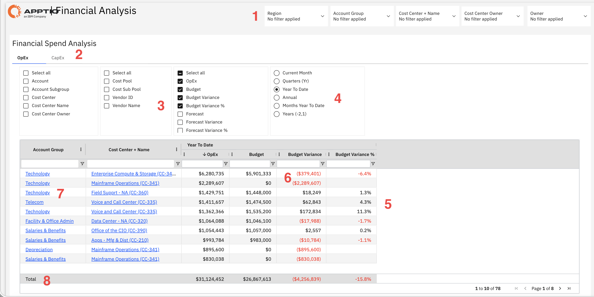

# Financial Analysis

Use this report to monitor spending, evaluate budget performance, and understand cost
trends across different cost centers, account groups, and time periods. Filters and column options
help you focus on the data relevant to your analysis.

This report is designed for use by the following personas:

- Financial Controllers
- Cost Center Owners
- Finance Analysts
- CFO
- Budget Planners

## Key Elements

| Element | Description |
| --- | --- |
| Filter Controls (1) | Five filters let you narrow the report by region, account group, cost center and name, cost center owner, and owner. |
| Spend Type Tabs (2) | Tabs switch between operating expense and capital expense views. |
| Dimension Configuration Panel (3) | This panel lets you show or hide row dimensions, column dimensions, and metrics in the table. |
| Time Period Selectors (4) | Use these controls to view report data by reporting period, including current month, quarter, year to date, annual, monthly year to date, and multi-year views. |
| Financial Spend Table (5) | This table includes columns such as account group, cost center and name, year-to-date operating expense, budget, budget variance, and budget variance percentage. |
| Variance Color Coding (6) | Color coding indicates budget variance status in the table. |
| Cost Center Drill-down Links (7) | Cost center names link to more detailed spending information for the selected cost center. |
| Total Summary Row (8) | The bottom row shows totals for year-to-date operating expense, budget, budget variance, and budget variance percentage. |

## Questions Answered

- How does our total spending compare to the budget so far?
- Which cost centers are over or under budget, and by how much?
- Are we on track to meet our overall budget targets?
- Where is most of the spending happening across cost centers or account groups?
- What is the split between OpEx and CapEx spending?
- Which areas show the biggest variances that need attention?
- Are there any cost centers with spending but no allocated budget?
- How does current spending compare with forecasts and expected year-end numbers?

## Recommended Actions

- Investigate cost centers with high negative variances and identify the reasons for
  overspending
- Drill down into detailed data to understand what is driving significant variances
- Work with cost center owners to review issues and define corrective actions
- Review spending in areas with no allocated budget and validate if it is justified
- Analyze under-budget areas to identify possible savings or opportunities to reallocate
  funds
- Review both OpEx and CapEx to ensure spending is categorized correctly and aligned with
  priorities
- Compare data across time periods to spot unusual changes or trends and update forecasts
  accordingly
