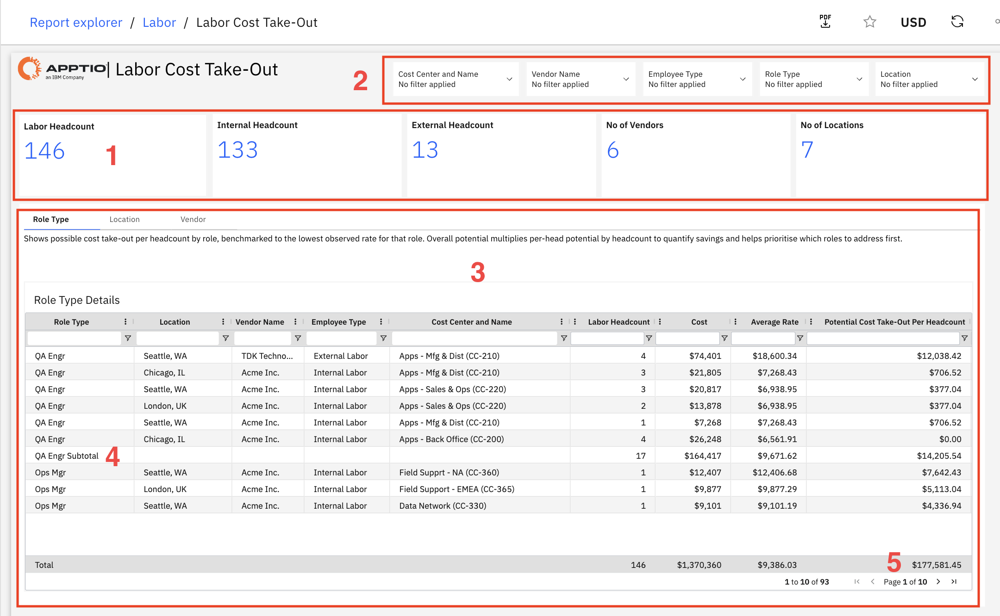

# Labor Cost Take-Out

Use this report to identify potential labor cost savings by comparing current rates
against the lowest observed rate for each role type and prioritizing high-impact cost reduction
opportunities.

This report is designed for use by the following personas:

- Business Leaders
- Procurement Teams
- Resource Managers
- HR Leaders
- Finance Teams

## Key Elements

| Element | Description |
| --- | --- |
| Summary KPI Cards (1) | Five summary cards show labor headcount, internal headcount, external headcount, number of vendors, and number of locations. |
| Filter Controls (2) | Five filters let you narrow the report by cost center and name, vendor name, employee type, role type, and location. |
| Role Type Details Table (3) | This table includes columns such as role type, location, vendor name, employee type, cost center and name, labor headcount, cost, average rate, and potential cost take-out per headcount. |
| Subtotals by Role Type (4) | Subtotal rows show aggregated values for each role type. |
| Grand Total Row (5) | The bottom row shows totals across all roles. |

## Questions Answered

- How do labor costs compare across locations for the same role?
- Which option is more cost-effective—internal employees or vendor resources?
- How do vendor rates differ for similar roles?
- Which locations offer the lowest-cost options for specific roles?
- Where can we achieve the highest cost savings across roles or cost centers?
- Which roles have the greatest savings potential per resource?
- Which vendors offer the most competitive rates?
- Where should we focus hiring or shift work to reduce costs effectively?

## Recommended Actions

- Focus on roles and areas with the highest savings potential to maximize impact.
- Review location-based cost differences and identify opportunities to shift work to lower-cost
  regions.
- Compare vendor rates and consider consolidating work with more cost-effective vendors.
- Evaluate internal versus external resource costs to guide hiring and contracting decisions.
- Assess feasibility before making changes, considering skills, timelines, and business
  needs.
- Use cost data to support vendor negotiations and improve rates.
- Track progress regularly to ensure planned cost savings are achieved.
