# Mainframe TCO Configuration Guide

## Component Install

The core of the Mainframe TCO & Usage solution is introduced via BI- Mainframe Insights
component. For new customers, the typical components, such as Cost Source, Labor, Vendor,
Fixed Assets, Applications etc. would also need to be installed, in accordance with the
overall intended architecture. Existing customers can re-use the previously installed
components without any changes.Before installing the components, refer to the next section
on architecture to ensure proper consideration, whether to install them in an existing
project or create a new project for the Mainframe TCO & Usage solution. What follows is
an overview of the 4 components, in the prioritized order to consider and install them.

**Prerequisites**

The prerequisites for the Mainframe TCO & Usage solution are:

- IBM Apptio Costing Standard license
- IBM Apptio Server Version: R12.11.17 (or higher), Beta Version – R12.11.16 (or
  higher)
- Components Version v120 in Project Settings.

**Configure Mainframe Object in the existing Cost Transparency project**. These changes
need to be done in TBM Studio

1. Go to the Components icon under Project tab and install the BI-Mainframe Insights
   component.

   
2. Install the component CT Apps- Applications.

   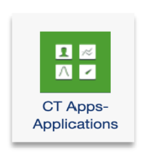

   Note: For the component BI-Mainframe Insights, two components must be
   pre-installed and configured.
   - CTF-Cost Source
   - CTF- IT Tower

   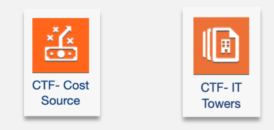
3. Check in the changes.

## Architecture

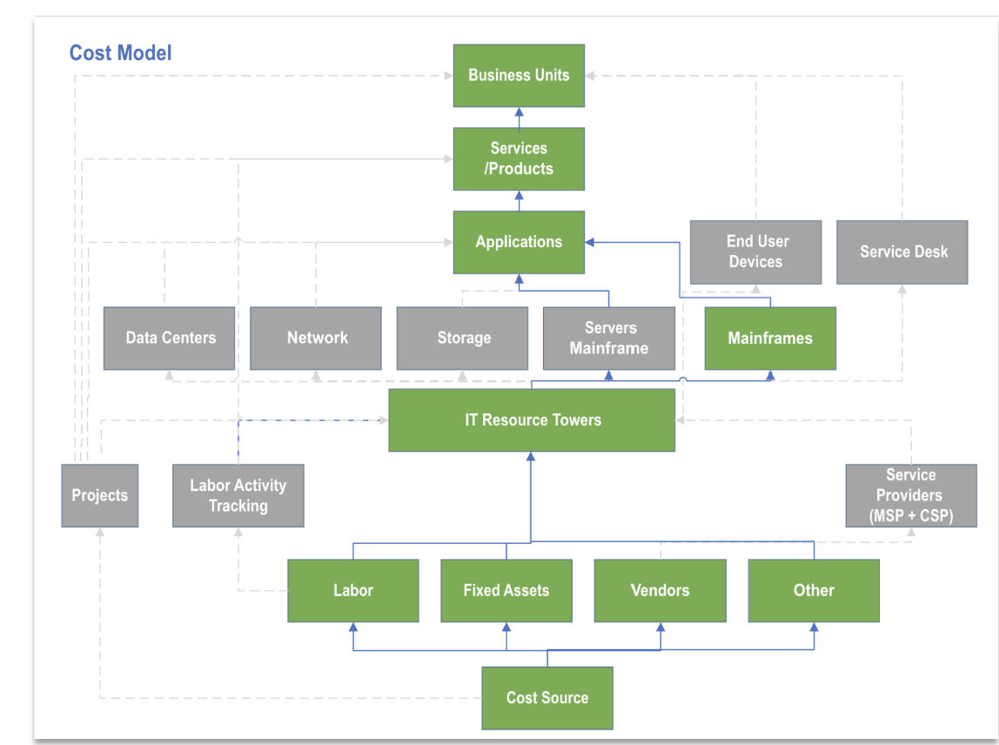

The Cost Model allocation line describes the Mainframe solutions cost flowing from Cost Source to
Labor/Vendor/Fixed Assets/other cost pools to IT Resource Towers to Mainframes to Applications to
Business Services to Business Unit. All greyed out and dotted lines show that these objects are not
a part of the Mainframe TCO solution.

Lineage flow

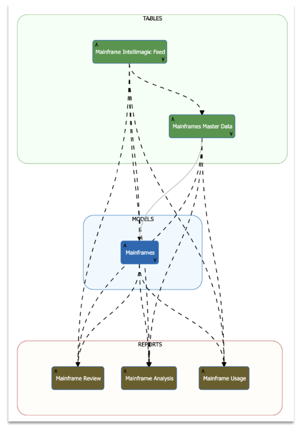

## Configurations

These changes need to be done in TBM Studio

**Datasets**

1. Load the data received from Intellimagic tool as input file under the ‘**Mainframes**’
   category. Create a ‘**Weighting**’ column using a custom formula.

   Note:
   - In Apptio, Weighting distributes costs across dimensions like Applications, Labor and Vendor.
     It’s based on: MSU + (zIIP \* 0.3), ensuring fair cost allocation based on usage.
   - You have the flexibility to alter the formula based on their MSU weightage preference. Here the
     weighting is based on the sum of 100% of GCP MSU consumption and 30% of zIIP MSU Consumption.

   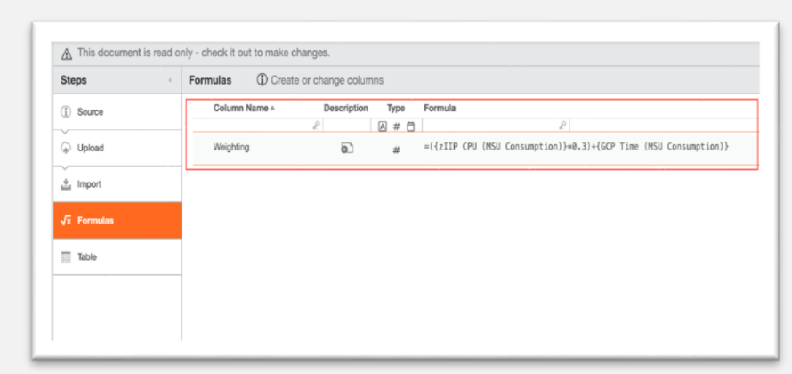
2. Select **Save** and Check in the changes.
3. Map the Intellimagic dataset to Mainframe Intellimagic Feed.

   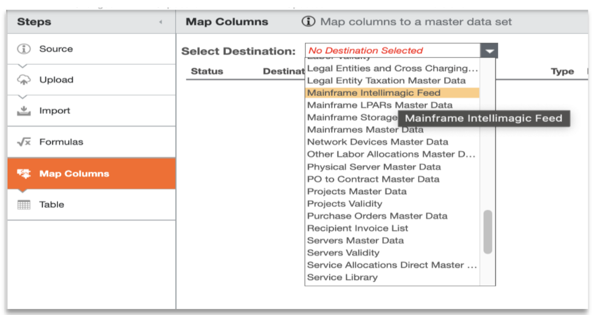
4. Map the relevant fields from the Input file to Mainframe Intellimagic Feed table as shown
   below.

   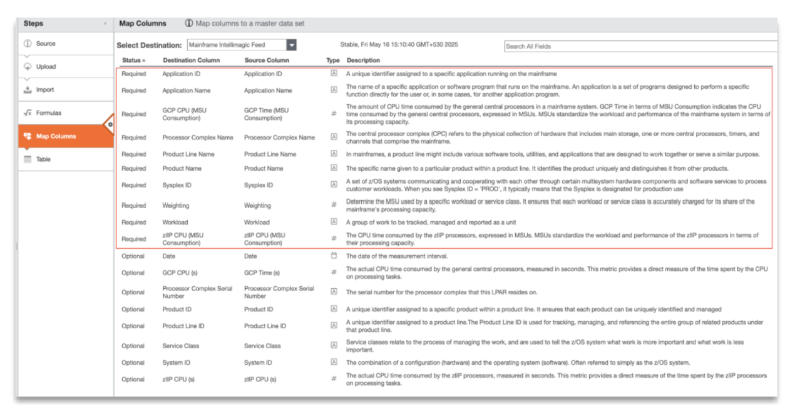
5. Select **Save** and Check in the changes.

   Note: The Mainframe Intellimagic Feed Table should
   be reviewed to ensure it is properly mapped to the Mainframe Master Table, with all necessary
   transformations created through custom formulas.Additionally, if any new custom fields are added,
   they must also be included in the mapping accordingly.

   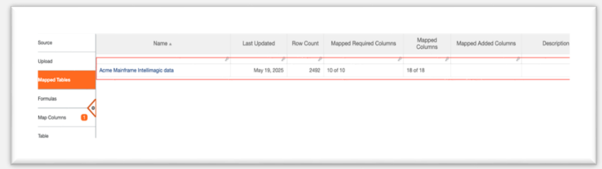

     

   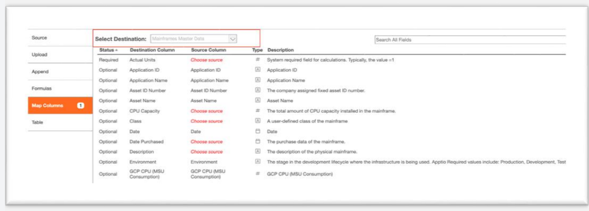
6. Cost allocation from IT Resource Tower to Mainframe.
   - Select Metric Cost from Select a metric drop down.
   - From the model, select **Distributing** > **By Weighting** section and choose the
     **Weighting** column from the Mainframe Master Data.

     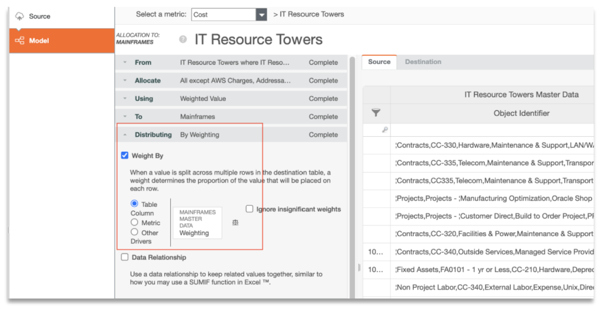
   - Cost Allocation from IT Resource Towers to Mainframes completed.

     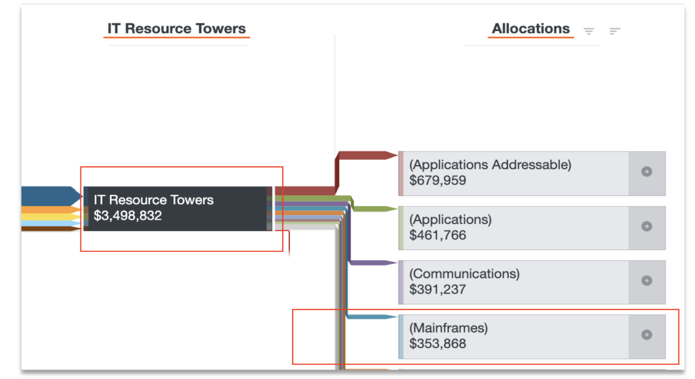
7. Select Save and Check in the changes.
8. GCP MSU allocation to Mainframe.
   - From Model, select the metric as GCP MSU and then click on the **Add Unit Driver**

     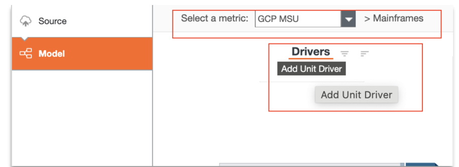
   - Use the column **GCP CPU (MSU Consumption)** to populate the driver and name the driver as
     **GCP MSU Unit Driver**.

     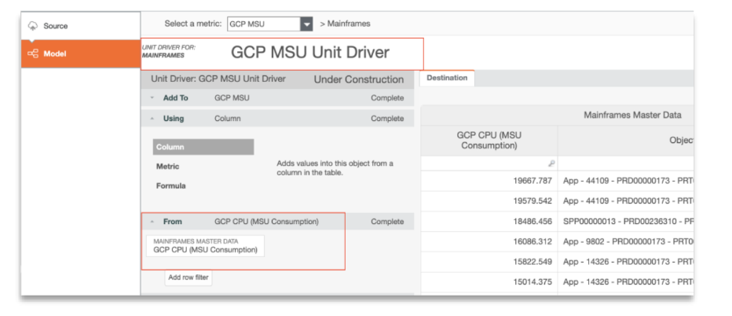
   - Select **Save** and Check in the changes to populate GCP MSU data into the Mainframes
     object.

     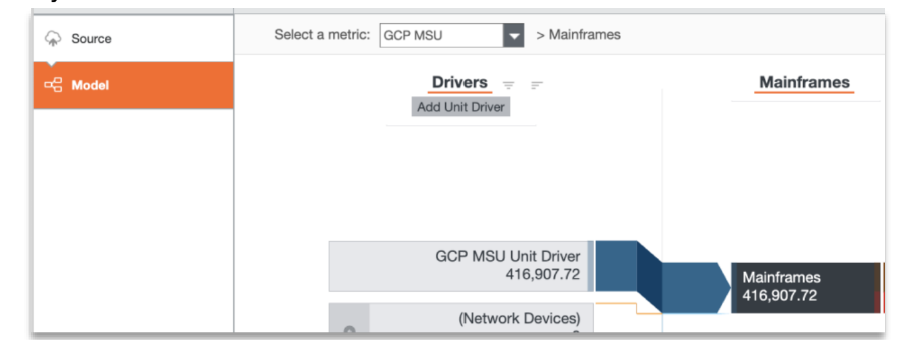

   Note: GCP MSUs are unit drivers specific to Mainframes object and should be allocated only from
   Mainframe. This allocation should be removed manually if allocation exists from any other objects.

   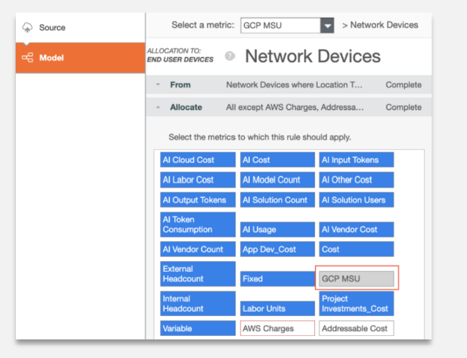
9. zIIP MSU allocation to Mainframe
   - From the Model, select the metric as zIIP MSU and then click on the **Add Unit Driver**

     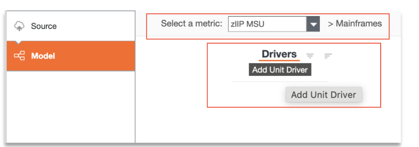
   - Use the column **zIIP CPU (MSU Consumption)** to populate the driver and name the driver as
     zIIP MSU Unit Driver.

     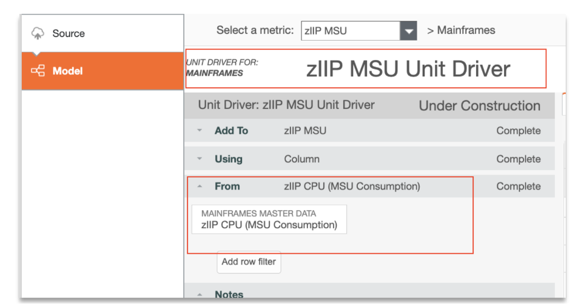
   - Select **Save** and Check in the changes to populate zIIP MSU data into the Mainframes
     object.

     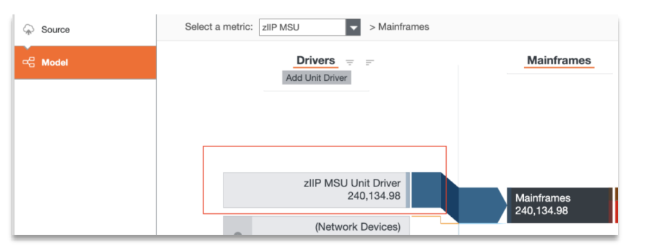

     Note: zIIP MSUs are unit drivers that are specific to Mainframes object and should be
     allocated only from Mainframe. This allocation should be removed manually if allocation exists from
     any other objects.

     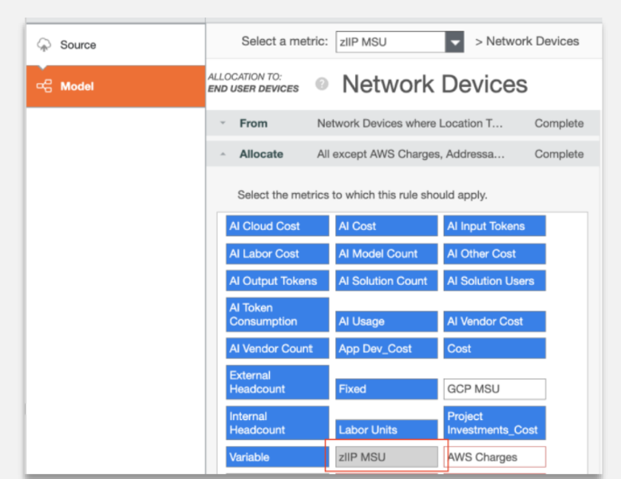
10. Cost allocation from Mainframe to Application.
    - Select Metric Cost and then select GCP MSU and zIIP MSU metrics.
    - Click on the **Add allocation** option and choose the **Applications** object as a
      destination.

      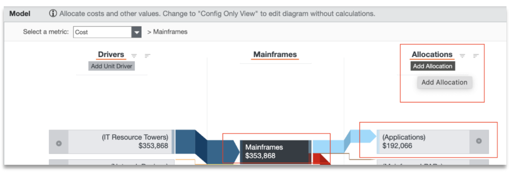
    - Under Distribution section, Select Data Relationship checkbox and then map the source and
      destination by Application ID.

      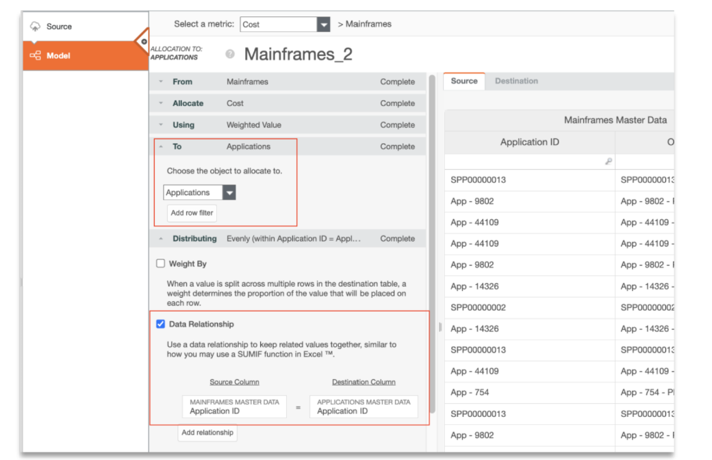
    - Select **Save** and Check in the changes.

## Reporting

Mainframe component has four out-of-the-box reports.

- **Mainframe TCO**
  - Comprehensive view of total cost and consumption by combining costs and GCP/zIIP MSUs in one
    screen.
  - Understand cost and usage trends over time and compare to business volumes and transactional
    unit costs to identify inefficiencies and anomalies.
  - Break down key cost drivers across labour, vendors, and applications—including spend by role,
    vendor type, and application investment objective.
  - A Drill report is available in the “Application” tab to have further detail on the selected
    application.
  - The drill report has two tabs
    - **Cost**: Comparison between Cost and Consumption based on the selected category, monthly are
      shown in detail for the selected application.
    - **Unit Metric:** Shows the detailed background of the selected application like “Application
      Family”, “Investment objective” etc. along with the comparison of two business metrics over months.

    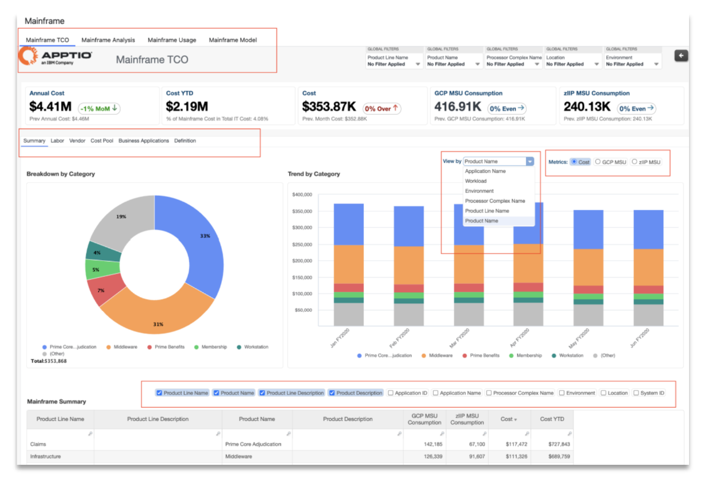
- **Mainframe Analysis**
  - View mainframe costs and consumption in a flexible table format using filters and optional
    dimensions, metrics, and time.
  - View consumption of both GCP and zIIP MSU and compare different types of workload processing.
  - Analyse trends across various time periods - monthly, quarterly, or as needed for
    reporting.

  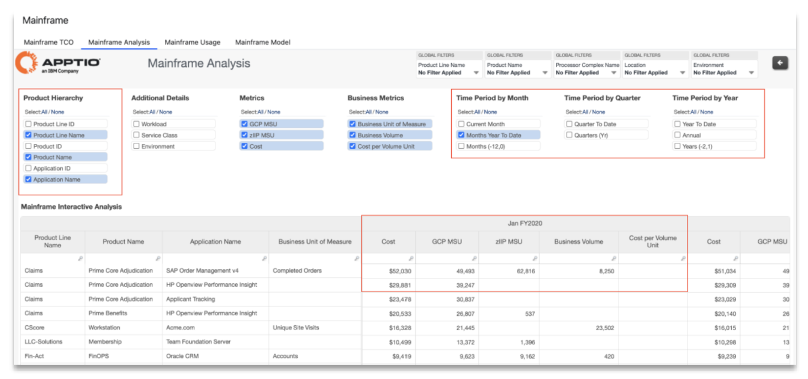
- **Mainframe Usage**
  - View MSU consumption trends by workload category, helping users track usage across different
    types of processing.
  - Track usage by workload type, product line name, product name, and application name.
  - Monitor month-over-month MSU consumption with conditional highlights identifying significant
    month-over-month changes.
  - Quarter-over-quarter and year-over-year views help understand long-term consumption trends.

  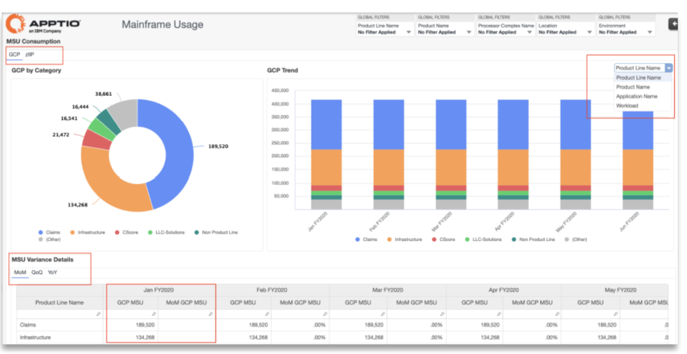
- **Mainframe Model**
  - Visualize cost flow from beginning to end in the cost model.
  - Trace the underlying cost drivers feeding into the mainframe processor including direct costs
    from the General Ledger (e.g., depreciation) as well as labour and vendor costs.
  - Visualize how usage data drives the allocation of mainframe TCO to the business
    applications.

  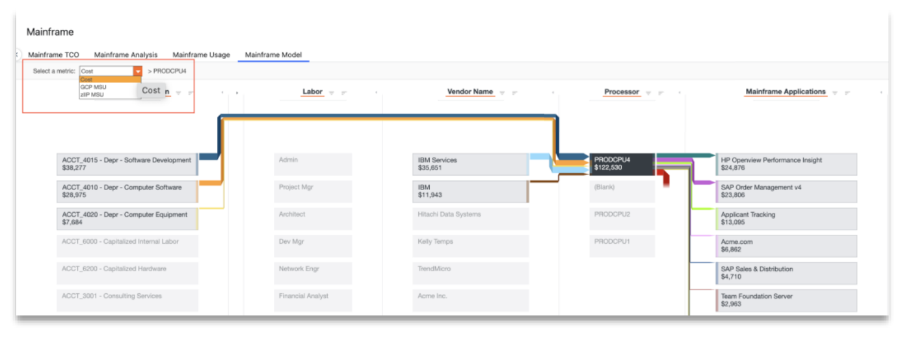
