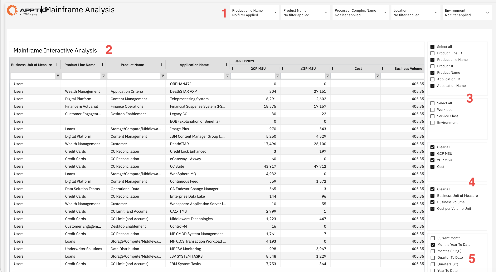

# Mainframe Analysis

Use this report to understand resource consumption patterns, assess usage across product
lines, applications, and business units, and identify cost trends for capacity planning and
optimization. Apply filters and available views to focus on the data relevant to your analysis and
support effective resource allocation decisions.

This report is designed for use by the following personas:

- Mainframe Capacity Planners
- IT Financial Managers
- Application Owners
- System Administrators

## Key Elements

| Element | Description |
| --- | --- |
| Filter controls (1) | Five filters let you narrow the report by product line name, product name, processor complex name, location, and environment. |
| Mainframe interactive analysis table (2) | This table shows mainframe usage data with columns such as business unit of measure, product line name, product name, application name, GCP MSU, zIIP MSU, cost, and business volume. You can drill down and filter the data. |
| Column selection panel (3) | This panel lets you show or hide columns in the table, such as product line ID, product line name, product ID, product name, application ID, application name, workload, service class, and environment. |
| Metric selection panel (4) | This panel lets you select which metrics to display in the table, such as GCP MSU, zIIP MSU, Cost, Business Volume, Business Unit of Measure, and Cost per Volume Unit. |
| Time period selector (5) | Shows the reporting period. Use this control to select different time periods. |

## Questions answered

- Which applications consume the most mainframe resources across your organization?
- How does resource usage vary between different product lines and business units?
- What is the cost breakdown for mainframe usage by application and product?
- How much processing capacity is being used by general-purpose processors versus specialized zIIP
  processors?
- Which applications might benefit from workload optimization or migration to zIIP
  processors?
- How can you allocate mainframe costs accurately to different business units for chargeback
  purposes?
- What trends in resource consumption can help you plan for future capacity needs?

## Recommended Actions

- Filter the data by product line, product name, or application to focus on specific areas of
  interest.
- Export the analysis results to share with stakeholders or perform additional analysis in
  external tools.
- Compare resource usage across different time periods to identify trends and seasonal
  patterns.
- Identify applications with high GCP MSU usage that might be candidates for zIIP processor
  migration.
- Review applications with unusually high costs and investigate opportunities for
  optimization.
- Set up regular monitoring schedules to track resource consumption and cost trends over
  time.
- Collaborate with application owners to discuss findings and develop optimization
  strategies.
