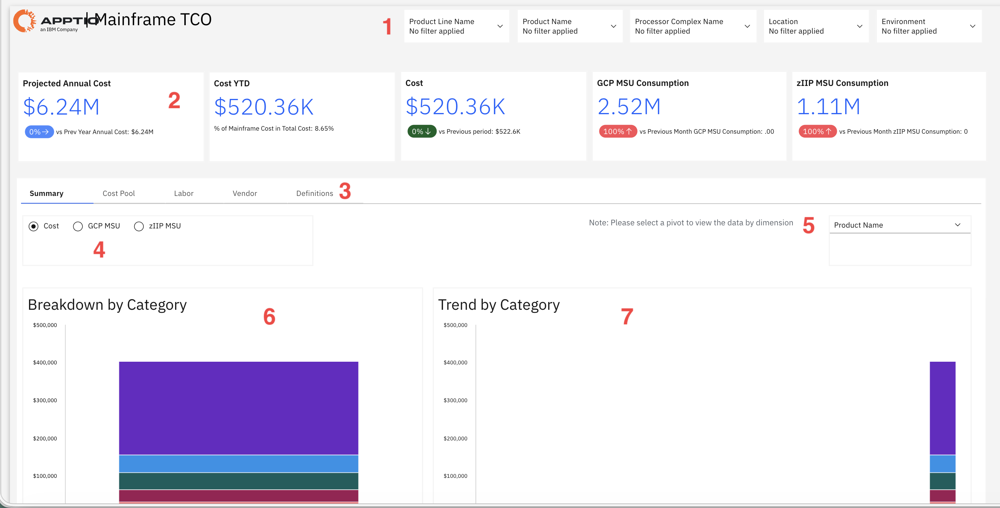
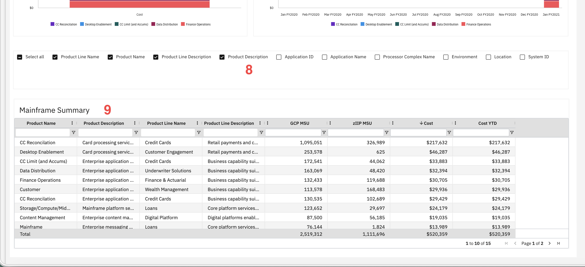

# Mainframe TCO

Use this report to understand mainframe costs, evaluate spending across categories and
time periods, and identify cost trends to support budgeting and investment decisions. Apply filters
and available views to focus on the data relevant to your analysis.

This report is designed for use by the following personas:

- Chief Financial Officers
- IT Finance Managers
- Mainframe Operations Managers
- Enterprise Architects

## Key elements

| Element | Description |
| --- | --- |
| Filter controls (1) | Five filters let you narrow the report by product line name, product name, processor complex name, location, and environment. |
| Key metrics cards (2) | Five cards show projected annual cost, cost year to date, cost, GCP MSU consumption, and zIIP MSU consumption. Each card includes comparison indicators showing changes from previous periods. |
| Navigation tabs (3) | Five tabs let you switch between Summary, Cost Pool, Labor, Vendor, and Definitions views. |
| Metric selector (4) | Use these radio buttons to select which metric to display in the charts: Cost, GCP MSU, or zIIP MSU. |
| Dimension selector (5) | Use this dropdown to select which dimension to view in the charts, such as Product Name. |
| Breakdown by category chart (6) | This stacked bar chart shows the breakdown of the selected metric by category, such as CC Reconciliation, Desktop Enablement, CC Limit, Data Distribution, and Finance Operations. |
| Trend by category chart (7) | This stacked area chart shows the trend of the selected metric over time by category, with monthly data points from January FY2020 to January FY2021. |
| Column selection panel (8) | This panel lets you show or hide columns in the table, such as Product Line Name, Product Name, Product Line Description, Product Description, Application ID, Application Name, Processor Complex Name, Environment, Location, and System ID. |
| Mainframe summary table (9) | This table shows mainframe data with columns such as product name, product description, product line name, product line description, GCP MSU, zIIP MSU, cost, and cost year to date. The table includes a total row and pagination controls. |

## Questions answered

- What is the projected annual cost for mainframe operations based on current spending?
- How does current spending compare to previous periods?
- Which cost categories contribute most to total mainframe expenses?
- How are GCP MSU and zIIP MSU consumption levels trending over time?
- What is the cost breakdown by product line and product?
- Which products or categories show increasing or decreasing cost trends?
- How much of the mainframe cost is attributed to each business capability?

## Recommended Actions

- Review the projected annual cost and compare it to your budget allocation.
- Analyze cost trends by category to identify areas with unexpected increases.
- Filter by product line or product name to focus on specific cost areas.
- Compare GCP MSU and zIIP MSU consumption to identify workload optimization opportunities.
- Export the summary data to share with finance and operations teams.
- Set up regular monitoring to track cost trends and consumption patterns.
- Investigate products with high costs to determine if optimization or modernization is
  needed.
