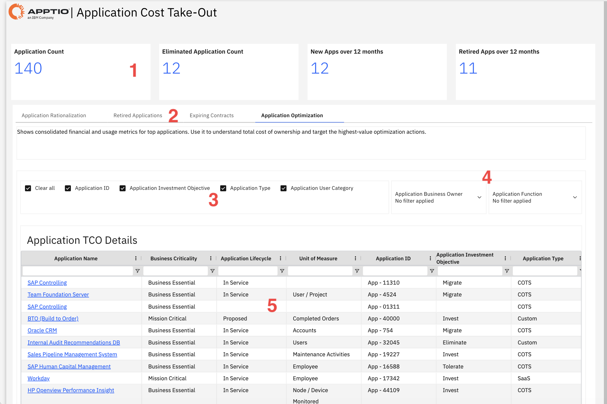

# Application Cost Take-Out

Use this report to identify cost optimization opportunities across the application
portfolio, focusing on rationalization candidates, expiring contracts, and applications targeted for
elimination or migration.

This report is designed for use by the following personas:

- CIO
- Application Portfolio Managers
- IT Financial Controllers
- Enterprise Architects
- Business Unit Leaders

## Key Elements

| Element | Description |
| --- | --- |
| Summary Cards (1) | Four summary cards show application count, eliminated application count, new applications over 12 months, and retired applications over 12 months. |
| Tab Navigation (2) | Tabs switch between Application Rationalization, Retired Applications, Expiring Contracts, and Application Optimization views. |
| Column Selector Check boxes (3) | Use these checkboxes to show or hide available columns in the table. |
| Filter Options (4) | Two filters let you narrow the report by application business owner and application function. |
| Application TCO Details Table (5) | The table includes columns such as application name, business criticality, application lifecycle, unit of measure, application ID, application investment objective, and application type. |

## Questions Answered

- Which applications should we eliminate to reduce costs?
- How many applications have we retired versus added in the past year?
- Which apps are marked for migration and what will that cost?
- What is the investment objective (Migrate, Invest, Eliminate, Tolerate) for each
  application?
- Which mission-critical apps consume the most resources?
- Are we investing in the right applications based on business criticality?
- Which applications are COTS versus Custom versus SaaS?

## Recommended Actions

- Review the 12 applications marked with "Eliminate" investment objective and create
  decommissioning plans to realize cost savings.
- Check applications with "Migrate" objective to understand migration costs and timelines,
  ensuring they align with your cloud or modernization strategy.
- Filter by Business Criticality to ensure Mission Critical apps have "Invest" objectives while
  lower-value apps are set to "Tolerate" or "Eliminate".
- Compare the number of new apps (12) versus retired apps (11) to assess if your portfolio is
  growing or shrinking as intended.
- Click on application names to view detailed TCO breakdowns and identify specific cost drivers
  for high-spend applications.
- Use the Application Type column to identify Custom applications that might be replaced with COTS
  or SaaS alternatives for cost savings.
- Review applications with "Tolerate" objective to determine if they should be upgraded to
  "Invest" or downgraded to "Eliminate" based on current business needs.
