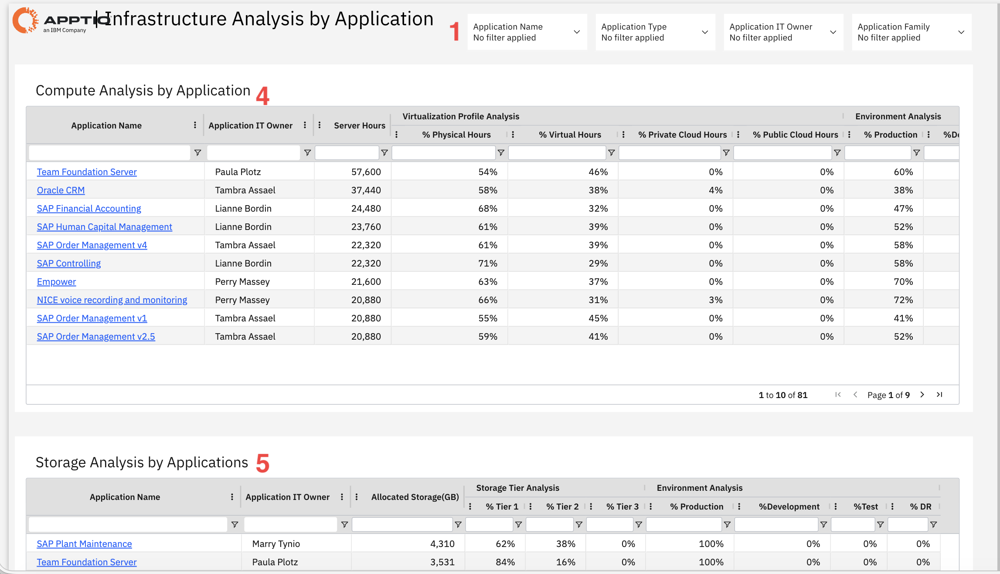
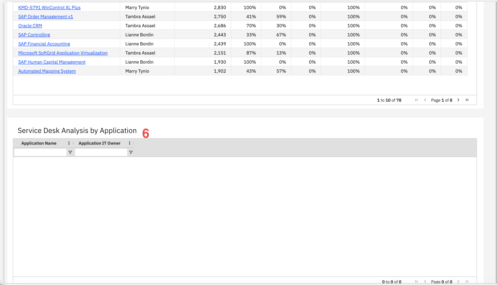
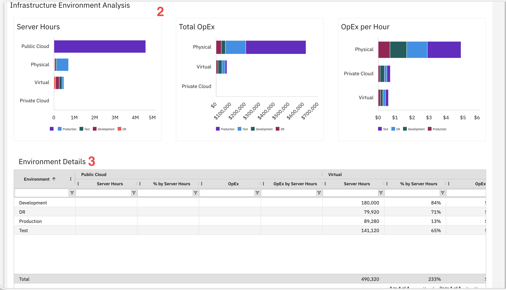

# Infrastructure Analysis by Application

Use this report to analyze infrastructure resource usage across applications, including
compute, storage, and environment distribution, identifying optimization opportunities for physical,
virtual, and cloud resources.

This report is designed for use by the following personas:

- Infrastructure Managers
- Application Owners
- IT Financial Controllers
- Cloud Architects
- Capacity Planners

## Key Elements

| Element | Description |
| --- | --- |
| Filter controls (1) | Four filters let you narrow the report by application name, application type, application IT owner, and application family. |
| Infrastructure Environment Analysis Charts (2) | Three horizontal bar charts show server hours, total operating expense, and operating expense per hour by environment, such as production, test, development, and disaster recovery. |
| Environment Details Table (3) | This table shows infrastructure metrics by environment, including server hours, percentage by server hours, operating expense, and operating expense by server hours. |
| Compute Analysis by Application Table (4) | The table includes columns such as application name, application IT owner, server hours, virtualization profile analysis, and environment analysis. |
| Storage Analysis by Applications Table (5) | This table includes columns such as application name, application IT owner, allocated storage, storage tier analysis, and environment analysis. |
| Service Desk Analysis by Application (6) | This section shows service desk data by application when data is available. |

## Questions Answered

- Which applications consume the most infrastructure resources?
- How much does each application cost to run on infrastructure?
- What percentage of infrastructure is Physical versus Virtual versus Cloud?
- Which applications use the most Production versus Test versus Development resources?
- What is the cost per server hour for each infrastructure type?
- Which applications use the most storage and what tier levels?
- Are we over-provisioning infrastructure for non-production environments?

## Recommended Actions

- Review applications with high Public Cloud server hours to ensure Reserved Instances or Savings
  Plans are used for cost optimization.
- Check applications with high Physical infrastructure percentages to identify migration
  candidates for virtualization or cloud.
- Look at the OpEx per Hour chart to find which infrastructure types cost the most and prioritize
  optimization efforts there.
- Filter by Application IT Owner to assign infrastructure cost reduction targets to specific
  teams.
- Review the Environment Analysis columns to identify applications over-provisioning Test or
  Development environments compared to Production.
- Check Storage Tier Analysis to ensure high-performance Tier 1 storage is only used where
  necessary, moving data to cheaper tiers when possible.
- Click on application names to drill into detailed infrastructure consumption and identify
  specific optimization opportunities.
