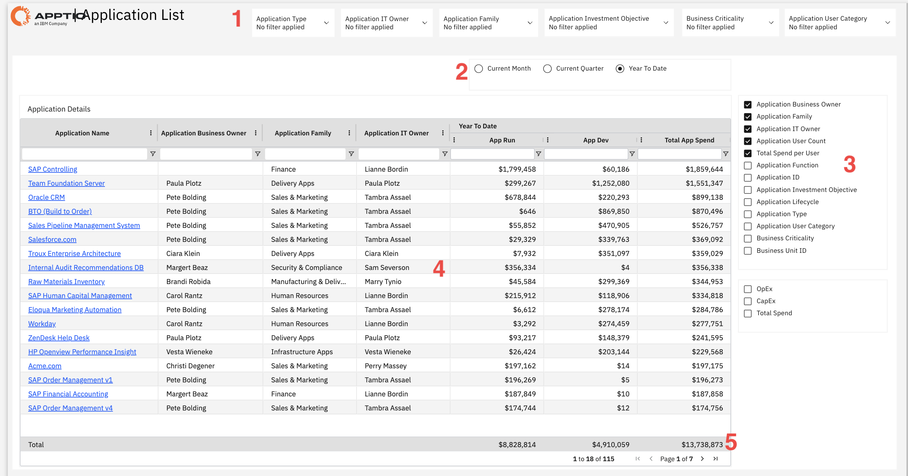

# Applications List

Use this report to analyze your application portfolio by family, including business
and IT ownership, while using filters to segment by key attributes. Review spending across
environments to understand resource allocation and identify optimization opportunities.

This report is designed for use by the following personas:

- Application Portfolio Managers
- IT Financial Controllers
- Business Unit Leaders
- Application Owners
- Finance Teams

## Key Elements

| Element | Description |
| --- | --- |
| Filter controls (1) | Six filters let you narrow the report by application type, application IT owner, application family, application investment objective, business criticality, and application user category. |
| Time Period Selector (2) | Use this selector to view spending data for the current month, current quarter, or year to date. |
| Column Selector Panel (3) | This panel lets you show or hide available columns, such as application business owner, application family, application IT owner, application user count, total spend per user, application function, application ID, application investment objective, application lifecycle, application type, application user category, business criticality, and business unit ID. |
| Application Details Table (4) | The table includes columns such as application name, application business owner, application family, application IT owner, application run year to date, application development year to date, and total application spend. |
| Total Row (5) | The bottom row shows totals for application run, application development, and total application spend. |

## Questions Answered

- What is the complete list of applications in our portfolio?
- How much does each application cost to run versus develop?
- Who owns each application (business owner and IT owner)?
- What application family does each app belong to?
- What is the total spending across all applications?
- Which applications have the highest total spend?
- How does spending break down between App Run and App Dev?

## Recommended Actions

- Use the column selector to add Business Criticality and Application Type columns to understand
  which apps are most important and what kind they are (COTS, Custom, SaaS).
- Filter by Application Family to see spending for specific areas like Finance, Sales and
  Marketing, or HR applications.
- Sort by Total App Spend to identify your most expensive applications and prioritize them for
  cost optimization reviews.
- Compare App Run versus App Dev spending to see if you're spending more on maintaining old apps
  versus building new capabilities.
- Change the time period selector to Current Quarter or Current Month to see more recent spending
  patterns.
- Click on application names to drill into detailed spending breakdowns and understand what drives
  costs for each app.
- Filter by Business Criticality to ensure Mission Critical applications are getting appropriate
  investment levels.
