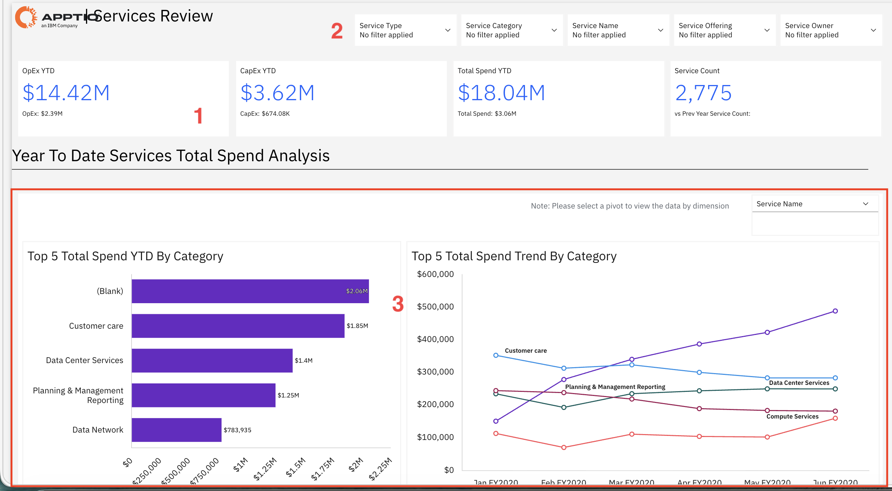
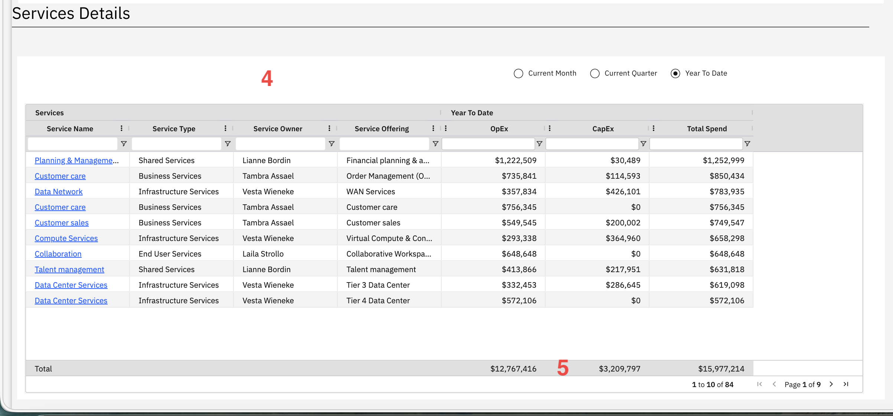

# Services Review

Use this report to analyze IT service spending across your organization by service
category, owner, and offering, identifying top spending areas and cost trends over time.

This report is designed for use by the following personas:

- Service Owners
- IT Leaders
- Finance Teams
- Business Unit Leaders
- Cost Center Owners

## Key Elements

| Element | Description |
| --- | --- |
| KPI Summary Cards (1) | Four summary cards show operating expense year to date, capital expense year to date, total spend year to date, and service count. |
| Filter Options (2) | Filters let you narrow the report by service type, service category, service name, service offering, and service owner. |
| Top 5 Spend Chart (3) | A bar chart shows the five services or categories with the highest spending. |
| Spend Trend Chart (3) | A line chart shows the spending trend over time for the top services. |
| Services Details Table (4) | The table includes columns such as service name, service type, service owner, service offering, operating expense, capital expense, and total spend. |
| Total Summary (5) | The bottom row shows totals for operating expense, capital expense, and total spend for the displayed services. |

## Questions Answered

- Which services cost the most money?
- How much am I spending on operational costs versus capital investments?
- Who owns the most expensive services?
- Is spending on specific services going up or down over time?
- Which service types (Business, Infrastructure, Shared, End User) consume the most budget?
- How does spending this month compare to the full year?
- What services does a specific owner manage and what do they cost?
- Are infrastructure services costing more than business services?

## Recommended Actions

- Sort the Services Details Table by Total Spend to identify your most expensive services and
  review whether the spending is justified.
- Look at the Top 5 Spend Chart and investigate any services with unexpectedly high costs or
  services you don't recognize.
- Check the Spend Trend Chart for services showing sharp increases and find out why costs are
  rising.
- Filter by Service Owner to see total spending for each person's services and discuss
  optimization opportunities with high-spend owners.
- Compare OpEx and CapEx columns to understand if you're investing in new capabilities (CapEx) or
  just maintaining existing services (OpEx).
- Use the time period selector to compare current month spending against year-to-date averages and
  spot unusual patterns.
- Export the filtered data to share with service owners or use in budget planning meetings.
