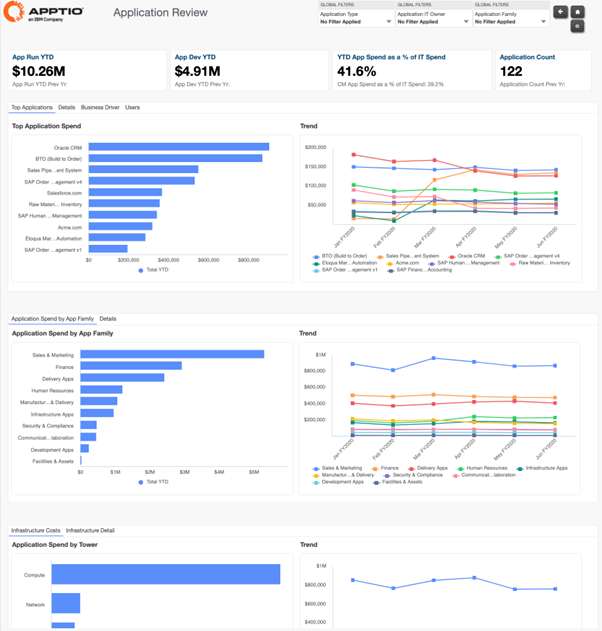
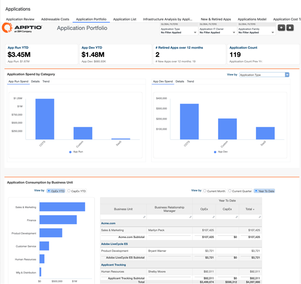
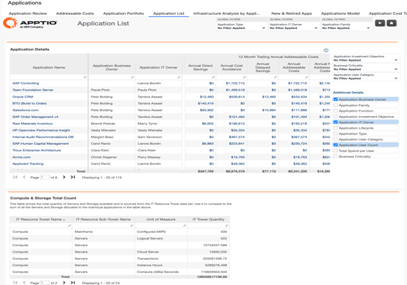
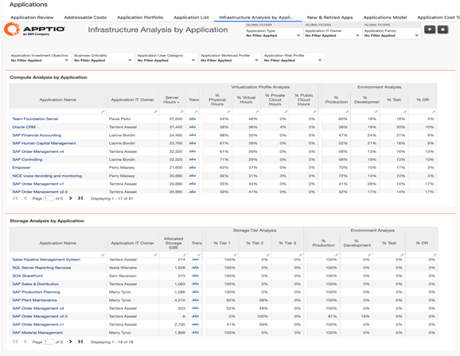
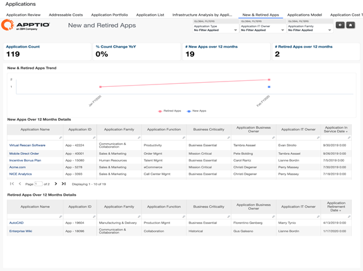
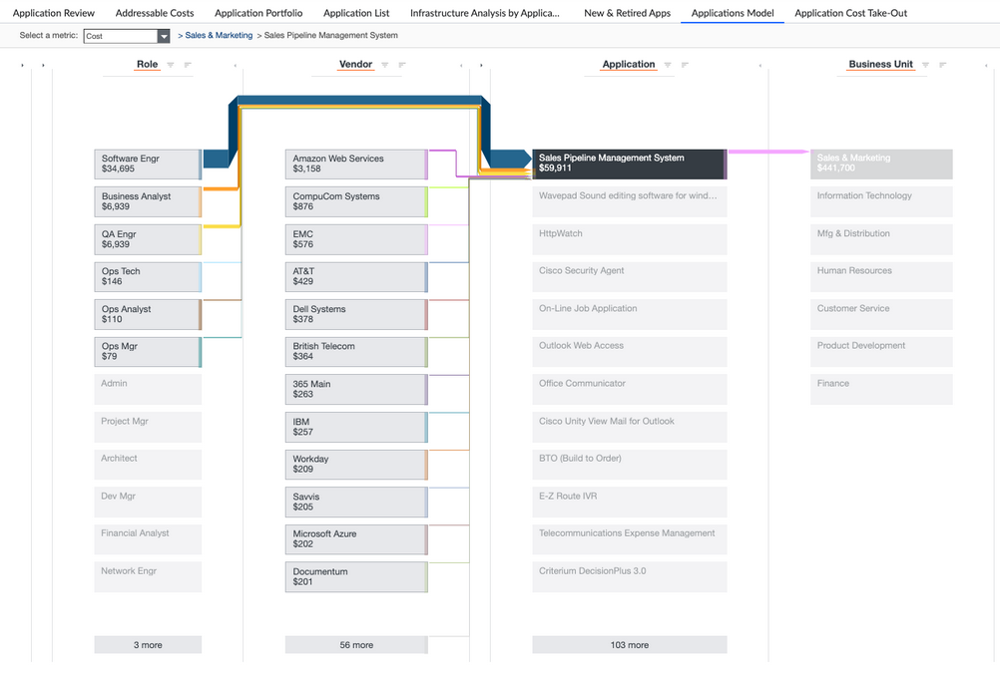

# Applications Reports

The Application Collection provides a consolidated set of reports that help
organizations understand application costs, usage, and lifecycle across the enterprise. This
collection enables IT and business leaders to gain transparency into application total cost of
ownership (TCO), identify key cost drivers, assess infrastructure dependencies, and support
portfolio optimization, rationalization, and modernization decisions.

**Reports available in this collection**

- Application Review
- Application Portfolio
- Application List
- Infrastructure Analysis by Application
- New & Retired Applications

## Application Review

An executive level overview of the application spend for your top applications, spend
based on application family and the underlying infrastructure costs.

This report is
designed for:

- Application portfolio owners
- Application owners
- CIO and IT leadership

Insights Provided:

- Identify the top applications in the portfolio and understand cost trends over
  time.
- Understand which applications and application families are the most expensive to
  run.
- Analyze key cost drivers for each application, including infrastructure and supporting
  resource towers.
- Review investment levels for application change and enhancement initiatives.
- Assess application usage by number of users and evaluate average cost per user.
- Understand overall infrastructure cost distribution supporting the application
  portfolio.

For more details on how to use the **Application Review** report, go [here.](https://www.ibm.com/docs/en/apptio-commercial/costing-standard/saas?topic=reports-application-review "(Opens in a new tab or window)")

## Application Portfolio

This report expands the information in the Application Review report to the entire
application portfolio. This report allows you to see who's responsible for the overall suite
of applications in your IT organization, the spend per business unit, cost drivers broken
out by IT tower and vendor, and the impact of projects related to the applications. The
portfolio view looks across your entire application suite and helps you gain insights
related to who's consuming application spend, the cost drivers, the cost composition of
vendors, and projects related to your applications.

This report is designed for:

- Office of the CIO or IT leadership
- Enterprise architects
- Business analysts

Insights Provided:

- Understand total application spend by category, including Run versus Development spend,
  and the applications contributing to each.
- Identify application consumption by business unit to assess usage patterns and support
  portfolio rationalization decisions.
- Determine which business units are consuming the highest application spend year to
  date.
- Analyze application cost composition by IT resource tower and vendor to identify key
  direct and indirect cost drivers.
- Review the impact of projects on applications across the portfolio, organized by
  application family.
- Gain a holistic view of application ownership, consumption, and cost structure to
  support portfolio simplification and investment decisions.

For more details on how to use the Application Portfolio report, go [here.](https://www.ibm.com/docs/en/apptio-commercial/costing-standard/saas?topic=reports-application-portfolio "(Opens in a new tab or window)")

## Application List

This report is designed for application owners. It is an analytical report that provides
quick access to the complete details about any of the applications in the organization.

This report is designed for:

- IT leadership
- Application owners
- Business analysts
- Enterprise architects
- Portfolio managers

This report allows application owners to dive into the details of the applications they are
responsible for. We can also quickly analyse the data about the applications that are being
eliminated.

Insights Provided:

- Identify SaaS providers associated with each application and understand total spend by
  provider.
- Review total application spend on a per-user basis to assess cost efficiency.
- Analyze Run versus Development spend for each application to understand investment
  patterns and support lifecycle decisions.

For more details on how to use the Application List report, go [here.](https://www.ibm.com/docs/en/apptio-commercial/costing-standard/saas?topic=reports-application-list "(Opens in a new tab or window)")

## Infrastructure Analysis By Application

This report provides a detailed analysis of the percentage of application use per IT tower
(Compute, Storage, and Service Desk).

This report is designed for:

- Application owners
- Infrastructure owners
- Enterprise architects

The report provides a high-level view of infrastructure across your applications. You can
find details about infrastructure compute storage, as well as a view into cloud data, and
service desk and help desk tickets that are associated with your applications. You can use
this report to drill into data about the underlying servers and storage devices (logical
storage units) that are associated with each application.

Insights Provided:

- Understand which infrastructure components (compute, storage, cloud, and service desk)
  support each application.
- Analyze the proportion of application costs attributed to underlying infrastructure
  towers.
- Assess how much of the application portfolio is running on public cloud versus
  on-premises infrastructure.
- Track changes in application TCO as workloads migrate to or operate within public cloud
  environments.
- Identify servers and storage tiers associated with applications by environment.
- Detect applications using non-standard or inefficient infrastructure products to support
  rationalization and optimization.

For more details on how to use the Infrastructure Analysis by Application report, go [here.](https://www.ibm.com/docs/en/apptio-commercial/costing-standard/saas?topic=reports-infrastructure-analysis-by-application "(Opens in a new tab or window)")

## New & Retired Apps

This report can be used to understand detail for each new and retired application over the
last 12 months.

This report is designed for:

- Application portfolio owners
- Application owners

Insights Provided:

- Understand the current total number of applications in the portfolio.
- Compare active versus retired applications to assess portfolio rationalization
  progress.
- Track the number of applications added and retired over the last 12 months.
- Identify business and IT owners responsible for each new or retired application.
- Review in-service and retirement dates to support lifecycle management and
  planning.

For more details on how to use the New & Retired Applications report, go [here.](https://www.ibm.com/docs/en/apptio-commercial/costing-standard/saas?topic=reports-new-retired-apps "(Opens in a new tab or window)")

## Application Model

Model Reports in Apptio provide complete traceability of how cost data moves through the
Apptio model covering Allocation Models, Tower/Sub-Tower structures, Cost Pools etc. They
are used to validate, troubleshoot, and analyze the data transformations applied at each
stage of the model

