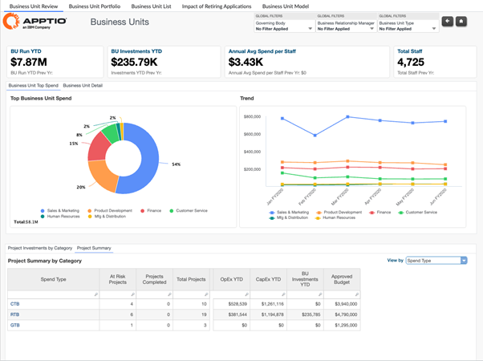
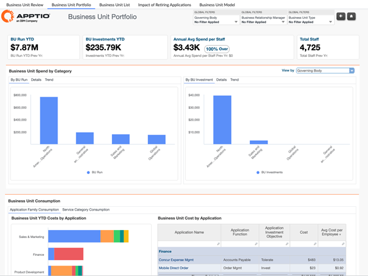
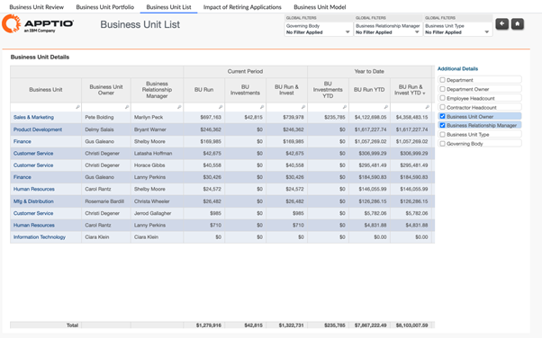
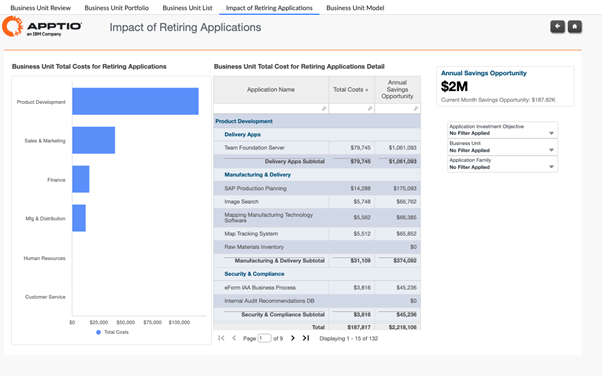
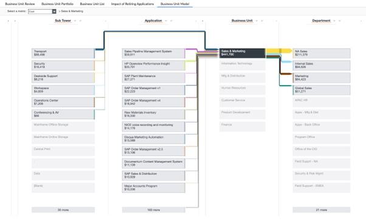

# Business Unit Reports

The Business Units collection provides a consolidated view of how technology costs are
consumed across business units. It enables organizations to understand total IT spend by
business unit, analyze Run versus Change investments, assess application and service
consumption, and evaluate the financial impact of application retirement or migration. This
collection supports cost transparency, accountability, and informed decision-making by aligning
technology spend with business ownership and outcomes.

**Reports included in this collection:**

Business Unit Review

Business Unit Portfolio

Business Unit List

Impact of Retiring Applications

Business Unit Model

## Business Unit Review

The Business Unit Review report provides a comprehensive view of IT spend, staffing, and
investment trends across business units. It helps stakeholders compare spend across revenue
and non-revenue generating units, understand cost efficiency per employee, and analyze how
investments are distributed across applications and projects to support business
outcomes.

**This report is designed for**:

• CIO Office

• IT Finance

• Business Unit Leaders

• Business Relationship Managers

**Insights Provided:**

• Compare IT spend across business units, including revenue-generating versus
non-revenue-generating units.

• Analyze average IT spend per employee and total staff by business unit to assess cost
efficiency.

• Review IT spend trends over time to identify growth patterns, anomalies, or shifts in
investment.

• Understand direct versus indirect spend breakdown by business unit.

• Assess Run versus Change spend to understand operational versus investment focus.

• Identify applications and projects driving spend within each business unit, including
project trends, sponsors, and budget performance.

For more details on how to use the Business Unit Review report, go [here.](https://www.ibm.com/docs/en/apptio-commercial/costing-standard/saas?topic=reports-business-unit-review "(Opens in a new tab or window)")

## Business Unit Portfolio

Use this report to review technology spend and consumption across business units, with
visibility into Run versus Investment costs, supporting applications, services, and project
impacts. The report helps stakeholders understand how IT resources are consumed by each
business unit and how spend trends evolve over time.

**This report is designed for:**

- IT Finance
- Business Unit Leaders
- Department Leaders
- Business Relationship Managers

**Insights Provided:**

- Understand the breakdown of Run versus Change (Investment) spend across business
  units
- Identify applications contributing to business unit spend and analyze their cost
  trends
- Review which services are consumed by each business unit and how consumption patterns
  differ
- Analyze the impact of projects on business unit technology costs
- Support informed discussions around cost accountability, optimization, and investment
  prioritization

For more details on how to use the Business Unit Portfolio report, go [here.](https://www.ibm.com/docs/en/apptio-commercial/costing-standard/saas?topic=reports-business-unit-portfolio "(Opens in a new tab or window)")

## Business Unit List Report

The Business Unit List report provides a consolidated view of all business units,
highlighting spend composition, staffing context, and investment trends. It enables
stakeholders to quickly review and compare OpEx and CapEx, understand how spend is
distributed across direct, indirect, and project investments, and identify patterns in
business unit spending over time.

**This report is designed for:**

• CIO Office

• IT Finance

• Business Unit Leaders

• Business Relationship Managers

**Insights Provided:**

• Review OpEx versus CapEx breakdown for each business unit.

• Analyze spend by service type to understand how IT services are consumed.

• Understand direct, indirect, and project-related investments by business unit.

• Compare business unit spend in relation to departments and staff levels.

• Track total spend trends over time to identify growth, reductions, or anomalies.

• Drill into individual business units to validate cost structure and investment
focus.

For more details on how to use the Business Unit List report, go [here.](https://www.ibm.com/docs/en/apptio-commercial/costing-standard/saas?topic=reports-business-unit-list "(Opens in a new tab or window)")

## Impact of Retiring Applications

Use this report to understand the financial impact of applications that are planned for
retirement or migration. The report highlights current spend associated with these
applications and quantifies the potential annual savings opportunity, helping organizations
prioritize decommissioning and modernization initiatives.

**This report is designed for:**

- Application Portfolio Owners
- IT Finance
- Enterprise Architects
- CIO and IT Leadership

**Insights Provided:**

- Understand how much spend is currently associated with applications marked for
  retirement or migration
- Identify the annual savings opportunity from retiring or migrating applications
- Analyze which business units carry the highest costs for applications slated for
  retirement
- Support application rationalization, modernization planning, and investment
  prioritization
- Enable data-driven decisions to reduce technical debt and eliminate unnecessary run
  costs

For more details on how to use the Impact of Retiring Applications report, go [here.](https://www.ibm.com/docs/en/apptio-commercial/costing-standard/saas?topic=reports-impact-retiring-applications "(Opens in a new tab or window)")

## Business Unit Model

Model Reports in Apptio provide complete traceability of how cost data moves through the
Apptio model covering Allocation Models, Tower/Sub-Tower structures, Cost Pools etc. They
are used to validate, troubleshoot, and analyze the data transformations applied at each
stage of the model.

