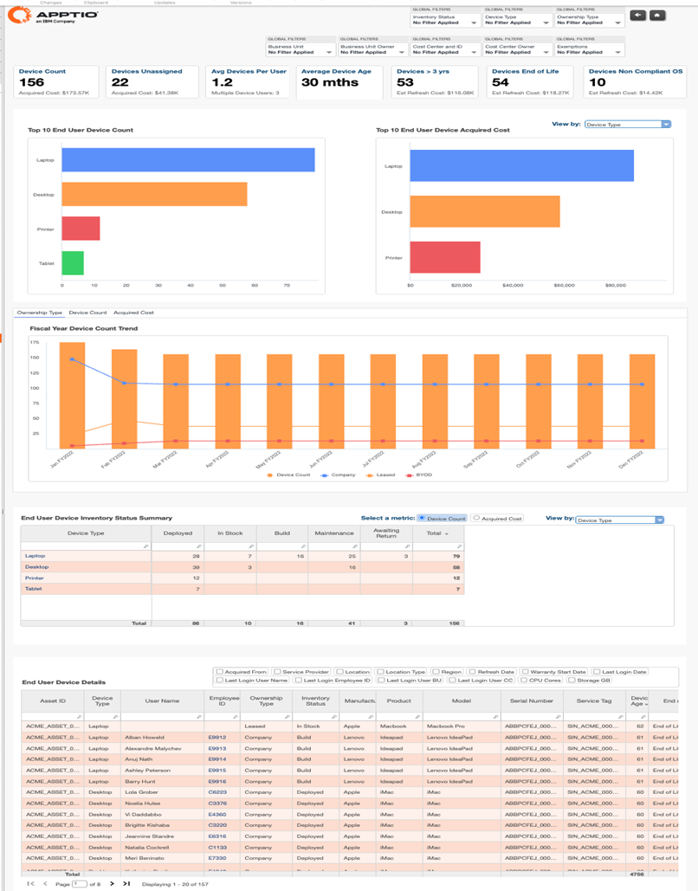
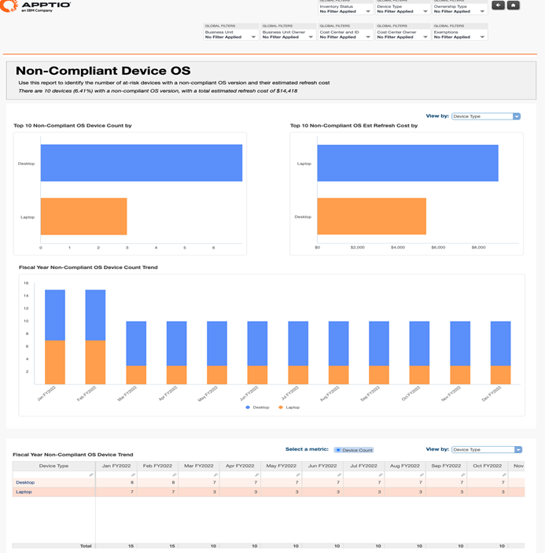
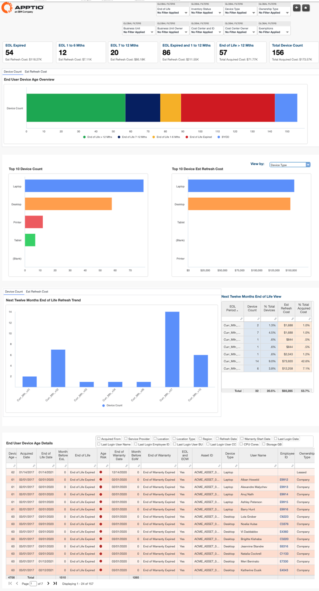
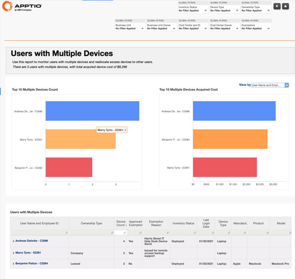
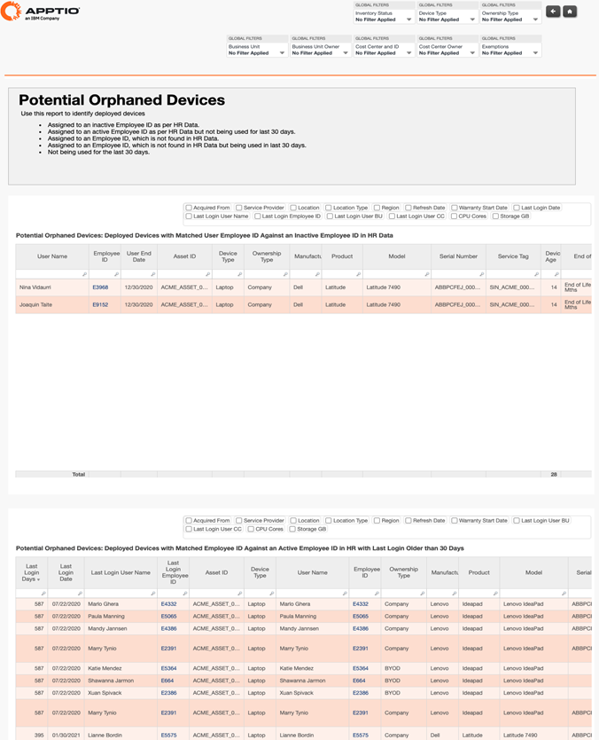
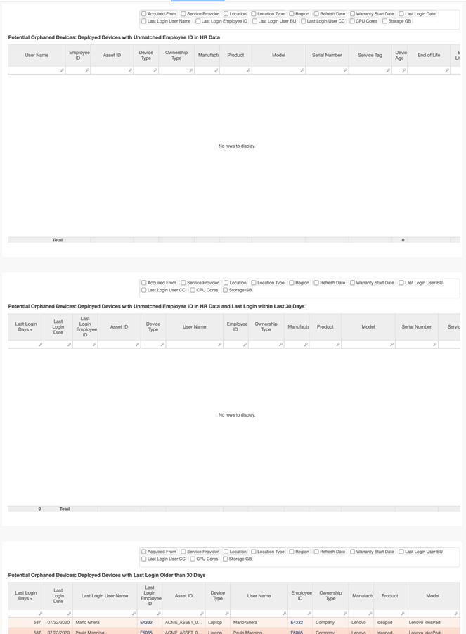
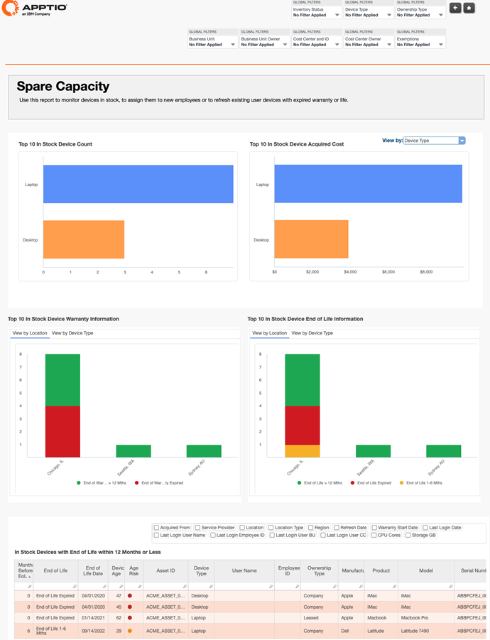
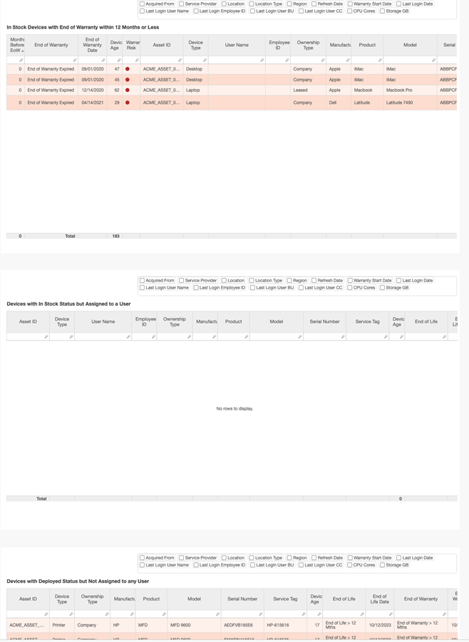
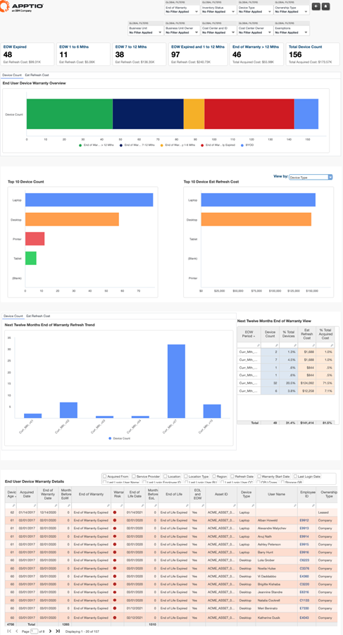

# End User Insights Reports

The End User Insights collection provides comprehensive visibility into the
organization’s end user device fleet, enabling effective management of cost, lifecycle,
compliance, and utilization across PCs, laptops, tablets, and mobile devices. This collection
helps IT and Finance teams understand how devices are assigned, used, aged, and refreshed,
supporting data-driven decisions around budgeting, inventory optimization, compliance risk, and
workforce enablement.

The collection enables organizations to track device ownership and assignment patterns,
identify aging and end-of-life exposure, detect compliance risks, and uncover optimization
opportunities such as reclaiming unused devices or redeploying spare inventory. By combining
cost, inventory, lifecycle, and usage signals, End User Insights supports proactive planning
and reduces unnecessary refresh and procurement spend.

**Reports available in this collection include:**

- End User Fleet Overview
- Compliance
- Age Analysis
- Multiple Devices
- Orphaned Devices
- Spare Capacity
- Warranty Analysis

## End User Insights Summary

The Fleet Overview report provides full
transparency into the organization’s end user device fleet, covering device assignments,
consumption profiles, makes, models, and locations. It also highlights device aging,
end-of-life (EOL) status, non-compliance, and estimated refresh costs, enabling data-driven
decisions for lifecycle, budget, and inventory planning.

This report is designed for
use by the following roles:

- IT Finance
- Service Owners
- IT Operations and Desktop Support

**Insights Provided**

• Obtain a **snapshot view of the current end user device
landscape** across the organization.

• Understand **fleet size, composition, and
ownership mix** (company-owned, leased, BYOD).

• Analyze **device age, EOL
exposure, and non-compliance risk****.**• Monitor **device acquisition volumes and
costs** over fiscal periods.

• Track **inventory status** across deployed,
in-stock, build, maintenance, and awaiting return states.

• Support **budgeting,
forecasting, and refresh planning** using estimated replacement costs.

For more
details on how to use End User Insights reports, go [here.](https://www.ibm.com/docs/en/apptio-commercial/costing-standard/saas?topic=configuration-end-user-devices-reports "(Opens in a new tab or window)")

## Compliance

This report provides insights into devices running non-compliant operating systems,
including device counts, trends over fiscal years, and estimated refresh costs. It helps you
identify at-risk devices requiring updates or replacement, enabling effective compliance
management and refresh planning.

This report is designed for use by the following roles:

- IT Asset Managers
- Desktop Support Managers
- IT Compliance Officers

**Insights provided:**

- Identify the number and percentage of devices running non-compliant OS versions by
  device type and operating system.
- Review the top 10 device types with the highest count of non-compliant OS versions to
  prioritize remediation efforts.
- Track fiscal year trends in non-compliant device counts and estimated refresh costs to
  monitor compliance improvements or risks over time.
- Analyze estimated refresh costs by device attributes such as device type, manufacturer,
  model, location, OS, ownership, and region to support budgeting and forecasting.
- Detect devices where the last login user ID differs from the assigned device owner to
  identify potential compliance or assignment issues.
- Use these insights to drive company-wide compliance and plan refreshes or upgrades for
  non-compliant devices.

## Age Analysis

This report provides visibility into the aging profile of
end user devices across the organization, including end-of-life (EoL) status, upcoming
refresh timelines, and estimated refresh costs. It helps organizations proactively plan
device refresh cycles, manage budget impact, and reduce operational risk caused by aging or
expired devices.

This report is designed for use by the following roles:

• IT
Asset Managers

• Desktop Support / End User Computing Managers

• IT Finance
and Budget Owners

**Insights provided**

• Understand the overall device age
distribution by key aging groups, including expired devices, devices nearing end of life,
and devices with remaining lifecycle.

• Identify the **number and percentage of
devices** that are:

– Already expired

– Approaching EoL in 1–6
months

– Approaching EoL in 7–12 months

– Beyond 12 months from EoL

•
Analyze **estimated refresh costs** associated with each EoL category to support
budgeting and financial planning.

• Obtain a **next twelve months EoL view**,
showing expected device counts and refresh costs by lifecycle period.

• Track **total
device population** and its distribution across defined EoL periods for better demand
forecasting.

• Review **top device categories** (Laptops, Desktops, Tablets)
reaching EoL in the next fiscal year to prioritize refresh planning.

• Assess
**estimated refresh costs by device type** for the upcoming fiscal year to understand
cost concentration and investment needs.

• Identify the **Top 10 device age counts
and refresh cost drivers** to focus remediation and replacement efforts where impact is
highest.

## Multiple Devices

This report provides visibility into users assigned
with multiple end user devices, including device counts and associated costs. It helps
organizations identify excess device assignments and reallocate unused or unnecessary
devices to optimize fleet utilization and reduce overall costs.

This report is
designed for use by the following roles:

• IT Asset Managers

• Desktop Support
/ End User Computing Managers

• IT Finance and Cost Center Owners

**Insights
provided**

• Identify the **total number of devices assigned per employee** for the
current fiscal year to detect multiple-device usage.

• Analyze **device distribution
by type** (Laptops, Desktops, Tablets) at the employee level to understand assignment
patterns.

• Review the **number of desktops and tablets assigned per employee** to
uncover potential over-allocation.

• Evaluate **estimated refresh costs by device
type**, split by business unit and cost center, to understand financial impact of
multiple-device assignments.

• Support **device recovery and reallocation**
initiatives by identifying employees with more devices than required for their role.

•
Reduce unnecessary refresh spend by aligning device allocation with actual usage and
business need.

## Orphaned Devices

This report provides visibility into deployed end
user devices that may be orphaned due to inactive users, missing HR records, or lack of
recent usage. It helps organizations identify reclaimable devices, reduce excess inventory,
and improve governance of end user computing assets.

Potential orphaned devices
include devices that are:

• Assigned to an **inactive Labor ID** based on HR
data

• Assigned to an **active Labor ID** but **not used in the last 30–90
days**

• Assigned to a **Labor ID not found in HR data**

• Assigned to
a **Labor ID not found in HR data but recently used**

• **Not used** for the
last defined inactivity period

This report is designed for use by the following
roles:

• IT Asset Managers

• IT Finance and Cost Center Owners

• IT Risk
and Compliance Teams

**Insights provided**

• Identify **users (active and inactive)
with multiple devices** to understand device assignment patterns and potential
over-allocation.

• Track the **total acquired cost of devices** associated with
users having multiple devices to quantify financial exposure.

• Detect **devices
deployed to inactive users** based on HR data to support recovery and redeployment
initiatives.

• Identify **devices assigned to active users with no recent login
activity** (e.g., last login older than 90 days), indicating potential
underutilization.

• Highlight **devices assigned to unmatched Labor IDs** that do
not exist in HR records, improving asset governance and data quality.

• Monitor
**unmatched devices with recent login activity** to differentiate between data issues
and legitimate usage.

• Identify **devices with no recent login activity** to
prioritize investigation, recovery, or retirement.

Support the ability to **track
multiple devices per user** across both active and inactive populations.

## Spare Capacity

This report provides visibility into available end user
devices across the organization, including devices held in stock, unassigned deployed
devices, and inventory nearing end of life. It helps organizations effectively utilize spare
capacity by redistributing existing inventory to new employees or using it to refresh
devices with expired warranty or lifecycle—reducing unnecessary purchases and overall fleet
costs.

This report is designed for use by the following roles:

• IT Asset
Managers

• IT Procurement and Inventory Managers

• IT Finance

**Insights
provided**

• Identify **spare capacity across all device types**, highlighting
devices currently in stock and available for assignment.

• Review the **Top 10
in-stock devices** by count to understand where inventory is concentrated.

•
Analyze **in-stock devices by device type, manufacturer, product, model, and location**
to support targeted redistribution.

• Detect **in-stock devices approaching end of
life** (12 months or less) to prioritize timely assignment or planned refresh.

•
Identify **in-stock devices that are still assigned to users**, highlighting inventory
and data governance gaps.

• Detect **deployed devices with no user assigned**,
enabling reassignment before new device purchases are made.

• Support proactive
inventory planning to **assign devices to new hires** or **refresh existing users’
devices** using available stock.

## Warranty Analysis

The Device Warranty Analysis report provides visibility into the aging profile of end user
devices based on warranty and end-of-life (EoL) timelines. It enables organizations to
proactively plan, budget, and forecast device refresh or replacement activities by
highlighting devices with expired warranties and those approaching end of warranty within
defined time horizons.

This report is designed for use by the following roles:

• IT Asset Managers

• IT Operations and Desktop Support

• IT Finance and Procurement

**Use Cases**

• Obtain a **comprehensive warranty overview** of end user devices across the
organization.

• Categorize devices into **four warranty aging groups** to understand risk exposure and
refresh urgency.

• Identify **expired devices** and devices approaching end of life within 1–6, 7–12, and
beyond 12 months.

• Forecast **refresh demand and costs** for the next fiscal and rolling 12-month
periods.

• Track **warranty-driven refresh trends** to support procurement and budgeting
decisions.

• Analyze **top devices by warranty count and estimated refresh cost** to prioritize
replacement strategies.

