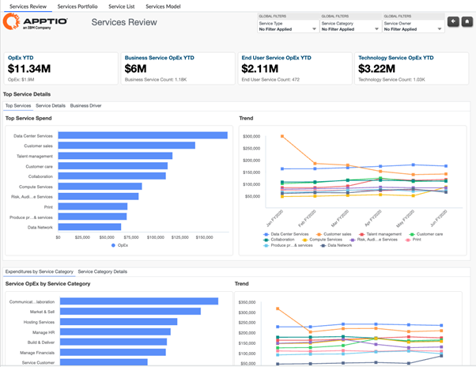
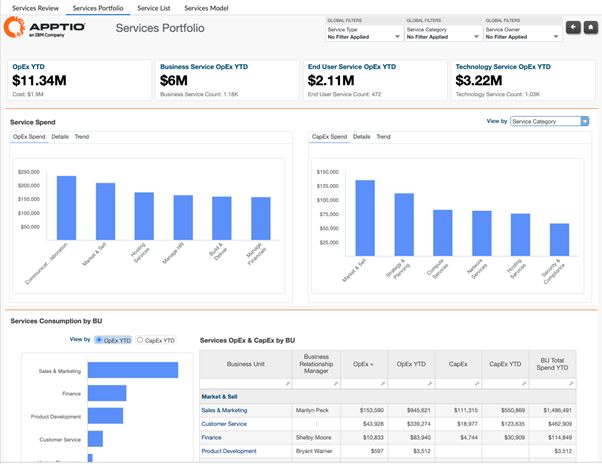
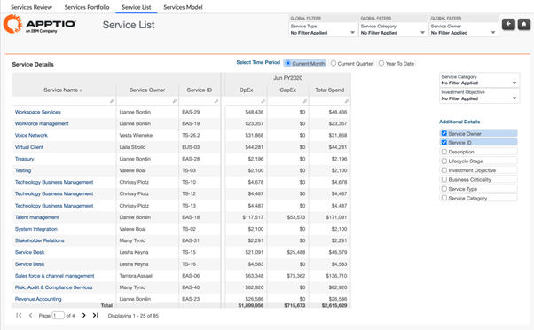
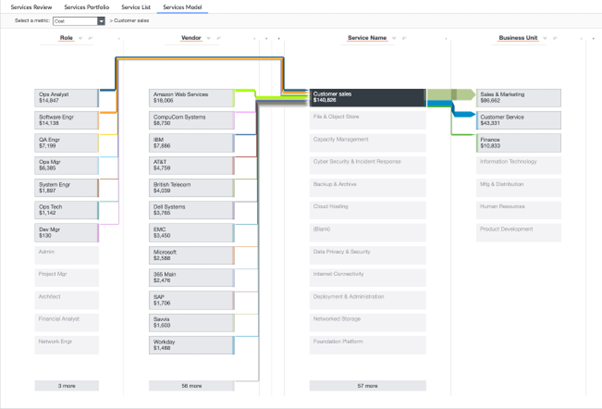

# Services Reports

The Services collection provides a consolidated view of business service costs, consumption,
and ownership across the enterprise. It enables organizations to understand how OpEx and CapEx
are distributed across services, service categories, and service types, while linking service
costs to consuming business units, applications, and IT towers. This collection supports
service portfolio transparency, cost accountability, and informed decision-making for
optimization, showback, chargeback, and service lifecycle management.

Reports included in this collection:

• Services Review

• Services Portfolio

• Service List

• Services Model

## Services Review

This report provides a comprehensive view of service costs across the portfolio, showing
total costs by service, service type, and service category. The report displays cost trends,
consumption volumes, and service ownership to enable portfolio-wide service cost
analysis.

Use this report to understand the distribution of service costs across your portfolio,
identify high-cost services, and compare costs across service categories to identify
optimization opportunities.

This report is designed for use by the following roles:

- CIO Office
- IT Finance
- Service Owners

Insights Provided:

- Identify which services have the highest total costs and understand portfolio cost
  concentration.
- Understand cost distribution across service categories and types.
- Review service costs by owner to understand accountability and cost management
  responsibility.
- Analyze consumption volumes and quantities across services.
- Compare service costs to identify potential rationalization or consolidation
  opportunities.

For more details on how to use the Service Review, go [here.](https://www.ibm.com/docs/en/apptio-commercial/costing-standard/saas?topic=reports-services-review "(Opens in a new tab or window)")

## Services Portfolio

The Services Portfolio report provides a portfolio-wide view of service costs, consumption,
and ownership across the organization. It helps stakeholders understand how OpEx and CapEx
are distributed across service categories and types, who consumes services, and which
applications and IT towers drive service costs.

This report is designed for:

• CIO Office

• IT Finance

• Service Owners

• Business Relationship Managers

Insights Provided:

• Review OpEx and CapEx by service category, service type, and service owner.

• Understand how service consumption is distributed across business units.

• Analyze service consumption by application and supporting IT towers.

• Identify which service categories represent the highest investment.

• Determine which business units are the largest consumers of services.

• Establish service ownership and accountability, including Business Relationship
Managers.

For more details on how to use the Services Portfolio report, go [here.](https://www.ibm.com/docs/en/apptio-commercial/costing-standard/saas?topic=reports-services-portfolio "(Opens in a new tab or window)")

## Service List

The Service List report provides a detailed view of all services defined within the
model, enabling stakeholders to review service-level investment, ownership, and cost
characteristics. It helps users understand which services the organization is investing
in, how costs are distributed across OpEx and CapEx, and how services are structured
through offerings, applications, and unit costs.

This report is designed for:

• CIO Office

• IT Finance

• Service Owners

• Business Relationship
Managers

**Insights Provided:**

• Review OpEx and CapEx for services
across the current month, quarter, or year to date.

• Identify the top services the
organization is investing in and their associated owners.

• Understand the
investment objectives assigned to key services.

• Drill into individual services to
review related service offerings and associated applications.

• Analyze service
unit cost and quantity trends over time.

• Understand the unit of measure used for
each service and how unit costs evolve.

For more details on how to use the Service
List report, go [here.](https://www.ibm.com/docs/en/apptio-commercial/costing-standard/saas?topic=reports-service-list "(Opens in a new tab or window)")

## Services Model

Model Reports in Apptio provide complete traceability of how cost data moves through the
Apptio model covering Allocation Models, Tower/Sub-Tower structures, Cost Pools etc. They
are used to validate, troubleshoot, and analyze the data transformations applied at each
stage of the model.

