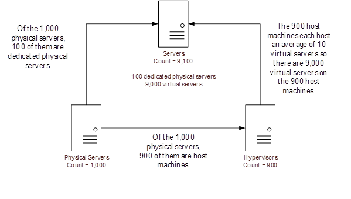

# Servers Workshop

## Preparing your Servers data

1. If you haven’t already done so, load your server data including:
   - List of servers
   - Server Monitoring data
2. Following Apptio standard
   practices, categorize each raw data set into the category of Servers.

## Transforms of Server data

Does your server data include all physical servers, hypervisors, and virtual servers or are they
in separate data sets? If you have a data set that combines any of these three types of servers, you
need to create transforms so you have a separate data set for each of the following:

- Physical Servers
- Hypervisors
- Virtual Servers

This often requires analysis of your server data to determine what's included and how to segment
the servers into these three categories. You can use the Data Filter option on the transform to
limit the records displayed through the transform.

## Relationship between Physical Servers, Hypervisors, and Servers

A physical server is a specific piece of hardware that may be a dedicated physical server or a
host machine for virtual servers.

A hypervisor is a piece of computer software that runs virtual servers.

A virtual server is a server that runs its own copy of an operating system and software but is
hosted on a physical server that may be shared with many virtual servers.

The diagram below depicts how Apptio manages the relationship between
physical servers, hypervisors, virtual servers, and dedicated physical servers.

## About the Servers Identifiers

The identifier for the Physical Servers Master Data set is the Physical Server ID. You must have
some way to identify each physical server and use that as the Physical Server ID.

The identifier for the Hypervisors Master Data set is the Hypervisor ID. As with the physical
servers, you must have some way to identify each hypervisor and use that as the Hypervisor ID.

The identifier for the Servers Master Data set is the Server ID. You must have some way to
identify each server and use that as the Server ID.

## Common Computed Columns Needed for Servers

For the various types of servers (which you may have in one or multiple data sets), there are a
couple computed column you may wish to have.

- Virtualization Profile (such as physical, hypervisor, or virtual)
- Is Virtual Machine (such as true of false)

You can then use these new columns to filter your transforms and build keys between data sets
(see next section).

## About the Server Keys

The keys in the Physical Server Master Data set are all user-defined. The recommended logic is in
the table below.

| Key | Field key is based on | Recommended Logic |
| --- | --- | --- |
| **ITRT\_Server Key** | User-defined | ="Asset\_Resource – Compute"&&OS    OS is the operating system. Your column name may be called something different. |
| **Storage\_Server Key** | User-defined | ="Storage\_Server Key"&&Device Name    Device Name is the name of the hardware that links the storage to the specific physical server. Your column name may be called something different. This must match the Storage\_Server Key you defined in Storage Master Data. |
| **DC\_Server Key** | User-defined | ="DC\_Server Key"&&Location    Use only if you are implementing the Data Centers component. The Location is the name of the data center. Your column name may be called something different. |
| **Asset\_Server Key** | User-defined | Recommended Logic is "Asset\_Server" && Server ID |
| **Phys\_Hyp Key** | User-defined | =If(Virtualization Profile != "Physical","Phys\_Hyp Key"&&Location,"")    By checking to see if the virtualization profile is not physical, you ensure only host machines and virtual servers have a Phys\_Hyp Key. |
| **Phys\_Server Key** | User-defined | =If(Virtualization Profile="Physical","Phys\_Server Key"&&Device Name,"")    By checking to see if the virtualization profile is physical, you ensure only dedicated physical servers have Phys\_Server Key. |

The keys in the Hypervisors Master Data set are all user-defined. The recommended logic is in the
table below.

| Key | Field key is based on | Recommended Logic |
| --- | --- | --- |
| **Phys\_Hyp Key** | User-defined | ="Phys\_Hyp Key" && Location |
| **Hyp\_Server Key** | User-defined | ="Hyp\_Server Key" && Location |

The keys in the Servers Master Data set are all user-defined. The recommended logic is in the
table below.

| Key | Field key is based on | Recommended Logic |
| --- | --- | --- |
| **Hyp\_Server Key** | User-defined | ="Hyp\_Server Key" && Location |
| **Phys\_Server Key** | User-defined | ="Phys\_Server Key" && Server ID |
| **Server\_App Key** | User-defined | ="Server\_App" && Application ID |
| **Communication\_Server Key** | User-defined | ="Communication\_Server" && Server Connection |

## Map data to Physical Server Master Data, Hypervisor Master Data, and Servers Master Data

Map your physical server data to the Physical Server Master Data set. Most of the mapping should
be self-explanatory at this point. In 12.7 you can now leverage the Column Map function in your raw
dataset to map to the Physical Servers Master Data ([Map
Columns](https://community.apptio.com/docs/DOC-10561 "(Opens in a new tab or window)"))

Map your hypervisor data to the Hypervisor Master Data set. In 12.7 you can now leverage the
Column Map function in your raw dataset to map to the Hypervisor Master Data ([Map
Columns](https://community.apptio.com/docs/DOC-10561 "(Opens in a new tab or window)"))

Map your physical and virtual server data to the Servers Master Data set. In 12.7 you can now
leverage the Column Map function in your raw dataset to map to the Servers Master Data ([Map
Columns](https://community.apptio.com/docs/DOC-10561 "(Opens in a new tab or window)"))

Most of the mappings should be self-explanatory at this point. Anywhere you see Actual Units,
Budgeted Units, Item Count, or Server Count, you can set to **=1** if you are using the server ID
as the identifier in each of the data sets.

## Review the Servers object on the models

| Model | Actions |
| --- | --- |
| **Cost** | Ensure values are flowing into the Physical Server, Hypervisor, and Servers objects.  From IT Resource Towers to Physical Server, allocate using the Data-based Reference, weighted by Actual Units (this is the default setting). The keys joining IT Resource Towers and Physical Server are the Asset\_Resource Key on the IT Resource Towers side and the ITRT\_Server Key on the Physical Server side.  From Storage to Physical Server, allocate using the Data-based Reference with an even weighting (this is the default setting). The keys joining Storage to Physical Server are the Storage\_Server Key columns in both data sets.  From Physical Server to Hypervisor, allocate using the Data-based Reference with an even weighting (this is the default setting). The keys joining Physical Server to Hypervisor are the Phys\_Hyp Key columns in both data sets.  From Physical Server to Servers, allocate using the Data-based Reference with an even weighting (this is the default setting). The keys joining Physical Server to Servers are the Phys\_Server Key columns in both data sets.  NOTE: You may need to check the Automatically create many to many relationship box for this allocation.  From Hypervisor to Servers, allocate using the Data-based Reference, weighted by Memory Capacity (this is the default setting). The keys joining Hypervisor to Servers are the Hyp\_Server Key columns in both data sets. |
| **Budget** | Ensure values are flowing into the Physical Server, Hypervisor, and Servers objects.  From IT Resource Towers to Physical Server, allocate using the Data-based Reference, weighted by Actual Units (this is the default setting). The keys joining IT Resource Towers and Physical Server are the Asset\_Resource Key on the IT Resource Towers side and the ITRT\_Server Key on the Physical Server side.  From Storage to Physical Server, allocate using the Data-based Reference with an even weighting (this is the default setting). The keys joining Storage to Physical Server are the Storage\_Server Key columns in both data sets.  From Physical Server to Hypervisor, allocate using the Data-based Reference with an even weighting (this is the default setting). The keys joining Physical Server to Hypervisor are the Phys\_Hyp Key columns in both data sets.  From Physical Server to Servers, allocate using the Data-based Reference with an even weighting (this is the default setting). The keys joining Physical Server to Servers are the Phys\_Server Key columns in both data sets.  NOTE: You may need to check the Automatically create many to many relationship box for this allocation.  From Hypervisor to Servers, allocate using the Data-based Reference, weighted by Memory Capacity (this is the default setting). The keys joining Hypervisor to Servers are the Hyp\_Server Key columns in both data sets. |

## Review Server reports

The following reports are updated after you have configured the Servers object:

- Server TCO
- Infra - Server TCO - Detail
- Infra - Summary - Servers
- Server Comparison
- Servers Validity
- App Infra
- App Infra - Compute Detail
- Data Dimensions - Servers
- Data Quality - IT Resources
- Data Quality - Servers

## Related information

- [Send feedback about
  Help Center](productfeedback@apptio.com "(Opens in a new tab or window)")
