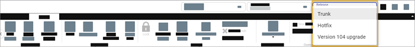

# Step 2: Open the new branch

Upgrade the project in a separate branch ([Learn more](https://community.apptio.com/docs/DOC-5472 "(Opens in a new tab or window)"))

1. On the **Project** tab, click the **Trunk** drop-down
   menu.
2. Select the branch you want, for example, "Version 104 Upgrade."

   

   After selecting a branch, you
   will see the active branch in the menu bar.
3. Each time you return to TBM Studio, verify that you are in the correct upgrade branch before
   proceeding. If not, and **Trunk** is displayed, you will need to re-select the
   "Version 104 Upgrade" branch.

Note: Do not make changes in the main project (for example, Trunk) during the course
of the upgrade activities in the separate upgrade branch. If you do, all changes made in the main
Trunk will be lost after merging the upgrade branch.

## Related information

- [Send feedback about
  Help Center](productfeedback@apptio.com "(Opens in a new tab or window)")
