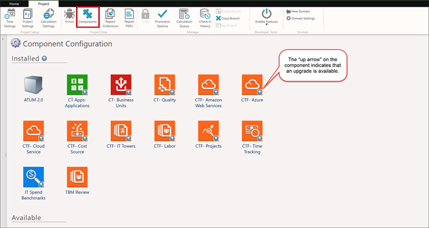

# Step 4: Review components to upgrade

Confirm that the new component versions are available, then upgrade them.

1. On the **Project** tab, click **Components**.

   The
   Component Configuration dialog opens.
2. View the list of installed components.

   An arrow in the bottom right corner of each installed
   component indicates that an upgraded version for that component is available.

   
3. Install and upgrade all components for the new template version, v104 and later. Perform Step 5
   for each component to be upgraded.

## Related information

- [Send feedback about
  Help Center](productfeedback@apptio.com "(Opens in a new tab or window)")
