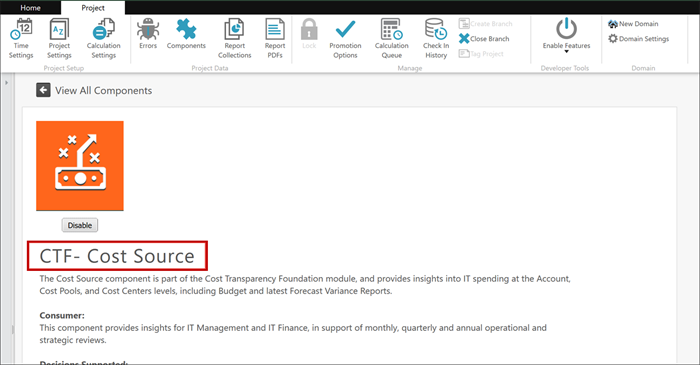
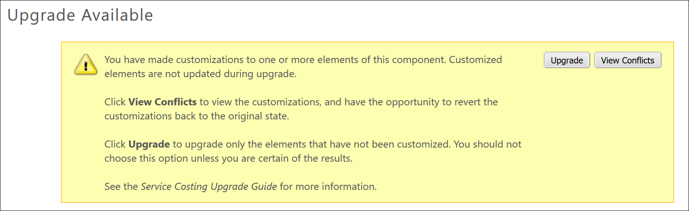
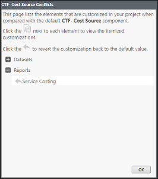
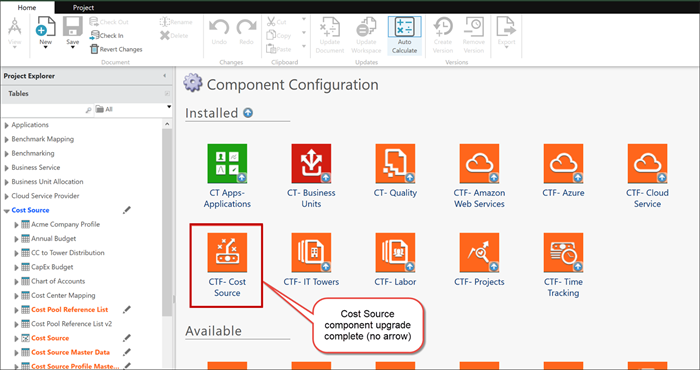

# Step 5: Upgrade individual components and check in the changes

1. In the Component Configuration dialog, double-click a specific component,
   for example, **CTF - Cost Source**.

   A component page opens.

   
2. Scroll down below the list of included reports to the **Upgrade Available** section.
   - A blue box indicates that no customizations have been made to any items in the component.
   - A yellow box indicates that customizations have been found with the data, calculated metrics, or
     reports.

   

   Occasionally, the yellow box remains after you revert all the customizations. To proceed,
   click the **Upgrade** button in the yellow box.
3. If customizations exist, click **View Conflicts**, or scroll to the bottom of
   the page.
4. Revert any customized reports and calculated metrics.

   
5. For customized data sets, revert the customized data sets for the following Cloud-related
   components:
   - CTF- Cloud Service Provider
   - CTF- Amazon Web Services
   - CTF- Azure

   Take a screenshot of your current mappings to assist with the re-mapping of the tagging
   fields.

   Note: Do **NOT** revert the data sets for any other components. If you revert data set
   changes, you will be required to re-append and re-map your source files to the master data
   sets.
6. Click **Upgrade**.

   The application takes a few minutes to process the
   upgrade. After the component page refreshes and returns to the Component
   Configuration page, you can continue. Confirm that the upgrade arrow is no longer
   displayed.

   
7. If you reverted data set changes for the Cloud reports, remap the source files to the Master
   Data, as follows:
   1. In Project Explorer, click **Tables**.
   2. Click **Master Data**.
   3. Append.
   4. Map the source columns to the appropriate Master Data columns.

      Use the screenshot you captured
      in the previous step to verify the mappings.
8. After the upgrade is complete, you must manually change the data sets that were not reverted.
   For v104, refer to the cumulative list of [Template v103 to v104 Data
   Updates](../../user-guide/template103to104dataupdates-9027.html) to identify what changes are required.
9. Check in all changes related to the single component upgrade one at a time, as follows:

   Note: Failure to follow these steps to check in components one at a time could result in an
   error that causes you to lose your work and restart the upgrade from the beginning.

   1. Select **Projects**, then click **Check In**.

      The Check
      In dialog opens.
   2. Select **All items** in the left pane (default).
   3. Enter a description of the items in the **Message** pane.

      Note: Enter a useful description, such as "Cost Source: revert data set changes, upgraded component."
      This is critical for the branch merge activities later in this upgrade process. Review [Step 9: Merge changes into the main project (Trunk)](step9.html) to understand why this is
      important.
   4. Click **Check In**.
   5. Continue with Step 6.

## Related information

- [Send feedback about
  Help Center](productfeedback@apptio.com "(Opens in a new tab or window)")
