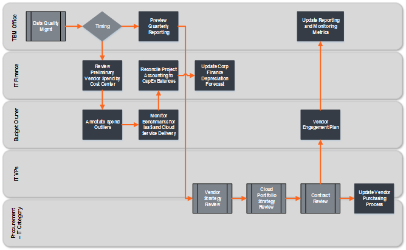

# Vendors Workshop

## Preparing your Vendor data

You can get started and prepare your Vendor data by reviewing the below checkpoints:

1. If you haven’t done so already, load all of the relevant vendor data into Apptio.
2. Following Apptio standard
   practices, categorize each raw data set into the category of Vendors.
3. If appropriate, apply a date filter to your vendor data.

## About the Vendor Identifier

The Identifier for the Vendor object is system generated and should not be altered. It
includes:

- Vendor Name
- Vendor ID
- Vendor Type
- Vendor Function
- Vendor Primary Service

## About the Vendor Keys

The keys for the Vendor Master Data set are all system generated and should not be altered.

| Key | Field key is based on | Logic |
| --- | --- | --- |
| **Cost Source\_Vendor Key** | Vendor ID  Cost Source Key Metafield | Append the text CS\_Vendor with the Vendor ID, Cost Source Key Metafield |
| **Vendor\_ITRT Key** | Vendor CSP Key  IT Resource Tower  IT Resource Sub-Tower | IF  Vendor\_CSP Key = Vendor\_CSP\_null  THEN  Append the text Vendor\_ITRT with IT Resource Tower and IT Resource Sub-Tower  ELSE  Set the text to Vendor\_ITRT\_null |
| **Vendor\_CSP Key** | Is CSP  Vendor Name | IF  Is CSP = yes  THEN  Append the text Vendor\_CSP with the Vendor Name  ELSE  Set the text to Vendor\_CSP\_null |

Vendor\_CSP\_Key is only required if you are also implementing the Public Cloud component.
Otherwise, the key (and other Cloud-related fields) can be left blank.

## Common Computed Columns Needed for Vendors

You may need to create any of the following computed columns:

- Conditional statement to determine if a vendor is a Cloud Service Provider. This should return a
  Yes/No response.
- Conditional statement to determine if a vendor is a Managed Service Provider. This should return
  a Yes/No response.
- Vendor Type should be categorized as "Strategic", "Preferred", or "Transactional"

If your vendor allocation data is in a separate data set from your vendor data, you may need
additional computed columns including:

- Lookup of Annual Target Spend from a vendor list to a vendor allocation list
- Lookup of Service Location from a vendor list to a vendor allocation list
- Lookup of User Interaction from a vendor list to a vendor allocation list
- Lookup of Vendor Function from a vendor list to a vendor allocation list
- Lookup of Vendor Location from a vendor list to a vendor allocation list
- Lookup of Vendor Manager from a vendor list to a vendor allocation list
- Lookup of Vendor Service from a vendor list to a vendor allocation list
- Lookup of Vendor Type from a vendor list to a vendor allocation list

Vendor Name MUST match the Provider name in the Cloud Service Provider Master Data set for a
relationship to exist. If it does not, you may need to either clean up the data or build a computed
column.

## Map data to Vendors Master Data

Map the customer’s vendor data to the Vendors Master Data set. Most of the mapping is
self-explanatory. In 12.7 you can now leverage the Column Map function in your raw dataset to map to
the Vendors Master Data ([Map Columns](https://community.apptio.com/docs/DOC-10561 "(Opens in a new tab or window)")).

In order to use the Allocation percentage (for vendors mapped to more than one tower), use the
Select additional source columns option when mapping your data. You’ll use this for the allocation
from Vendors to IT Resource Towers on the models.

## Review the Vendors object on the models

After you have mapped your data to the Vendors Master data, you can go ahead and review the
objects on the models. Review the following models and ensure the values are flowing into the
objects appropriately.

| Model | Actions |
| --- | --- |
| **Cost** | Ensure values are flowing from the Cost Source object to the Vendors object.  From Cost Source to Vendors, allocate using the Data-based Reference (this is the default setting).The keys joining the two data sets include Vendor ID and the Cost Source Key Metafield. |
| **Budget** | Ensure values are flowing from the Cost Source object to the Vendors object.  From Cost Source to Vendors, allocate using the Data-based Reference (this is the default setting).The keys joining the two data sets include Vendor ID and the Cost Source Key Metafield. |
| **Forecast** | Ensure values are flowing from the Cost Source object to the Vendors object.  From Cost Source to Vendors, allocate using the Data-based Reference (this is the default setting).The keys joining the two data sets include Vendor ID and the Cost Source Key Metafield. |
| **CapEx** | Ensure values are flowing from the Cost Source object to the Vendors object.  From Cost Source to Vendors, allocate using the Data-based Reference (this is the default setting).The keys joining the two data sets include Vendor ID and the Cost Source Key Metafield. |
| **CapEx Budget** | Ensure values are flowing from the Cost Source object to the Vendors object.  From Cost Source to Vendors, allocate using the Data-based Reference (this is the default setting).The keys joining the two data sets include Vendor ID and the Cost Source Key Metafield. |
| **CapEx Forecast** | Ensure values are flowing from the Cost Source object to the Vendors object.  From Cost Source to Vendors, allocate using the Data-based Reference (this is the default setting).The keys joining the two data sets include Vendor ID and the Cost Source Key Metafield. |

## Review Vendor reports

The following reports are updated after you have configured the Vendors object:

- Vendor Review
- Vendor Portfolio
- Vendor List
- Vendor Spend by Project
- Vendors Validity
- Data Dimensions - Vendors
- Vendor - Cost Center Trend
- Vendor - IT Tower Trend
- Vendor - Project Trend
- Vendor - Vendor Type Trend
- Vendor Details
- Vendor Type Details

To see details of these reports (including navigation, roles, objectives, and questions answered
for each report), please see the Costing Standard User Guide in the Online Help.

## Track and manage vendor spend

The typical TBM enabled company will utilize Apptio to gain greater insight into the
cost and value of its vendor relationships by monitoring the utilization of various products and
services provided by vendors along with metrics related to cost-volume performance.

Apptio allows procurement, legal,
finance, and IT to align viewpoints of vendor financial performance and clarify the nature of a
vendor’s contribution to IT value. In addition, Apptio bridges the old and the new,
providing standard insights into cloud vendor billing and comparisons of unit cost trends. Finance
and IT can now see the meaningful details of what vendors are doing, what types of vendors are
engaged, and how those vendors stack up to cloud-based alternatives.

This procedure encompasses analysis of strategic, preferred, and transactional vendors on the
basis of total cost, budget, target, CapEx/OpEx, cost center, project, tower, sub-tower, and vendor
function. This includes monitoring vendors by type and by spend target with time series analysis and
key metrics.

## Related information

- [Send feedback about
  Help Center](productfeedback@apptio.com "(Opens in a new tab or window)")
