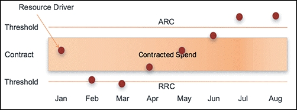
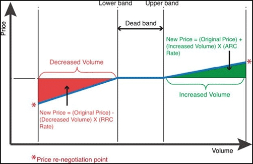
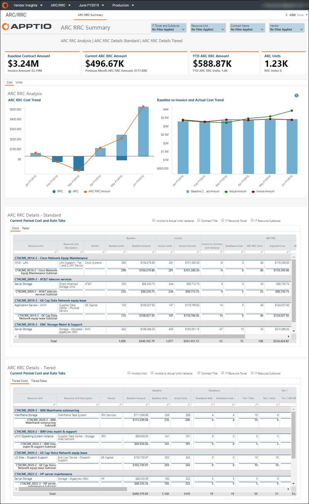

# ARC RRC Summary

◆ Applies to: Vendor Insights on TBM Studio 12.8 and later (v107)

The Additional Resource Charge (ARC)/Reduced Resource Credit (RRC) capability can be used to
view changes in consumption (+ / -) of the services during the term of a contract. In addition, the
multi-tier structure for ARC/RRC can be configured to add an additional level of granularity into
the ARC/RRC model. The capability was broken out into two reports to perform the analysis: Summary,
RU Reconcile.

ARC charges for additional resources above the threshold are priced at rates to reflect the
marginal cost of the additional production plus a reasonable profit.

RRC credits granted for a reduction in resources consumed or provided offer the enterprise
customer reduced cost but tend to be equivalent to the increased costs when paying for incremental
resources in excess of the threshold.

The following image displays  **ARC/RRC**  charges:

Use the  **ARC RRC Summary**  report to analyze an additional resource charge (ARC) and
reduced resource credit (RRC) contract terms based on resource unit quantities and price.

This report is designed for:

- CIO and senior IT leadership
- Application Owners
- Services Owners
- IT Finance Managers
- Vendor Managers

**Display the ARC RRC Summary report**

In the  Application  menu, select  **Vendor Insights**  .

1. Navigate to  Report Collections > ARC/RRC  .
2. Optionally, filter the report using the options at the top of the report.
3. To export or email your data, select  Export  (  ) at the top right of
   the page and select an export format.

The  **ARC RRC Summary**  report contains the following elements:

The ARC RRC Summary report includes two separate panels for both standard and tiered ARC RRC
methods. Depending on the contract, they will either show in the standard or tiered panel. If all
contracts are tiered, you will not see the standard panel.

Questions answered

Use the information presented in this report to answer the
following questions:

- Am I consistently staying within ARC/RRC deadband thresholds?
- Am I being billed at the correct rate based on resource utilization?
- Are we being as efficient as possible with this contract?
- Do we know if this contract is still cost-effective?
- How many resources have been consumed?
- Have the services we're paying for been performed?

Click on any value in the  **Resource Unit**  columns on the  **ARC RCC Details - Standard** or  **ARC RCC Details - Tiered**  tables to open the  [ARC RRC RU Reconcile report](report-arcrrcru-reconcile.htm "(Opens in a new tab or window)")  .
