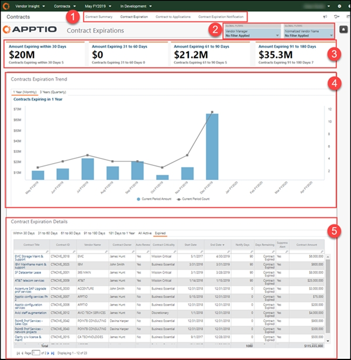

# Contract Expiration

◆ Applies to: Vendor Insights on TBM Studio 12.8 and later (v107)

Use the Contract Expiration report to proactively analyze contracts prior to expiration and
renewals. This report is designed for:

- Vendor Managers
- Services Owners
- Application Owners
- IT Finance Managers
- CIO and senior IT leadership

**Display the Contract Expiration report**

In the  Application  menu, select  Vendor Insights  .

1. Navigate to  Report Collections > Contracts  .
2. From the bar at the top of the page, select  Contract Expiration  .
3. Optionally, filter the report using the options at the top of the report.
4. To export or email your data, select  Export  (  ) at the top right of
   the page and select an export format.
5. To create an alert to notify you if a contract is expiring, select  Alert  (  ) on the top
   right of the page. To learn more, see  [Create alerts for expiring vendor
   contracts](alerts.html)  .
6. Select any item in the  Contract Title  column of the table in the  Contract
   Expiration Details  report component to open the  Contract Detail  report for that
   contract. To learn more, see  [Contract Detail report](report-contract-detail.html) .

The report contains the following elements:

**(1) Report collection**

This report collection provides the details you need to analyze your vendor portfolio spending
across vendor type and time:

- [Contract Summary report](report-contract-summary.html)
- Contract Expiration report (described in this article)
- [Contract to Applications report](report-contract-applications.html)
- [Contract Expiration Notification report](report-contract-expiration-notification.html)

**(2) Slicers**

The following global filters are available in this report collection:

- **Vendor Manager**  - Filter by a specific person so you can see the impact of vendors managed
  by that person.
- **Normalized Vendor Name**  - Filter by a specific vendor.

**(3) KPIs**

KPIs provide a high-level view of your vendor spend and contract expiration:

- **Amount Expiring within 30 Days**  - This KPI shows the total spend for the current period and
  the number of vendors spending in the current period. Spend is the sum of all account payables in
  the current period.
- **Amount Expiring 31 to 60 Days**  - This KPI shows the total vendor spend YTD and the
  difference in the YTD spend between the previous and current year.
- **Amount Expiring 61 to 90 Days**  - This KPI shows the number of contracts expiring in less
  than 90 days, and in less than 180 days.
- **Amount Expiring 91 to 180 Days**  - This KPI shows the minimum committed spend for contracts
  expiring in less than 90 days, and in less than 180 days.

**(4) Contracts Expiration Trend**

Use this section to understand how many contracts are expiring in the upcoming months or
quarters (line chart) and the impacted contract amount (bar chart). This section helps you visualize
the impact of upcoming contract expirations and the effort that might be needed to plan for contract
renewals.

- Click the  **1 Year (Monthly)**  tab to see the contract amount and number of vendor
  contracts set to expire in the next 12 months, in monthly increments. View the total monthly
  expiring contract amount by hovering over the bar chart.
- Click the  **3 Years (Quarterly)**  tab to see the contract amount and number of vendor
  contracts set to expire in the next three years, in quarterly increments.

**(5) Contract Expiration Details**

Use this section to view the contract details of expiring contracts per period. You can see the
top spending contract during a selected time period by sorting the  **Contract Amount**  column.

Use the tabs to view different periods. Setting a slicer allows you to narrow the results as
needed. For additional detail about a specific contract, click in the  **Contract Title**  column
to open the  [Contract Detail report](report-contract-detail.html)  .

The  **Notify Days**  value will be highlighted in red when a contract is past the expiration
date so you can notify the vendor to update the contract.

As of the 12.7 release, a column for  **Suppress Alert**  was added to the Details table. **Yes**  means that alerts are suppressed for the contract.

Questions answered

- What contracts are expiring, and when?
- Which contracts are up for renewal, and when?
- What are my critical contracts and the services they support?
