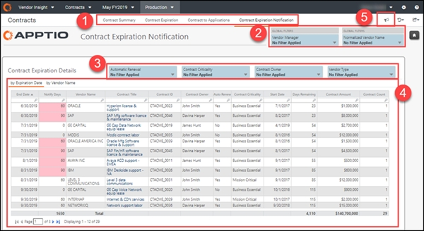

# Contract Expiration Notification

◆ Applies to: Vendor Insights on TBM Studio 12.8 and later (v107)

With IT growth comes an increasing number of vendor contracts, pre-negotiated expenditures,
contract renewals, and contract expirations. Vendor contracts require constant attention to prevent
accidental auto-renewal and unexpected price increases. In addition, it's difficult to keep
stakeholders informed about expiring contracts so they can make informed decisions about renewals
and negotiations. The Contract Expiration Notification report in Vendor Insights is designed to
provide such information and make contract management easier.

**NOTE**  : The Contract Expiration Notification report can be attached to email alerts that are
generated before contracts expire, based on user-defined threshold settings. For more information,
see  [Alerts for vendor contract expiration](alerts.html)  .

This report is designed for roles, such as listed below, who decides whether to let contracts
expire, renegotiate terms, and provide feedback as stakeholders:

- Contract Owners
- Vendor Managers
- Applications Owners
- Services Owners

Use cases

- What contracts are expiring, and when?
- How can I know what contracts need attention without having to check the contract expiration
  report daily?
- A contract has been renewed or allowed to expire. Does it require follow-up?
- How can I make sure that all stakeholders are aware of contract changes?
- What are my critical contracts, and what services do they support?

**Display the Contract Expiration Notification report**

The Contract Expiration Notification report can be opened from an email generated when a
contract expiration threshold is met. You can also navigate to the report in Vendor Insights :

In the  Application  menu, select  Vendor Insights  .

1. Navigate to  Report Collections > Contracts  .
2. From the bar at the top of the page, select  Contract Expiration Notification  .
3. Optionally, filter the report using the options at the top of the report.
4. To export or email your data, select  Export  (  ) at the top right of
   the page and select an export format.
5. To create an alert to notify you if a contract is expiring, select  Alert  (  ) on the top
   right of the page. To learn more, see  [Create alerts for expiring vendor
   contracts](alerts.html)  .
6. Select any item in the  Contract Title  column of the table to open the  Contract
   Detail  report for that contract. See  [Contract Detail
   report](report-contract-detail.html)  .

The report contains the following elements:

**(1) Report collection**

This report collection provides the details you need to analyze your vendor portfolio spending
across vendor type and time:

- [Contract Summary report](report-contract-summary.html)
- [Contract Expiration report (TBM Studio 12.6 and
  later)](report-contract-expiration-12-6.html)
- [Contract to Applications report](report-contract-applications.html)
- Contract Expiration Notification (described in this article)

**(2) Slicers**

The following global filters are available in this report collection:

- **Vendor Manager**  - Filter by a specific person so you can see the impact of vendors managed
  by that person.
- **Normalized Vendor Name**  - Filter by a specific vendor.

**(3) Filters**

Use the following local filters to limit the contracts displayed in the  **Contract Expiration** Details table:

- **Automatic Renewal**  - Filter the  **Auto Renew**  column for contracts set to
  automatically renew (set to  **Yes**  ) versus contracts that will not automatically renew (set
  to  **No**  ). Remove the filter to display all contracts.
- **Contract Criticality**  - Filter the  **Contract Criticality**  column for contracts tagged
  with different levels of contract criticality (as Mission Critical, Business Essential,
  Discretionary, or Strategic). Remove the filter to display all contracts regardless of criticality.
- **Contract Owner**  - Filter the  **Contract Owner**  column for contracts per owner. Remove
  the filter to display all contracts regardless of owner.
- **Vendor Type**  - Filter the  **Vendor Type**  column for contracts based on vendor type
  (such as whether the contract is from a vendor with a preferred versus strategic vendor type).
  Remove the filter to display all contracts regardless of vendor type.

**(3) by Expiration Date**

Use this tab to view contract data based on contract end date. The contracts are sorted by the
contract expiration date, listing the ones expiring today first. The table provides a quick view of
the most critical information about contracts, including the end date, owner, days remaining to
expiration, notify days, and the contract amount.

For more information about a specific contract, click the Contract Title column to open the
 [Contract Detail report](report-contract-detail.html)  .

**(4) by Vendor Name**

This view displays the same data as the  **Expiration Date**  tab except that clicking this
tab moves the  **Vendor Name**  column to the left-most column and sorts by the Vendor Name
ascending.

**(5) Alerts icon**

Click this icon to open the  **Threshold Alerts**  page, which lists all of your alerts and
their status. On that page, you can click any alert to open the  **Threshold Setting**  page and
edit the thresholds. For more information about setting alerts, see  [Create
alerts for expiring vendor contracts](alerts.html)  .
